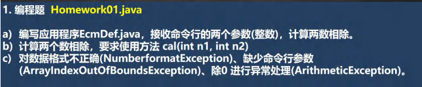
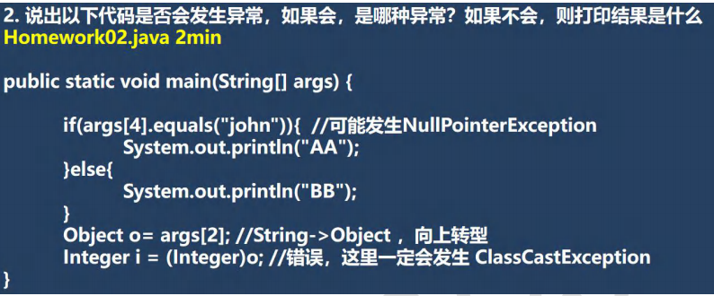
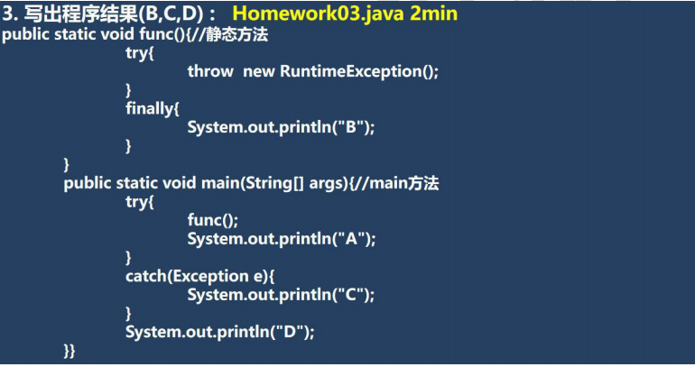
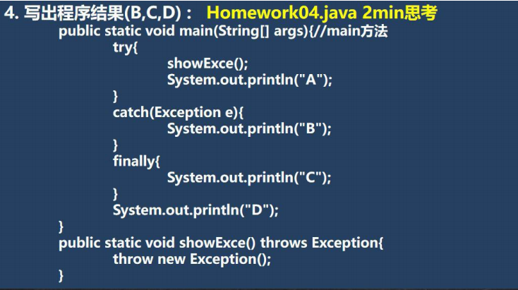

 

```java
package com.czl.exception_;

public class Homework01 {
    public static void main(String[] args) {
        try {
            //先验证输入的参数的个数是否正确 两个参数
            if (args.length != 2) {
                throw new ArrayIndexOutOfBoundsException("参数个数不对");
            }
            //先把接收到的参数，转成整数
            int n1 = Integer.parseInt(args[0]);
            int n2 = Integer.parseInt(args[1]);

            double res = cal(n1, n2);//该方法可能抛出ArithmeticException
            System.out.println("计算结果是=" + res);

        } catch (ArrayIndexOutOfBoundsException e) {
            System.out.println(e.getMessage());
        } catch (NumberFormatException e) {
            System.out.println("参数格式不正确，需要输出整数");
        } catch (ArithmeticException e) {
            System.out.println("出现了除0的异常");
        }
    }

    //编写cal方法，就是两个数的商
    public static double cal(int n1, int n2) {
        return n1 / n2;
    }
}
```


 

```java
public class Homework02 {
    public static void main(String[] args) {
        //args.length = 0
        //这里发生的是 ArrayIndexOutOfBoundsException
        if(args[4].equals("john")){  //可能发生NullPointerException，args[4] = null;
            System.out.println("AA");
        }else{
            System.out.println("BB");
        }
        Object o= args[2]; //String->Object ，向上转型
        Integer i = (Integer)o; //错误，这里一定会发生 ClassCastException

    }
}
```


 

 