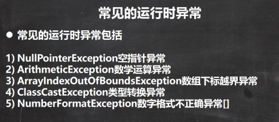
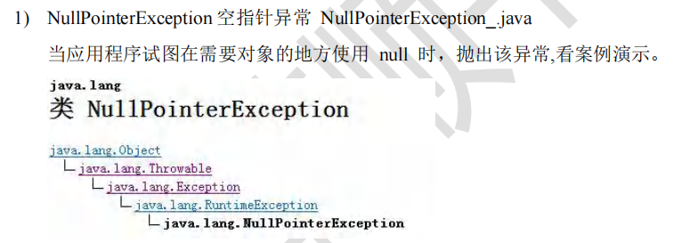
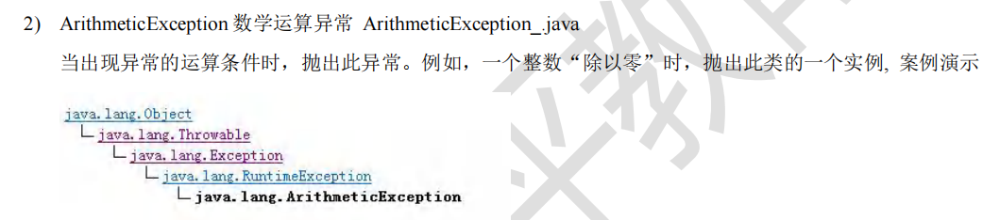
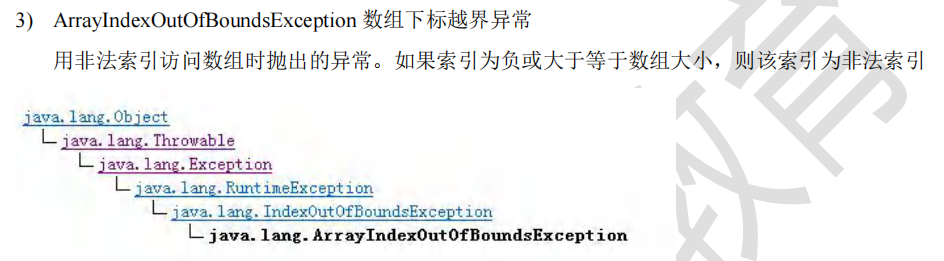
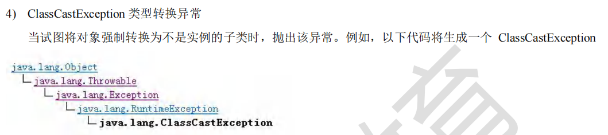
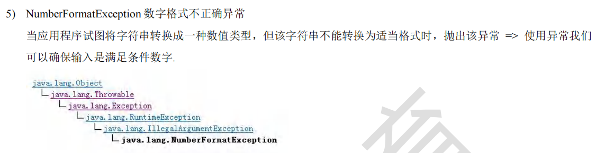
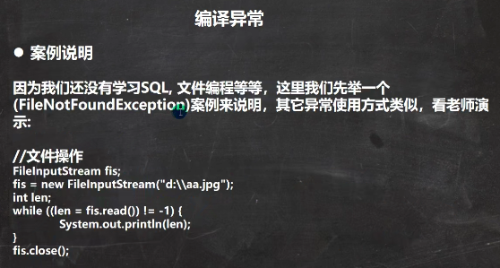
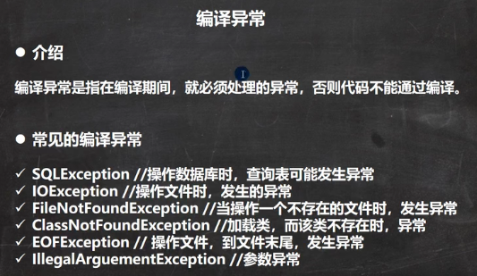

 

 

```java
package com.czl.exception_;

public class NullPointerException_ {
    public static void main(String[] args) {

        String name = null;
        System.out.println(name.length());
    }
}
```

 

 

```java
public class ArrayIndexOutOfBoundsException_ {
    public static void main(String[] args) {
        int[] arr = {1,2,4};
        for (int i = 0; i <= arr.length; i++) {
            System.out.println(arr[i]);
        }
    }
}
```

 

```java
public class ClassCastException_ {
    public static void main(String[] args) {
        A b = new B(); //向上转型
        B b2 = (B)b;//向下转型，这里是OK
        C c2 = (C)b;//这里抛出ClassCastException
    }
}
class A {}
class B extends A {}
class C extends A {}
```

 

```java
public class NumberFormatException_ {
    public static void main(String[] args) {
        String name = "czl";//"1234"
        //将String 转成 int
        int num = Integer.parseInt(name);//抛出NumberFormatException
        System.out.println(num);//1234
    }
}
```


 

 

 