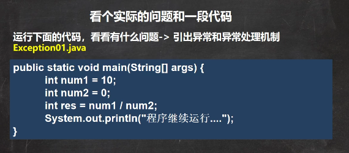
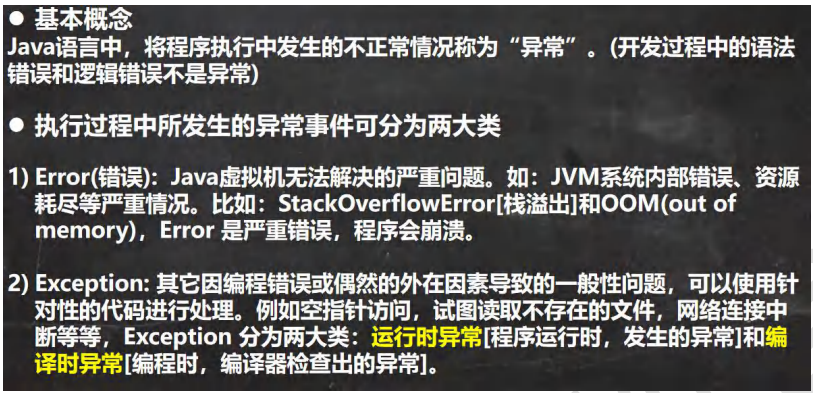
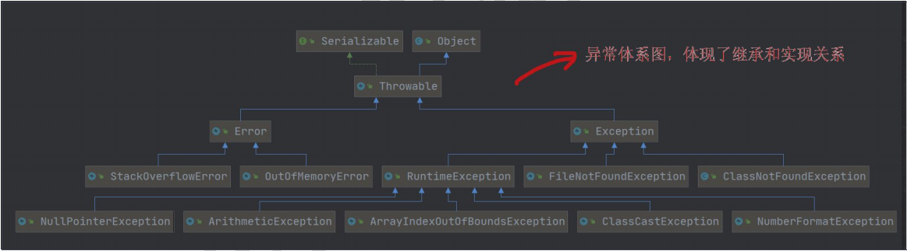
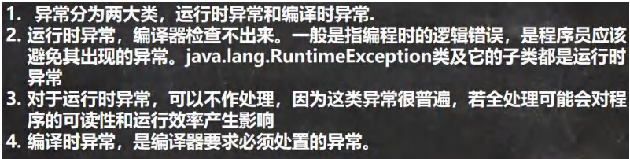

 

```java
package com.czl.exception_;

public class Exception {
    public static void main(String[] args) {
        int num1 = 1;
        int num2 = 0;
        //当执行到 num1 / num2 因为 num2 = 0, 程序就会出现(抛出)异常 ArithmeticException
        //当抛出异常后，程序就退出，崩溃了,下面的代码就不再执行
        //异常处理机制
        //如果程序员，认为一段代码可能出现异常/问题，可以使用try-catch异常处理机制来解决
        //将该代码块->选中->快捷键 ctrl + alt + t -> 选中 try-catch
        //如果进行异常处理，那么即使出现了异常，程序可以继续执行

        try {
            int res = num1 / num2;
        } catch (java.lang.Exception e) {
            //e.printStackTrace();
            System.out.println(e.getMessage());//输出异常信息
        }
        System.out.println("程序继续运行...");
    }
}
```

 

 

 