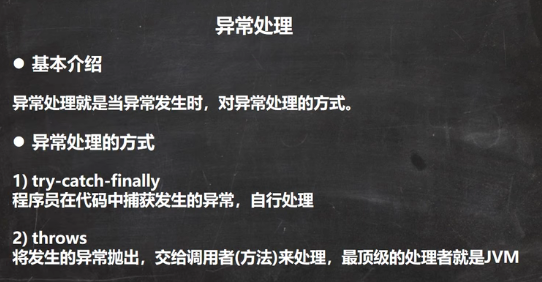 

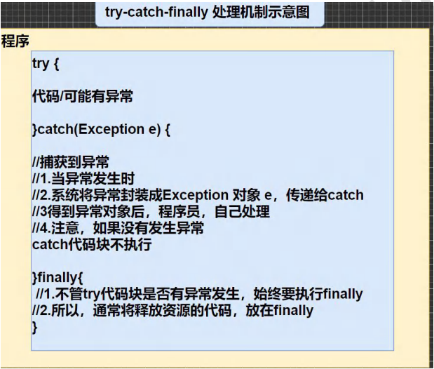 

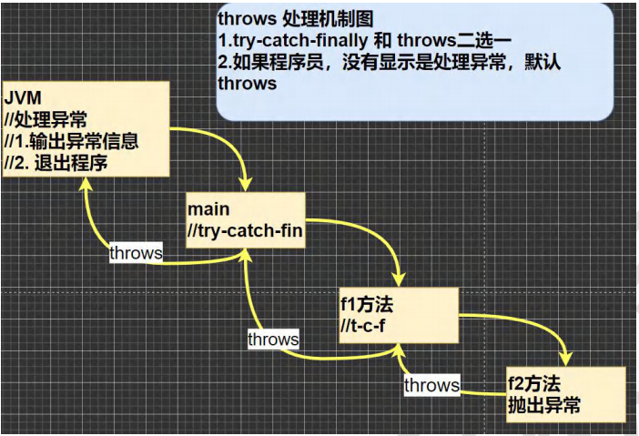 


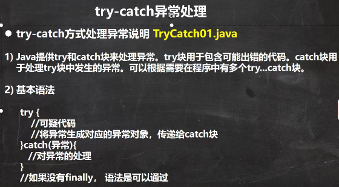 

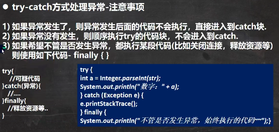 

```java
public class TryCatchDetail {
    public static void main(String[] args) {
        //ctrl + atl + t
        try {
            String str = "czl";
            int a = Integer.parseInt(str);
            System.out.println("数字：" + a);
        } catch (NumberFormatException e) {
            System.out.println("异常信息=" + e.getMessage());
        } finally {
            System.out.println("finally代码块被执行...");
        }
        System.out.println("程序继续...");
        //异常信息=For input string: "czl"
        //finally代码块被执行...
        //程序继续...
    }
}
```

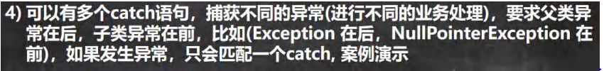 

```java
public class TryCatchDetail02 {
    public static void main(String[] args) {
        //1.如果try代码块有可能有多个异常
        //2.可以使用多个catch 分别捕获不同的异常，相应处理
        //3.要求子类异常写在前面，父类异常写在后面
        try {
            Person person = new Person();
            //person = null;
            System.out.println(person.getName());//NullPointerException
            int n1 = 10;
            int n2 = 0;
            int res = n1 / n2;//ArithmeticException
        } catch (NullPointerException e) {
            System.out.println("空指针异常=" + e.getMessage());
        } catch (ArithmeticException e) {
            System.out.println("算术异常=" + e.getMessage());
        } catch (java.lang.Exception e) {
            System.out.println(e.getMessage());
        } finally {
        }
        //输出
        //空指针异常=null
        //注释person = null;后输出
        //jack
        //算术异常=/ by zero
    }
}
class Person {
    private String name = "jack";

    public String getName() {
        return name;
    }
}
```

 

```java
public class TryCatchDetail03 {
    public static void main(String[] args) {
        /*
        可以进行 try-finally 配合使用, 这种用法相当于没有捕获异常，
        因此程序会直接崩掉/退出。应用场景，就是执行一段代码，不管是否发生异常，
        都必须执行某个业务逻辑
         */
        try{
            int n1 = 10;
            int n2 = 0;
            System.out.println(n1 / n2);
        }finally {
            System.out.println("执行了finally..");
        }
        System.out.println("程序继续执行..");

    }
}
```

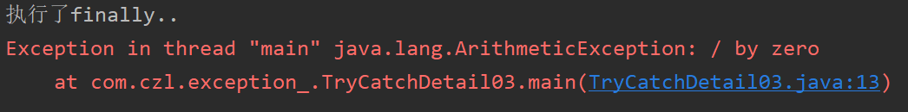 

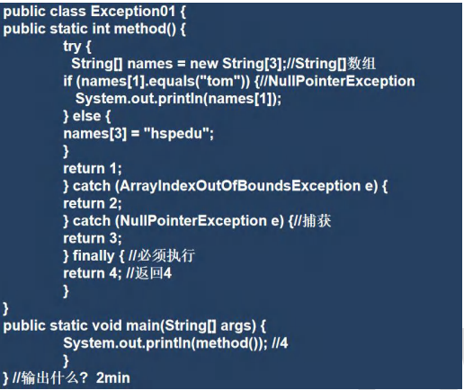 

name[0],name[1],name[2]为null

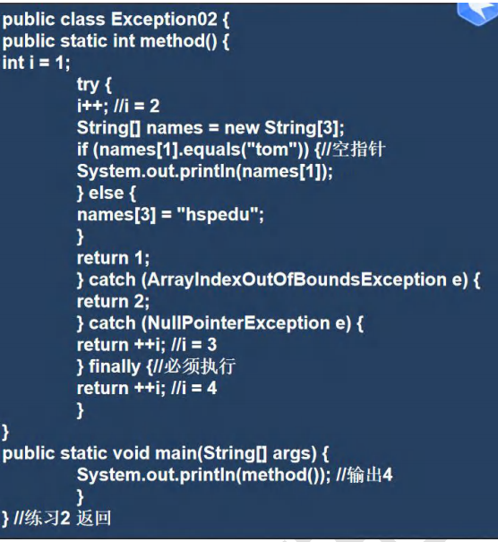 

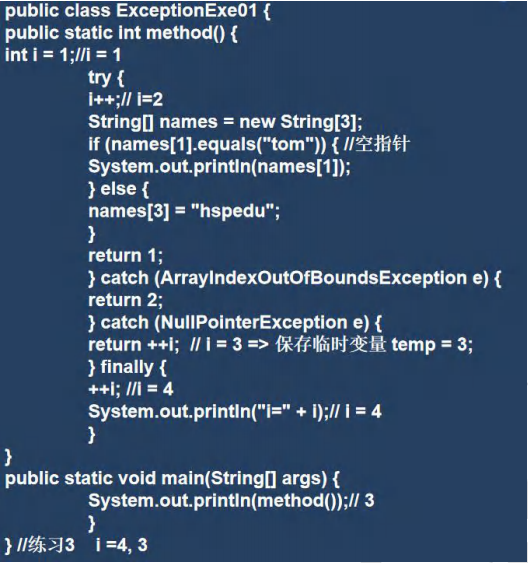 

return 3;不会马上执行，用临时变量保存


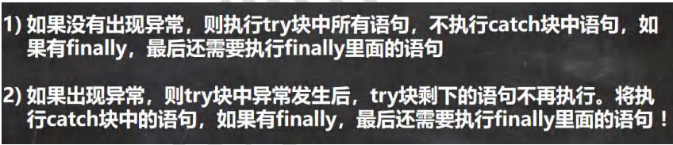 

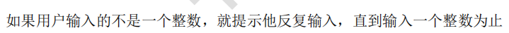 

```java
方法一：
public class TryCatchExercise04 {
    public static void method() {
        try {
            Scanner scanner = new Scanner(System.in);
            System.out.println("请输入一个数:");
            int i = scanner.nextInt();
            System.out.println("数字:" + i);
        } catch (java.lang.Exception e) {
            method();
        } finally {
        }
    }
    public static void main(String[] args) {
        method();
    }
}
方法二：
public class TryCatchExercise04 {
    public static void main(String[] args) {
        Scanner scanner = new Scanner(System.in);
        while (true) {
            try {
                System.out.println("请输入数字:");
                int i = Integer.parseInt(scanner.next());
                System.out.println("数字:" + i);
                break;
            } catch (java.lang.Exception e) {
                continue;
            } finally {
            }
        }
    }
}
```


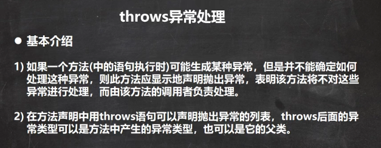 

```java
public class Throws01 {
    public static void main(String[] args) {
    }
    public void f2() throws FileNotFoundException,NullPointerException,ArithmeticException {
        //创建了一个文件流对象
        //1. 这里的异常是一个FileNotFoundException 编译异常
        //2. 使用前面讲过的 try-catch-finally
        //3. 使用throws ,抛出异常, 让调用f2方法的调用者(方法)处理
        //4. throws后面的异常类型可以是方法中产生的异常类型，也可以是它的父类
        //5. throws 关键字后也可以是 异常列表, 即可以抛出多个异常
        FileInputStream fis = new FileInputStream("d://aa.txt");

    }
}
```


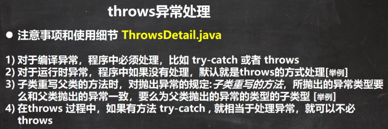 

```java
package com.czl.exception_;

import java.io.FileInputStream;
import java.io.FileNotFoundException;

public class ThrowsDetail {
    public static void main(String[] args) {
        f2();
    }
    public static void f2() /*throws ArithmeticException*/ {
        //1.对于编译异常，程序中必须处理，比如 try-catch 或者 throws
        //2.对于运行时异常，程序中如果没有处理，默认就是throws的方式处理

        int n1 = 10;
        int n2 = 0;
        double res = n1 / n2;
    }

    public static void f1() {
        //这里大家思考问题 调用f3() 报错
        //1. 因为f3() 方法抛出的是一个编译异常
        //2. 即这时，就要f1() 必须处理这个编译异常
        //3. 在f1() 中，要么 try-catch-finally ,或者继续throws 这个编译异常
        f3(); // 抛出异常
    }
    public static void f3() throws FileNotFoundException {
        FileInputStream fis = new FileInputStream("d://aa.txt");
    }

    public static void f4() {
        //1. 在f4()中调用方法f5() 是OK
        //2. 原因是f5() 抛出的是运行异常
        //3. 而java中，并不要求程序员显示处理,因为有默认处理机制
        f5();
    }
    public static void f5() throws ArithmeticException {

    }
}

class Father { //父类
    public void method() throws RuntimeException {
    }
}
class Son extends Father {//子类
    //3. 子类重写父类的方法时，对抛出异常的规定:子类重写的方法，
    //   所抛出的异常类型要么和父类抛出的异常一致，要么为父类抛出的异常类型的子类型
    //4. 在throws 过程中，如果有方法 try-catch , 就相当于处理异常，就可以不必throws
    @Override
    public void method() throws ArithmeticException {
    }
}
```

