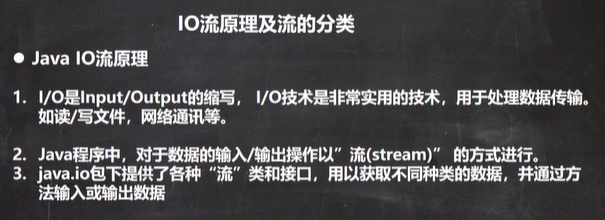 

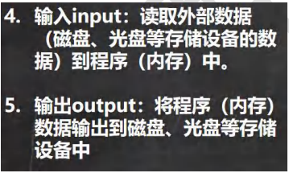 


流的分类：

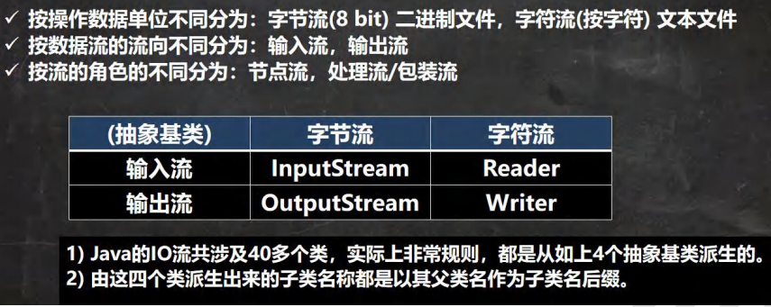 


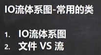 

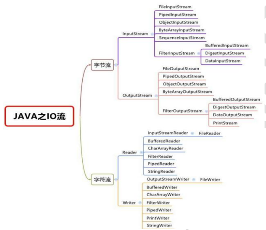 

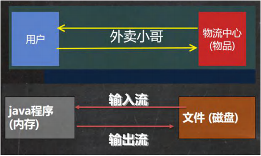 


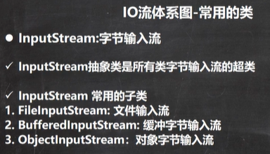 

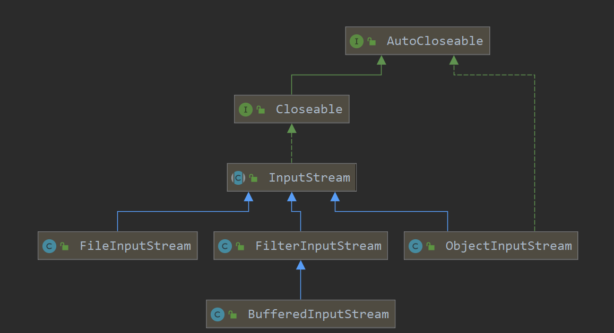 

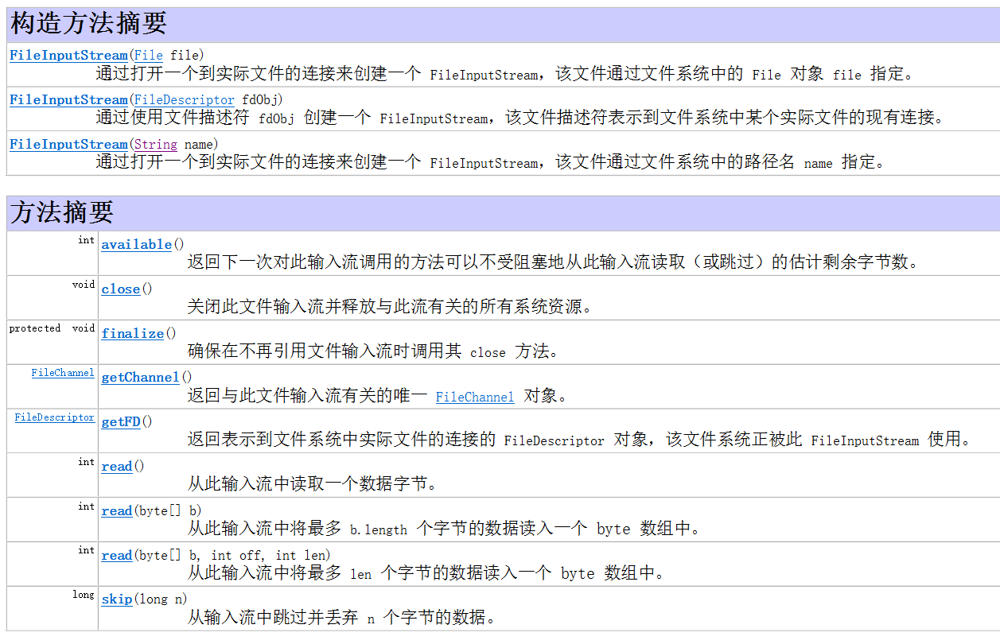 

```java
package com.czl.io;

import org.junit.jupiter.api.Test;

import java.io.FileInputStream;
import java.io.IOException;

//演示FileInputStream的使用(字节输入流 把文件读取到程序)
@SuppressWarnings({"all"})
public class FileInputStream_ {
    public static void main(String[] args) {

    }

    /**
     * 演示读取文件...
     * 单个字节的读取，效率比较低
     * 优化 -> 使用 read(byte[] b)
     */
    //如果读取的文件里面有占三个字节的汉字，会乱码，因为只能一个个字节读取，汉字的三个字节会分别读取，会被拆分开
    @Test
    public void readFile01() {
        String filePath = "C:\\Users\\chenzhoule\\Desktop\\hello.txt";
        int readData = 0;
        FileInputStream fileInputStream = null;
        try {
            //创建 FileInputStream 对象，用于读取 文件
            fileInputStream = new FileInputStream(filePath);
            //从该输入流读取一个字节的数据。 如果没有输入可用，此方法将阻止。
            //如果返回-1 , 表示读取完毕
            while ((readData = fileInputStream.read()) != -1) {
                System.out.print((char)readData);//转成char显示
            }

        } catch (IOException e) {
            e.printStackTrace();
        } finally {
            //关闭文件流，释放资源.
            try {
                fileInputStream.close();
            } catch (IOException e) {
                e.printStackTrace();
            }
        }

    }

    /**
     * 使用 read(byte[] b) 读取文件，提高效率
     */
    @Test
    public void readFile02() {
        String filePath = "C:\\Users\\chenzhoule\\Desktop\\hello.txt";
        //字节数组
        byte[] buf = new byte[8]; //一次读取8个字节.
        int readLen = 0;
        FileInputStream fileInputStream = null;
        try {
            //创建 FileInputStream 对象，用于读取 文件
            fileInputStream = new FileInputStream(filePath);
            //从该输入流读取最多b.length字节的数据到字节数组。 此方法将阻塞，直到某些输入可用。
            //如果返回-1 , 表示读取完毕
            //如果读取正常, 返回实际读取的字节数
            while ((readLen = fileInputStream.read(buf)) != -1) {
                System.out.print(new String(buf, 0, readLen));//显示
            }

        } catch (IOException e) {
            e.printStackTrace();
        } finally {
            //关闭文件流，释放资源.
            try {
                fileInputStream.close();
            } catch (IOException e) {
                e.printStackTrace();
            }
        }

    }
}
```


FileOutputStream

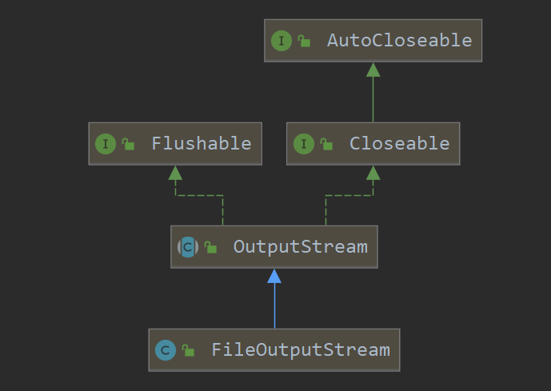 

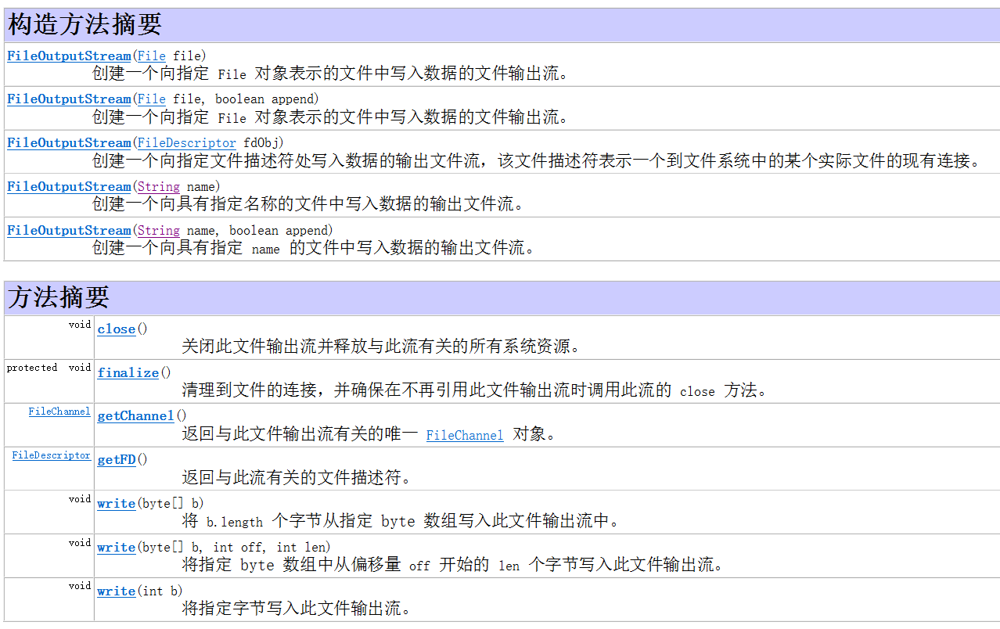 

```java
package com.czl.io;

import org.junit.jupiter.api.Test;

import java.io.FileOutputStream;
import java.io.IOException;

@SuppressWarnings({"all"})
public class FileOutputStream01 {
    public static void main(String[] args) {
    }

    /**
     * 演示使用 FileOutputStream 将数据写到文件中,
     * 如果该文件不存在，则创建该文件
     */
    @Test
    public void writeFile() {

        //创建 FileOutputStream对象
        String filePath = "C:\\Users\\chenzhoule\\Desktop\\a.txt";
        FileOutputStream fileOutputStream = null;
        try {
            //得到 FileOutputStream对象
            //1. new FileOutputStream(filePath) 创建方式，当写入内容时，会覆盖原来的内容
            //2. new FileOutputStream(filePath, true) 创建方式，当写入内容时，是追加到文件后面
            fileOutputStream = new FileOutputStream(filePath, true);
            //写入一个字节
            //fileOutputStream.write('H');

            //写入字符串
            String str = "czl,world!";
            //str.getBytes(); //可以把 字符串-> 字节数组
            fileOutputStream.write(str.getBytes());

            /*
            write(byte[] b, int off, int len) 将 len字节从位于偏移量 off的指定字节数组写入此文件输出流
             */
            fileOutputStream.write(str.getBytes(), 0, 3);//str.length()

        } catch (IOException e) {
            e.printStackTrace();
        } finally {
            try {
                fileOutputStream.close();
            } catch (IOException e) {
                e.printStackTrace();
            }
        }
    }
}
```


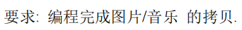 

```java
package com.czl.io;

import java.io.FileInputStream;
import java.io.FileOutputStream;
import java.io.IOException;

@SuppressWarnings({"all"})
public class FileCopy {
    public static void main(String[] args) {
        //完成 文件拷贝，将 C:\Users\chenzhoule\Desktop\wb.png 拷贝到 c:\
        //思路分析
        //1. 创建文件的输入流 , 将文件读入到程序
        //2. 创建文件的输出流， 将读取到的文件数据，写入到指定的文件.
        String srcFilePath = "C:\\Users\\chenzhoule\\Desktop\\wb.png";
        String destFilePath = "C:\\Users\\chenzhoule\\Desktop\\wb1.png";
        FileInputStream fileInputStream = null;
        FileOutputStream fileOutputStream = null;

        try {
            fileInputStream = new FileInputStream(srcFilePath);
            fileOutputStream = new FileOutputStream(destFilePath);
            //定义一个字节数组,提高读取效果
            byte[] buf = new byte[1024];
            int readLen = 0;
            while ((readLen = fileInputStream.read(buf)) != -1) {
                //读取到后，就写入到文件 通过 fileOutputStream
                //即，是一边读，一边写
                fileOutputStream.write(buf, 0, readLen);//一定要使用这个方法
            }
            System.out.println("拷贝ok~");
        } catch (IOException e) {
            e.printStackTrace();
        } finally {
            try {
                //关闭输入流和输出流，释放资源
                if (fileInputStream != null) {
                    fileInputStream.close();
                }
                if (fileOutputStream != null) {
                    fileOutputStream.close();
                }
            } catch (IOException e) {
                e.printStackTrace();
            }
        }
    }
}
```


 

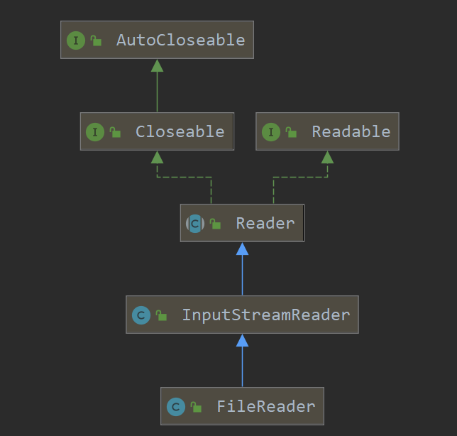 

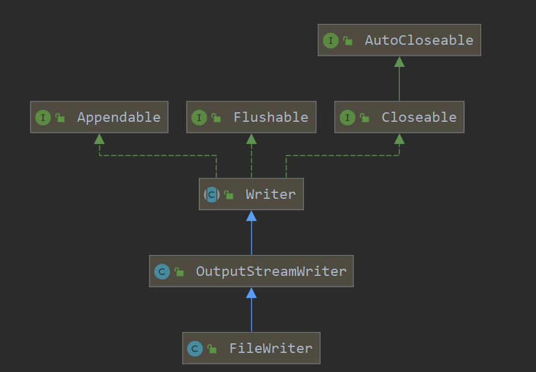 

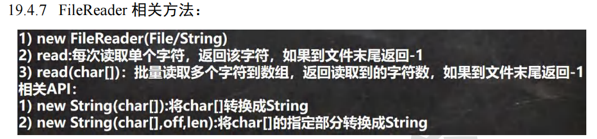 

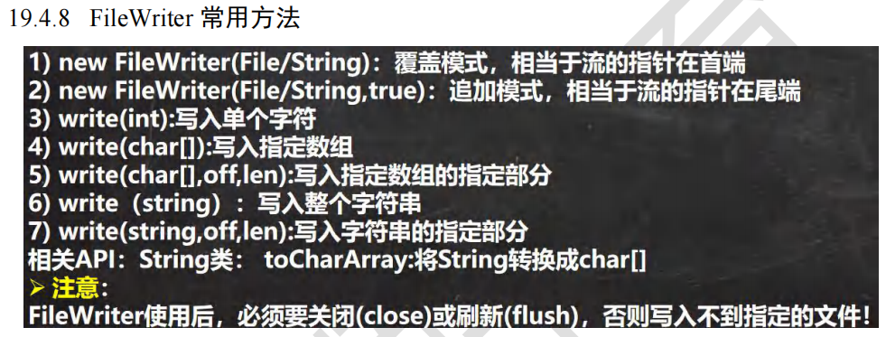 

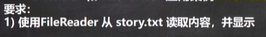 

```java
package com.czl.io;

import org.junit.jupiter.api.Test;

import java.io.FileReader;
import java.io.IOException;

@SuppressWarnings({"all"})
public class FileReader_ {
    public static void main(String[] args) {
    }

    /**
     * 单个字符读取文件
     */
    @Test
    public void readFile01() {
        String filePath = "C:\\Users\\chenzhoule\\Desktop\\story.txt";
        FileReader fileReader = null;
        int data = 0;
        //1. 创建FileReader对象
        try {
            fileReader = new FileReader(filePath);
            //循环读取 使用read, 单个字符读取
            while ((data = fileReader.read()) != -1) {
                System.out.print((char) data);
            }

        } catch (IOException e) {
            e.printStackTrace();
        } finally {
            try {
                if (fileReader != null) {
                    fileReader.close();
                }
            } catch (IOException e) {
                e.printStackTrace();
            }
        }
    }

    /**
     * 字符数组读取文件
     */
    @Test
    public void readFile02() {
        System.out.println("~~~readFile02 ~~~");
        String filePath = "C:\\Users\\chenzhoule\\Desktop\\story.txt";
        FileReader fileReader = null;

        int readLen = 0;
        char[] buf = new char[8];
        //1. 创建FileReader对象
        try {
            fileReader = new FileReader(filePath);
            //循环读取 使用read(buf), 返回的是实际读取到的字符数
            //如果返回-1, 说明到文件结束
            while ((readLen = fileReader.read(buf)) != -1) {
                System.out.print(new String(buf, 0, readLen));
            }

        } catch (IOException e) {
            e.printStackTrace();
        } finally {
            try {
                if (fileReader != null) {
                    fileReader.close();
                }
            } catch (IOException e) {
                e.printStackTrace();
            }
        }
    }
}
```


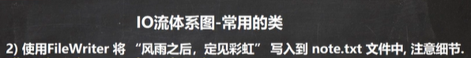 

```java
package com.czl.io;

import java.io.FileWriter;
import java.io.IOException;

@SuppressWarnings({"all"})
public class FileWriter_ {
    public static void main(String[] args) {

        String filePath = "C:\\Users\\chenzhoule\\Desktop\\note.txt";
        //创建FileWriter对象
        FileWriter fileWriter = null;
        char[] chars = {'a', 'b', 'c'};
        try {
            fileWriter = new FileWriter(filePath);//默认是覆盖写入
            //write(int):写入单个字符
            fileWriter.write('H');
            //write(char[]):写入指定数组
            fileWriter.write(chars);
            //write(char[],off,len):写入指定数组的指定部分
            fileWriter.write("czl".toCharArray(), 0, 3);
            //write（string）：写入整个字符串
            fileWriter.write(" 你好北京~");
            fileWriter.write("风雨之后，定见彩虹");
            //write(string,off,len):写入字符串的指定部分
            fileWriter.write("上海天津", 0, 2);
            //在数据量大的情况下，可以使用循环操作.
        } catch (IOException e) {
            e.printStackTrace();
        } finally {

            //对于 FileWriter , 一定要关闭流，或者flush才能真正的把数据写入到文件
            try {
                //fileWriter.flush();
                //关闭文件流，等价 flush() + 关闭
                fileWriter.close();
            } catch (IOException e) {
                e.printStackTrace();
            }
        }
        System.out.println("程序结束...");
    }
}
```

