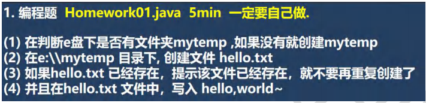
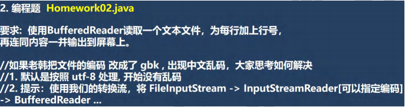
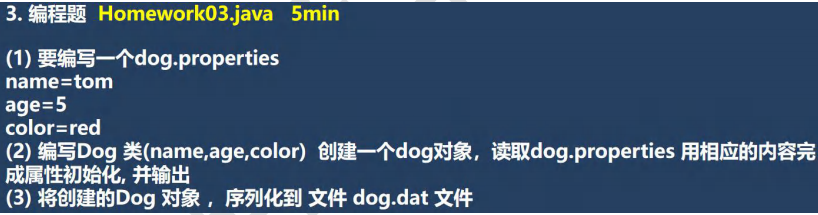

```java
public class Homework01 {
    public static void main(String[] args) throws IOException {

        String directoryPath = "e:\\mytemp";
        File file = new File(directoryPath);
        if(!file.exists()) {
            //创建
            if(file.mkdirs()) {
                System.out.println("创建 " + directoryPath + " 创建成功" );
            }else {
                System.out.println("创建 " + directoryPath + " 创建失败");
            }
        }

        String filePath  = directoryPath + "\\hello.txt";// e:\mytemp\hello.txt
        file = new File(filePath);
        if(!file.exists()) {
            //创建文件
            if(file.createNewFile()) {
                System.out.println(filePath + " 创建成功~");
                
                BufferedWriter bufferedWriter = new BufferedWriter(new FileWriter(file));
                bufferedWriter.write("hello, world~~ 韩顺平教育");
                bufferedWriter.close();

            } else {
                System.out.println(filePath + " 创建失败~");
            }
        } else {
            //如果文件已经存在，给出提示信息
            System.out.println(filePath + " 已经存在，不在重复创建...");
        }
    }
}
```




```java
public class Homework02 {
    public static void main(String[] args) {

        String filePath = "e:\\a.txt";
        BufferedReader br = null;
        String line = "";
        int lineNum = 0;
        try {
            br = new BufferedReader(new FileReader(filePath));
            while ((line = br.readLine()) != null) {//循环读取
                System.out.println(++lineNum + line);
            }
        } catch (Exception e) {
            e.printStackTrace();
        } finally {

            try {
                if(br != null) {
                    br.close();
                }
            } catch (IOException e) {
                e.printStackTrace();
            }
        }
    }
}
```




```java
public class Homework03 {
    public static void main(String[] args) throws IOException {

        String filePath = "src\\dog.properties";
        Properties properties = new Properties();
        properties.load(new FileReader(filePath));
        String name = properties.get("name") + ""; //Object -> String
        int age = Integer.parseInt(properties.get("age") + "");// Object -> int
        String color = properties.get("color") + "";//Object -> String

        Dog dog = new Dog(name, age, color);
        System.out.println("===dog对象信息====");
        System.out.println(dog);

        //将创建的Dog 对象 ，序列化到 文件 dog.dat 文件
        String serFilePath = "e:\\dog.dat";
        ObjectOutputStream oos = new ObjectOutputStream(new FileOutputStream(serFilePath));
        oos.writeObject(dog);

        //关闭流
        oos.close();
        System.out.println("dog对象，序列化完成...");
    }

    //在编写一个方法，反序列化dog
    @Test
    public void m1() throws IOException, ClassNotFoundException {
        String serFilePath = "e:\\dog.dat";
        ObjectInputStream ois = new ObjectInputStream(new FileInputStream(serFilePath));
        Dog dog = (Dog)ois.readObject();

        System.out.println("===反序列化后 dog====");
        System.out.println(dog);

        ois.close();

    }
}

class Dog implements Serializable{
    private String name;
    private int age;
    private String color;

    public Dog(String name, int age, String color) {
        this.name = name;
        this.age = age;
        this.color = color;
    }

    @Override
    public String toString() {
        return "Dog{" +
                "name='" + name + '\'' +
                ", age=" + age +
                ", color='" + color + '\'' +
                '}';
    }
}
```

