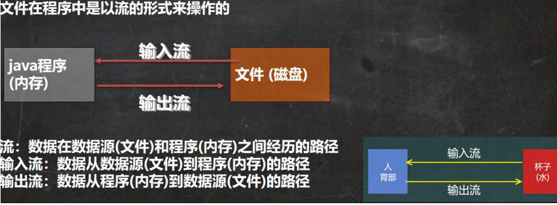
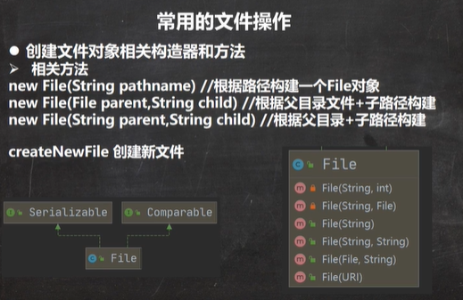

 

文件流：

 

 

```java
package com.czl.io;

import org.junit.jupiter.api.Test;
import java.io.File;
import java.io.IOException;

@SuppressWarnings({"all"})
public class FileCreate {
    public static void main(String[] args) {

    }

    //方式1 new File(String pathname)
    @Test
    public void create01() {
        String filePath = "C:\\Users\\chenzhoule\\Desktop\\news1.txt";
        File file = new File(filePath);

        try {
            file.createNewFile();
            System.out.println("文件创建成功");
        } catch (IOException e) {
            e.printStackTrace();
        }
    }

    //方式2 new File(File parent,String child) //根据父目录文件+子路径构建
    //C:\Users\chenzhoule\Desktop\\news2.txt
    @Test
    public  void create02() {
        File parentFile = new File("C:\\Users\\chenzhoule\\Desktop\\");
        String fileName = "news2.txt";
        //这里的file对象，在java程序中，只是一个对象
        //只有执行了createNewFile 方法，才会真正的，在磁盘创建该文件
        File file = new File(parentFile, fileName);

        try {
            file.createNewFile();
            System.out.println("创建成功~");
        } catch (IOException e) {
            e.printStackTrace();
        }
    }

    //方式3 new File(String parent,String child) //根据父目录+子路径构建
    @Test
    public void create03() {
        String parentPath = "C:\\Users\\chenzhoule\\Desktop\\";
        String fileName = "news3.txt";
        File file = new File(parentPath, fileName);

        try {
            file.createNewFile();
            System.out.println("创建成功~");
        } catch (IOException e) {
            e.printStackTrace();
        }
    }

    //下面四个都是抽象类
    //InputStream
    //OutputStream
    //Reader //字符输入流
    //Writer  //字符输出流
}
```


 

```java
package com.czl.io;

import org.junit.jupiter.api.Test;

import java.io.File;

@SuppressWarnings({"all"})
public class FileInformation {
    public static void main(String[] args) {

    }

    //获取文件的信息
    @Test
    public void info() {
        //先创建文件对象
        File file = new File("C:\\Users\\chenzhoule\\Desktop\\test.txt");

        //调用相应的方法，得到对应信息
        System.out.println("文件名字=" + file.getName());
        //getName、getAbsolutePath、getParent、length、exists、isFile、isDirectory
        System.out.println("文件绝对路径=" + file.getAbsolutePath());
        System.out.println("文件父级目录=" + file.getParent());
        System.out.println("文件大小(字节)=" + file.length());
        System.out.println("文件是否存在=" + file.exists());//T
        System.out.println("是不是一个文件=" + file.isFile());//T
        System.out.println("是不是一个目录=" + file.isDirectory());//F
    }
}
```


 

```java
package com.czl.io;

import org.junit.jupiter.api.Test;
import java.io.File;

@SuppressWarnings({"all"})
public class Directory_ {
    public static void main(String[] args) {
    }

    //判断 C:\Users\chenzhoule\Desktop\test.txt 是否存在，如果存在就删除
    @Test
    public void m1() {
        String filePath = "C:\\Users\\chenzhoule\\Desktop\\test.txt";
        File file = new File(filePath);
        if (file.exists()) {
            if (file.delete()) {
                System.out.println(filePath + "删除成功");
            } else {
                System.out.println(filePath + "删除失败");
            }
        } else {
            System.out.println("该文件不存在...");
        }
    }

    //判断 C:\Users\chenzhoule\Desktop\test 是否存在，存在就删除，否则提示不存在
    //这里我们需要体会到，在java编程中，目录也被当做文件
    @Test
    public void m2() {

        String filePath = "C:\\Users\\chenzhoule\\Desktop\\test";
        File file = new File(filePath);
        if (file.exists()) {
            if (file.delete()) {
                System.out.println(filePath + "删除成功");
            } else {
                System.out.println(filePath + "删除失败");
            }
        } else {
            System.out.println("该目录不存在...");
        }
    }

    //判断 C:\Users\chenzhoule\Desktop\\demo\\a\\b\\c 目录是否存在，如果存在就提示已经存在，否则就创建
    @Test
    public void m3() {

        String directoryPath = "C:\\Users\\chenzhoule\\Desktop\\demo\\a\\b\\c";
        File file = new File(directoryPath);
        if (file.exists()) {
            System.out.println(directoryPath + "存在..");
        } else {
            if (file.mkdirs()) { //创建一级目录使用mkdir() ，创建多级目录使用mkdirs()
                System.out.println(directoryPath + "创建成功..");
            } else {
                System.out.println(directoryPath + "创建失败...");
            }
        }
    }
}
```

