基本介绍：

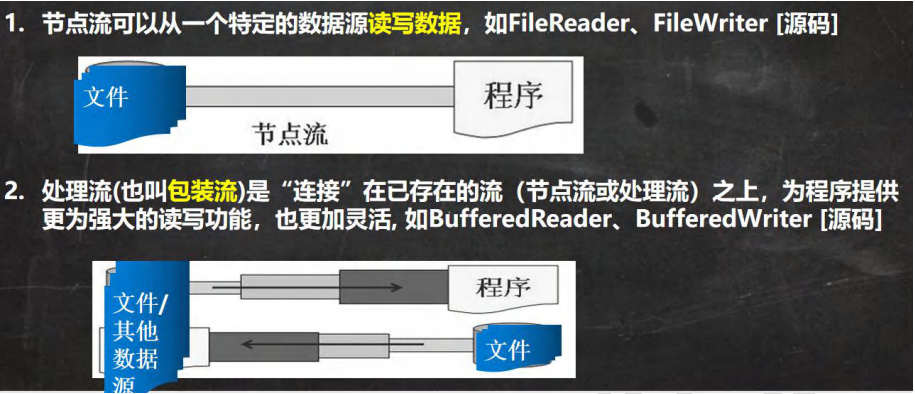 

 

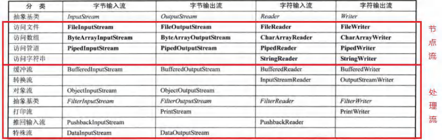 

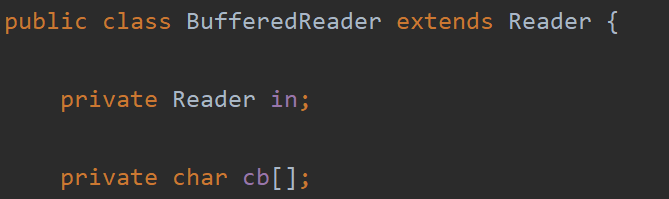 

BufferedReader类中，有属性Reader，即可以封装/包装一个节点流，该节点流可以是任意的，只要是Reader的子类

BufferedWriter同理。

 

节点流和处理流的区别和联系：

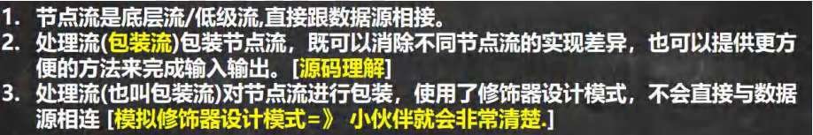 

```java
package com.czl.io;

public abstract class Reader_ { //抽象类
    public void readFile() {
    }
    public void readString() {
    }

    //在Reader_ 抽象类，使用read方法统一管理.
    //后面在调用时，用对象动态绑定机制， 绑定到对应的实现子类即可.
    //public abstract void read();
}

package com.czl.io;

//节点流
public class FileReader_ extends Reader_ {
    public void readFile() {
        System.out.println("对文件进行读取...");
    }
}

package com.czl.io;

//节点流
public class StringReader_ extends Reader_ {
    public void readString() {
        System.out.println("读取字符串..");
    }
}

package com.czl.io;

//做成处理流/包装流
public class BufferedReader_ extends Reader_{

    private Reader_ reader_; //属性是 Reader_类型

    //接收 Reader_ 子类对象
    public BufferedReader_(Reader_ reader_) {
        this.reader_ = reader_;
    }

    public void readFile() { //封装一层
        reader_.readFile();
    }

    //扩展readFile()方法，让方法更加灵活,多次读取文件, 或者加缓冲byte[] ....
    public void readFiles(int num) {
        for(int i = 0; i < num; i++) {
            reader_.readFile();
        }
    }

    //扩展 readString, 批量处理字符串数据
    public void readStrings(int num) {
        for(int i = 0; i <num; i++) {
            reader_.readString();
        }
    }
}

package com.czl.io;

public class Test_ {
    public static void main(String[] args) {
        BufferedReader_ bufferedReader_ = new BufferedReader_(new FileReader_());
        bufferedReader_.readFiles(10);
        //bufferedReader_.readFile();

        //这次希望通过 BufferedReader_ 多次读取字符串
        BufferedReader_ bufferedReader_2 = new BufferedReader_(new StringReader_());
        bufferedReader_2.readStrings(5);
    }
}
```

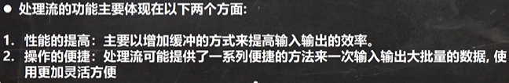 

 

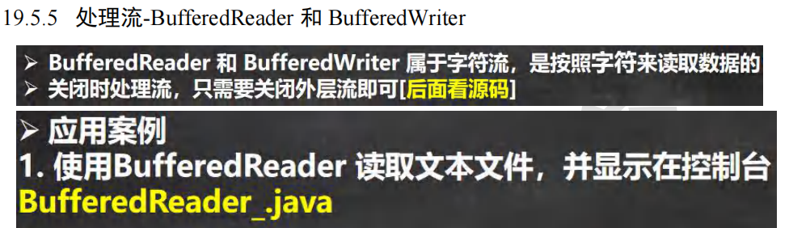 

```java
package com.czl.io;

import java.io.BufferedReader;
import java.io.FileReader;

@SuppressWarnings({"all"})
public class BufferedReader_ {
    public static void main(String[] args) throws Exception {

        String filePath = "C:\\Users\\chenzhoule\\Desktop\\新建文本文档.txt";
        //创建bufferedReader 在bufferedReader里包装FileReader
        BufferedReader bufferedReader = new BufferedReader(new FileReader(filePath));
        //读取
        String line; //按行读取, 效率高
        //说明
        //1. bufferedReader.readLine() 是按行读取文件
        //2. 当返回null 时，表示文件读取完毕
        while ((line = bufferedReader.readLine()) != null) {
            System.out.println(line);
        }

        //关闭流, 这里注意，只需要关闭 BufferedReader ，因为底层会自动的去关闭 节点流 FileReader
        /*
            public void close() throws IOException {
                synchronized (lock) {
                    if (in == null)
                        return;
                    try {
                        in.close();//in 就是我们传入的 new FileReader(filePath), 关闭了.
                    } finally {
                        in = null;
                        cb = null;
                    }
                }
            }
         */
        bufferedReader.close();
    }
}
```


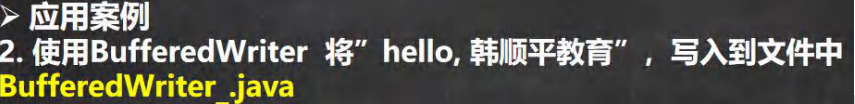 

```java
package com.czl.io;

import java.io.BufferedWriter;
import java.io.FileWriter;
import java.io.IOException;

@SuppressWarnings({"all"})
public class BufferedWriter_ {
    public static void main(String[] args) throws IOException {
        String filePath = "C:\\Users\\chenzhoule\\Desktop\\新建文本文档.txt";
        //创建BufferedWriter
        //说明:
        //1. new FileWriter(filePath, true) 表示以追加的方式写入
        //2. new FileWriter(filePath) , 表示以覆盖的方式写入
        BufferedWriter bufferedWriter = new BufferedWriter(new FileWriter(filePath));
        bufferedWriter.write("hello, czl!");
        bufferedWriter.newLine();//插入一个和系统相关的换行
        bufferedWriter.write("hello2, czl!");
        bufferedWriter.newLine();
        bufferedWriter.write("hello3, czl!");
        bufferedWriter.newLine();

        //说明：关闭外层流即可,传入的 new FileWriter(filePath),会在底层关闭
        bufferedWriter.close();
    }
}
```


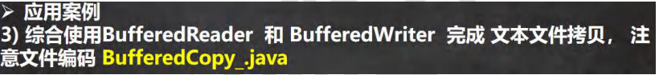 

```java
package com.czl.io;

import java.io.*;

@SuppressWarnings({"all"})
public class BufferedCopy_ {

    public static void main(String[] args) {

        //1. BufferedReader 和 BufferedWriter 是按照字符操作
        //2. 不要去操作 二进制文件[声音，视频，doc, pdf ], 可能造成文件损坏
        String srcFilePath = "C:\\Users\\chenzhoule\\Desktop\\新建文本文档.txt";
        String destFilePath = "C:\\Users\\chenzhoule\\Desktop\\1.txt";
        BufferedReader br = null;
        BufferedWriter bw = null;
        String line;
        try {
            br = new BufferedReader(new FileReader(srcFilePath));
            bw = new BufferedWriter(new FileWriter(destFilePath));

            //说明: readLine 读取一行内容，但是没有换行
            while ((line = br.readLine()) != null) {
                //每读取一行，就写入
                bw.write(line);
                //插入一个换行
                bw.newLine();
            }
            System.out.println("拷贝完毕...");
        } catch (IOException e) {
            e.printStackTrace();
        } finally {
            //关闭流
            try {
                if(br != null) {
                    br.close();
                }
                if(bw != null) {
                    bw.close();
                }
            } catch (IOException e) {
                e.printStackTrace();
            }
        }
    }
}
```


 

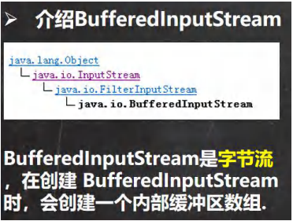 

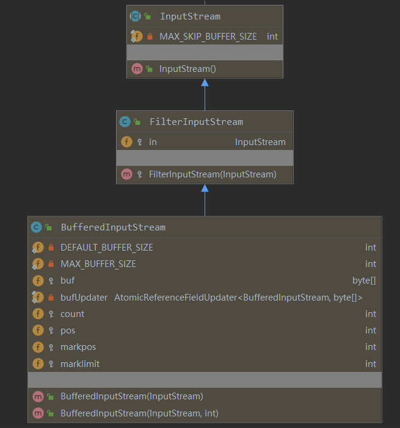 

BufferedInputStream处理流封装了一个in，in是从父类FilterInputStream继承下来的，是InputStream类型的。也就是说，在创建一个BufferedInputStream对象时，只需要传入一个InputStream的实现子类就行。
构造器BufferedInputStream(InputStream)，当要创建一个BufferedInputStream对象时，只需要传一个InputStream就可以了，只要是实现了InputStream的任意节点流都可以接收，会把这个值传到in，BufferedInputStream底层用的是从父类传下来的in。


 

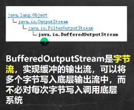 

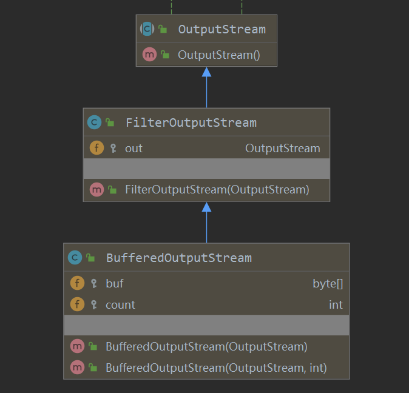 


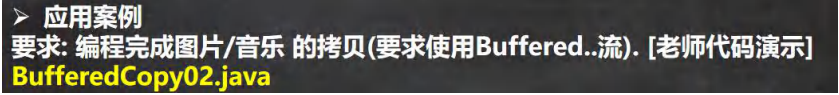 

```java
package com.czl;

import java.io.*;

public class BufferedCopy02 {
    public static void main(String[] args) {

	//字节流既可以操作二进制文件，也可以操作文本文件
//        String srcFilePath = "\.jpg";
//        String destFilePath = "\.jpg";
//        String srcFilePath = "\.avi";
//        String destFilePath = "\.avi";
        String srcFilePath = ".java";
        String destFilePath = ".java";

        //创建BufferedOutputStream对象BufferedInputStream对象
        BufferedInputStream bis = null;
        BufferedOutputStream bos = null;

        try {
            //因为 FileInputStream  是 InputStream 子类
            bis = new BufferedInputStream(new FileInputStream(srcFilePath));
            bos = new BufferedOutputStream(new FileOutputStream(destFilePath));

            //循环的读取文件，并写入到 destFilePath
            byte[] buff = new byte[1024];
            int readLen = 0;
            //当返回 -1 时，就表示文件读取完毕
            while ((readLen = bis.read(buff)) != -1) {
                bos.write(buff, 0, readLen);
            }
            System.out.println("文件拷贝完毕~~~");
        } catch (IOException e) {
            e.printStackTrace();
        } finally {
            //关闭流 , 关闭外层的处理流即可，底层会去关闭节点流
            try {
                if(bis != null) {
                    bis.close();
                }
                if(bos != null) {
                    bos.close();
                }
            } catch (IOException e) {
                e.printStackTrace();
            }
        }
    }
}
```


 

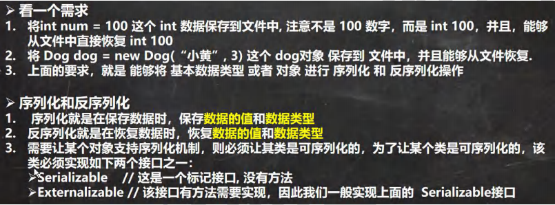 

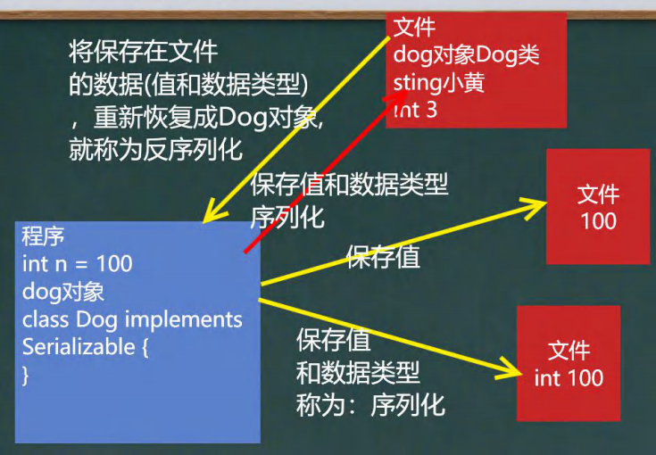 

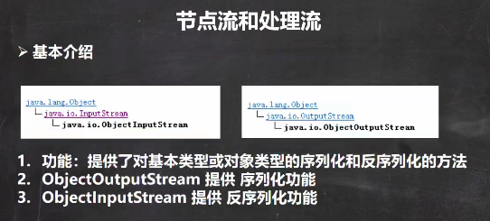 

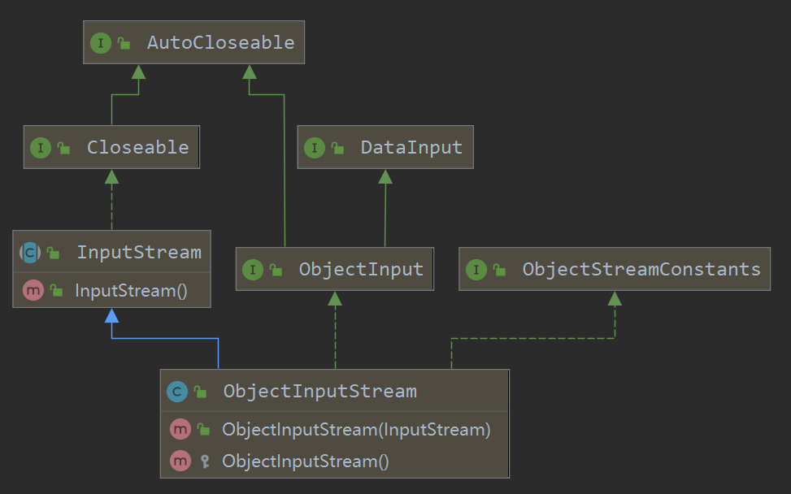 

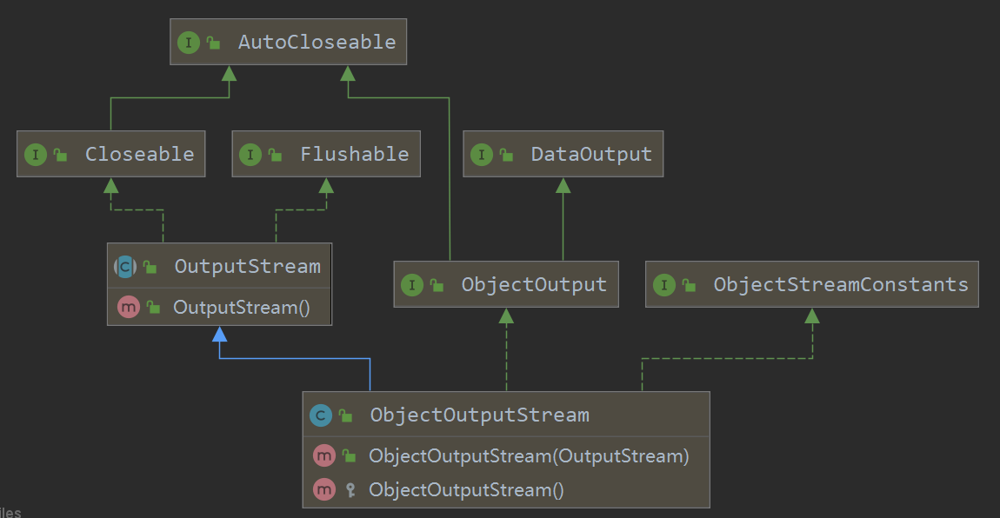 


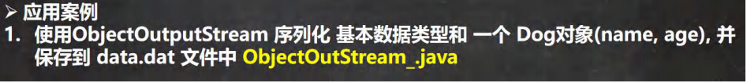 

```java
package com.czl.io;

import java.io.FileOutputStream;
import java.io.ObjectOutputStream;
import java.io.Serializable;

@SuppressWarnings({"all"})
public class ObjectOutStream_ {
    public static void main(String[] args) throws Exception {
        //序列化后，保存的文件格式，不是存文本，而是按照它的格式来保存
        String filePath = "C:\\Users\\chenzhoule\\Desktop\\data.dat";

        ObjectOutputStream oos = new ObjectOutputStream(new FileOutputStream(filePath));

        //序列化数据到 C:\Users\chenzhoule\Desktop\data.dat
        //保存的所有数据，本质是一个对象，必须要实现Serializable接口
        oos.writeInt(100);// int ->自动装箱 Integer (实现了 Serializable)
        oos.writeBoolean(true);// boolean -> Boolean (实现了 Serializable)
        oos.writeChar('a');// char -> Character (实现了 Serializable)
        oos.writeDouble(9.5);// double -> Double (自动装箱)
        oos.writeUTF("czl");//String 自动装箱
        //保存一个dog对象
        oos.writeObject(new Dog("旺财", 10));
        oos.close();
        System.out.println("数据保存完毕(序列化形式)");
    }
}

//如果需要序列化某个类的对象，要实现 Serializable
class Dog implements Serializable {
    private String name;
    private int age;
    public Dog(String name, int age) {
        this.name = name;
        this.age = age;
    }

    @Override
    public String toString() {
        return "Dog{" +
                "name='" + name + '\'' +
                ", age=" + age +
                '}';
    }

    public String getName() {
        return name;
    }

    public void setName(String name) {
        this.name = name;
    }

    public int getAge() {
        return age;
    }

    public void setAge(int age) {
        this.age = age;
    }
}
```


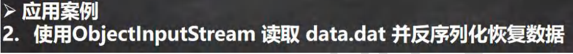 

```java
package com.czl.io;

import java.io.FileInputStream;
import java.io.IOException;
import java.io.ObjectInputStream;

@SuppressWarnings({"all"})
public class ObjectInputStream_ {
    public static void main(String[] args) throws IOException, ClassNotFoundException {

        //指定反序列化的文件
        String filePath = "C:\\Users\\chenzhoule\\Desktop\\data.dat";

        ObjectInputStream ois = new ObjectInputStream(new FileInputStream(filePath));

        //读取
        //1. 读取(反序列化)的顺序需要和你保存数据(序列化)的顺序一致
        //2. 否则会出现异常

        System.out.println(ois.readInt());
        System.out.println(ois.readBoolean());

        System.out.println(ois.readChar());
        System.out.println(ois.readDouble());
        System.out.println(ois.readUTF());

        //dog 的编译类型是 Object , dog 的运行类型是 Dog
        Object dog = ois.readObject();
        System.out.println("运行类型=" + dog.getClass());
        System.out.println("dog信息=" + dog);//底层 Object -> Dog

        //这里是特别重要的细节:
        //1. 如果我们希望调用Dog的方法, 需要向下转型
        //2. 需要我们将Dog类的定义，放到可以引用的位置
        // 保证使用的是同一个Dog类，放在同一个包下或者做成public
        Dog dog2 = (Dog)dog;
        System.out.println(dog2.getName()); //旺财

        //关闭流, 关闭外层流即可，底层会关闭 FileInputStream 流
        ois.close();
    }
}
```

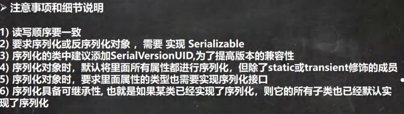 

```java
//如果需要序列化某个类的对象，实现 Serializable
public class Dog implements Serializable {
    private String name;
    private int age;
    //序列化对象时，默认将里面所有属性都进行序列化，但除了static或transient修饰的成员
    private static String nation;
    private transient String color;
    
    //序列化对象时，要求里面属性的类型也需要实现序列化接口
    private Master master = new Master();
    /*
    public class Master implements Serializable {
}
     */

    //serialVersionUID 序列化的版本号，可以提高兼容性
    private static final long serialVersionUID = 1L;

    public Dog(String name, int age, String nation, String color) {
        this.name = name;
        this.age = age;
        this.color = color;
        this.nation = nation;
    }

    @Override
    public String toString() {
        return "Dog{" +
                "name='" + name + '\'' +
                ", age=" + age +
                ", color='" + color + '\'' +
                '}' + nation + " " +master;
    }

    public String getName() {
        return name;
    }

    public void setName(String name) {
        this.name = name;
    }

    public int getAge() {
        return age;
    }

    public void setAge(int age) {
        this.age = age;
    }
}
```


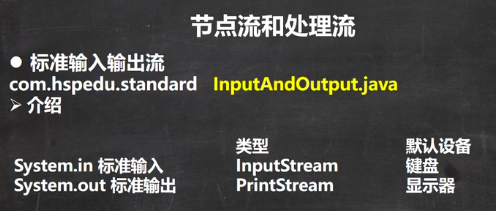 

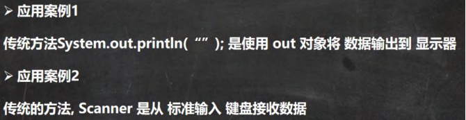 

```java
package com.czl.io;

import java.util.Scanner;

public class InputAndOutput {
    public static void main(String[] args) {
        //System.in 是 System 类 的 public final static InputStream in = null;
        // System.in 编译类型 InputStream
        // System.in 运行类型 BufferedInputStream
        // 表示的是标准输入 键盘
        System.out.println(System.in.getClass());

        //1. System.out public final static PrintStream out = null;
        //2. 编译类型 PrintStream
        //3. 运行类型 PrintStream
        //4. 表示标准输出 显示器
        System.out.println(System.out.getClass());

        System.out.println("hello, czl~");

        Scanner scanner = new Scanner(System.in);
        System.out.println("输入内容");
        String next = scanner.next();
        System.out.println("next=" + next);
    }
}
```


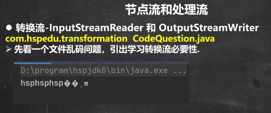 

```java
package com.czl.io;

import java.io.BufferedReader;
import java.io.FileReader;
import java.io.IOException;

@SuppressWarnings({"all"})
public class CodeQuestion {
    public static void main(String[] args) throws IOException {
        //读取C:\Users\chenzhoule\Desktop\1.txt 文件到程序
        //思路
        //1.  创建字符输入流 BufferedReader(处理流)
        //2. 使用 BufferedReader 对象读取1.txt
        //3. 默认情况下，读取文件是按照 utf-8 编码
        String filePath = "C:\\Users\\chenzhoule\\Desktop\\1.txt";
        BufferedReader br = new BufferedReader(new FileReader(filePath));

        String s = br.readLine();
        System.out.println("读取到的内容: " + s);
        br.close();
    }
}
```

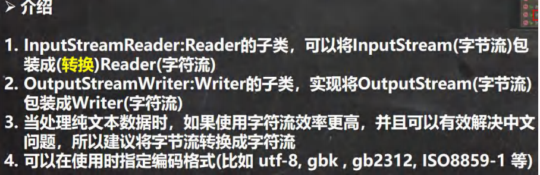 

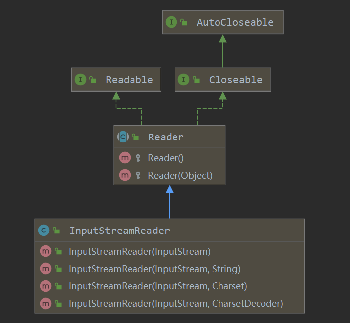 

构造器InputStreamReader(InputStream,Charset)可以传入一个InputStream子类对象，Charset指定编码，也就是说，可以把字节流转成InputStreamReader字符流，同时可以指定编码。

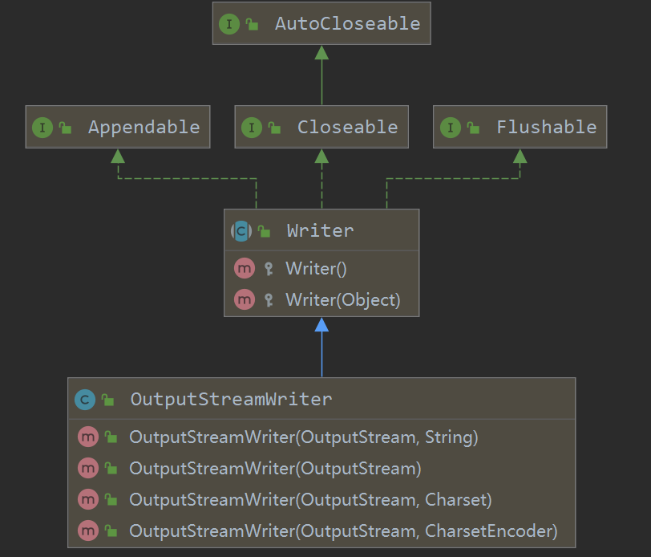 

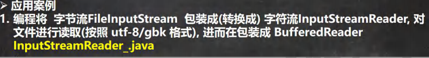 

```java
public class InputStreamReader_ {
    public static void main(String[] args) throws IOException {

        String filePath = "e:\\a.txt";
        //解读
        //1. 把 FileInputStream 转成 InputStreamReader
        //2. 指定编码 gbk
        //InputStreamReader isr = new InputStreamReader(new FileInputStream(filePath), "gbk");
        //3. 把 InputStreamReader 传入 BufferedReader
        //BufferedReader br = new BufferedReader(isr);

        //将2 和 3 合在一起
        BufferedReader br = new BufferedReader(new InputStreamReader(new FileInputStream(filePath), "gbk"));

        //4. 读取
        String s = br.readLine();
        System.out.println("读取内容=" + s);
        //5. 关闭外层流
        br.close();
    }
}
```


```java
public class OutputStreamWriter_ {
    public static void main(String[] args) throws IOException {
        String filePath = "e:\\hsp.txt";
        String charSet = "utf-8";
        OutputStreamWriter osw = new OutputStreamWriter(new FileOutputStream(filePath), charSet);
        osw.write("hi, 韩顺平教育");
        osw.close();
        System.out.println("按照 " + charSet + " 保存文件成功~");
    }
}
```


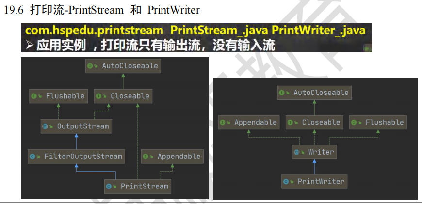

```java
public class PrintStream_ {
    public static void main(String[] args) throws IOException {

        PrintStream out = System.out;
        //在默认情况下，PrintStream 输出数据的位置是 标准输出，即显示器
        /*
             public void print(String s) {
                if (s == null) {
                    s = "null";
                }
                write(s);
            }
         */
        out.print("john, hello");
        //因为print底层使用的是write , 所以我们可以直接调用write进行打印/输出
        out.write("韩顺平,你好".getBytes());
        out.close();

        //我们可以去修改打印流输出的位置/设备
        //1. 输出修改成到 "e:\\f1.txt"
        //2. "hello, 韩顺平教育~" 就会输出到 e:\f1.txt
        //3. public static void setOut(PrintStream out) {
        //        checkIO();
        //        setOut0(out); // native 方法，修改了out
        //   }
        System.setOut(new PrintStream("e:\\f1.txt"));
        System.out.println("hello, 韩顺平教育~");
    }
}
```

```java
public class PrintWriter_ {
    public static void main(String[] args) throws IOException {

        //PrintWriter printWriter = new PrintWriter(System.out);
        PrintWriter printWriter = new PrintWriter(new FileWriter("e:\\f2.txt"));
        printWriter.print("hi, 北京你好~~~~");
        printWriter.close();//flush + 关闭流, 才会将数据写入到文件..
    }
}
```


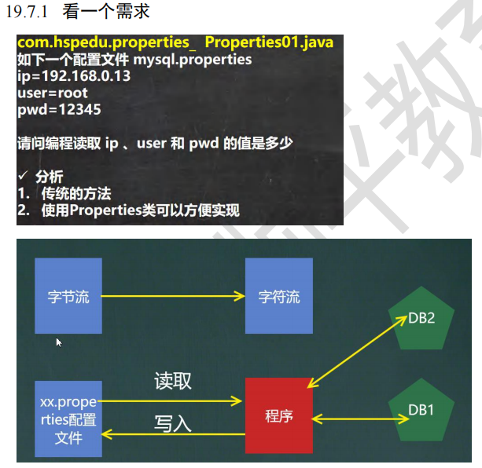

```java
public class Properties01 {
    public static void main(String[] args) throws IOException {
        //读取mysql.properties 文件，并得到ip, user 和 pwd
        BufferedReader br = new BufferedReader(new FileReader("src\\mysql.properties"));
        String line = "";
        while ((line = br.readLine()) != null) { //循环读取
            String[] split = line.split("=");
            //如果我们要求指定的ip值
            if("ip".equals(split[0])) {
                System.out.println(split[0] + "值是: " + split[1]);
            }
        }
        br.close();
    }
}
```

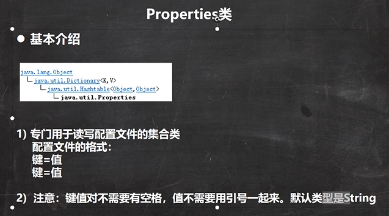

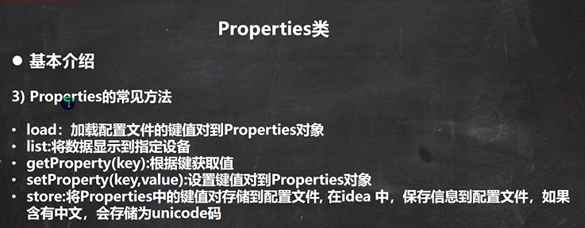

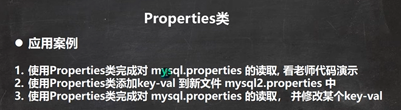

```java
public class Properties02 {
    public static void main(String[] args) throws IOException {
        //使用Properties 类来读取mysql.properties 文件

        //1. 创建Properties 对象
        Properties properties = new Properties();
        //2. 加载指定配置文件
        properties.load(new FileReader("src\\mysql.properties"));
        //3. 把k-v显示控制台
        properties.list(System.out);
        //4. 根据key 获取对应的值
        String user = properties.getProperty("user");
        String pwd = properties.getProperty("pwd");
        System.out.println("用户名=" + user);
        System.out.println("密码是=" + pwd);
    }
}
```

```java
public class Properties03 {
    public static void main(String[] args) throws IOException {
        //使用Properties 类来创建 配置文件, 修改配置文件内容

        Properties properties = new Properties();
        //创建
        //1.如果该文件没有key 就是创建
        //2.如果该文件有key ,就是修改
        properties.setProperty("charset", "utf8");
        properties.setProperty("user", "汤姆");//注意保存时，是中文的 unicode码值
        properties.setProperty("pwd", "888888");

        //将k-v 存储文件中即可
        properties.store(new FileOutputStream("src\\mysql2.properties"), null);
        System.out.println("保存配置文件成功~");
    }
}
```

