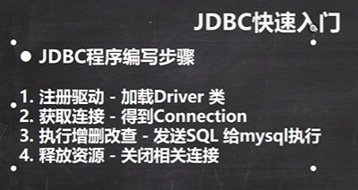
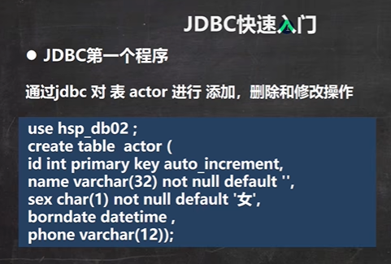
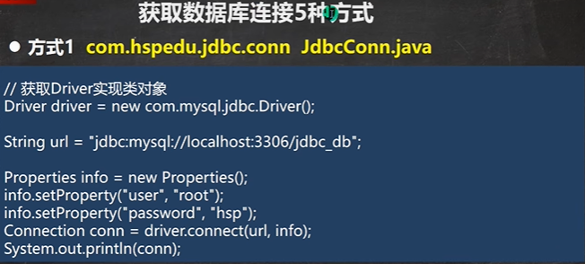
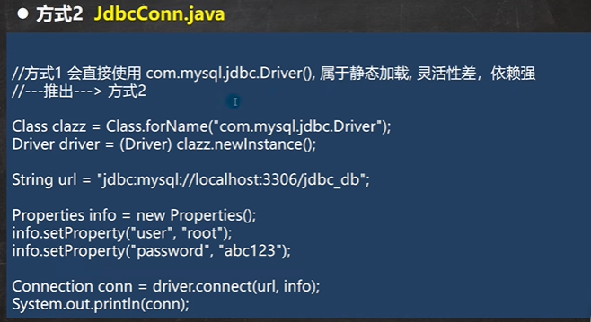
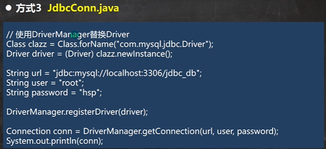
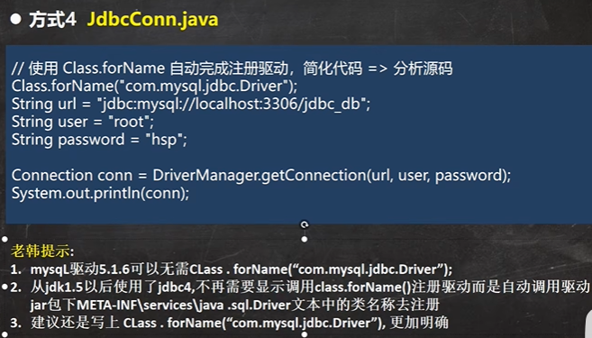
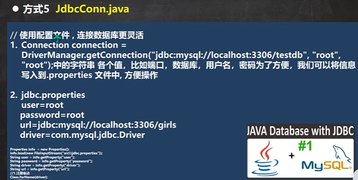

```java
public class Jdbc01 {
    public static void main(String[] args) throws SQLException {

        //前置工作： 在项目下创建一个文件夹比如 libs
        // 将 mysql.jar 拷贝到该目录下，点击 add to project ..加入到项目中
        //1. 注册驱动
        Driver driver = new Driver(); //创建driver对象

        //2. 得到连接
        //(1) jdbc:mysql:// 规定好表示协议，通过jdbc的方式连接mysql
        //(2) localhost 主机，可以是ip地址
        //(3) 3306 表示mysql监听的端口
        //(4) hsp_db02 连接到mysql dbms 的哪个数据库
        //(5) mysql的连接本质就是前面学过的socket连接
        String url = "jdbc:mysql://localhost:3306/hsp_db02";
        //将 用户名和密码放入到Properties 对象
        Properties properties = new Properties();
        //说明 user 和 password 是规定好，后面的值根据实际情况写
        properties.setProperty("user", "root");// 用户
        properties.setProperty("password", "hsp"); //密码
        Connection connect = driver.connect(url, properties);

        //3. 执行sql
        //String sql = "insert into actor values(null, '刘德华', '男', '1970-11-11', '110')";
        //String sql = "update actor set name='周星驰' where id = 1";
        String sql = "delete from actor where id = 1";
        //statement 用于执行静态SQL语句并返回其生成的结果的对象
        Statement statement = connect.createStatement();
        int rows = statement.executeUpdate(sql); // 如果是 dml语句，返回的就是影响行数

        System.out.println(rows > 0 ? "成功" : "失败");

        //4. 关闭连接资源
        statement.close();
        connect.close();
    }
}
```












```java
public class JdbcConn {

    //方式1
    @Test
    public void connect01() throws SQLException {
        Driver driver = new Driver(); //创建driver对象
        String url = "jdbc:mysql://localhost:3306/hsp_db02";
        //将 用户名和密码放入到Properties 对象
        Properties properties = new Properties();
        //说明 user 和 password 是规定好，后面的值根据实际情况写
        properties.setProperty("user", "root");// 用户
        properties.setProperty("password", "hsp"); //密码
        Connection connect = driver.connect(url, properties);
        System.out.println(connect);
    }

    //方式2
    @Test
    public void connect02() throws ClassNotFoundException, IllegalAccessException, InstantiationException, SQLException {
        //使用反射加载Driver类 , 动态加载，更加的灵活，减少依赖性
        Class<?> aClass = Class.forName("com.mysql.jdbc.Driver");
        Driver driver = (Driver)aClass.newInstance();

        String url = "jdbc:mysql://localhost:3306/hsp_db02";
        //将 用户名和密码放入到Properties 对象
        Properties properties = new Properties();
        //说明 user 和 password 是规定好，后面的值根据实际情况写
        properties.setProperty("user", "root");// 用户
        properties.setProperty("password", "hsp"); //密码

        Connection connect = driver.connect(url, properties);
        System.out.println("方式2=" + connect);

    }

    //方式3 使用DriverManager 替代 driver 进行统一管理
    @Test
    public void connect03() throws IllegalAccessException, InstantiationException, ClassNotFoundException, SQLException {

        //使用反射加载Driver
        Class<?> aClass = Class.forName("com.mysql.jdbc.Driver");
        Driver driver = (Driver) aClass.newInstance();

        //创建url 和 user 和 password
        String url = "jdbc:mysql://localhost:3306/hsp_db02";
        String user = "root";
        String password = "hsp";

        DriverManager.registerDriver(driver);//注册Driver驱动

        Connection connection = DriverManager.getConnection(url, user, password);
        System.out.println("第三种方式=" + connection);
    }

    //方式4: 使用Class.forName 自动完成注册驱动，简化代码
    //这种方式获取连接是使用的最多，推荐使用
    @Test
    public void connect04() throws ClassNotFoundException, SQLException {
        //使用反射加载了 Driver类
        //在加载 Driver类时，完成注册
        /*
            源码: 1. 静态代码块，在类加载时，会执行一次.
            2. DriverManager.registerDriver(new Driver());
            3. 因此注册driver的工作已经完成
            static {
                try {
                    DriverManager.registerDriver(new Driver());
                } catch (SQLException var1) {
                    throw new RuntimeException("Can't register driver!");
                }
            }
         */
        Class.forName("com.mysql.jdbc.Driver");

        //创建url 和 user 和 password
        String url = "jdbc:mysql://localhost:3306/hsp_db02";
        String user = "root";
        String password = "hsp";
        Connection connection = DriverManager.getConnection(url, user, password);

        System.out.println("第4种方式~ " + connection);

    }

    //方式5 , 在方式4的基础上改进，增加配置文件，让连接mysql更加灵活
    @Test
    public void connect05() throws IOException, ClassNotFoundException, SQLException {

        //通过Properties对象获取配置文件的信息
        Properties properties = new Properties();
        properties.load(new FileInputStream("src\\mysql.properties"));
        //获取相关的值
        String user = properties.getProperty("user");
        String password = properties.getProperty("password");
        String driver = properties.getProperty("driver");
        String url = properties.getProperty("url");

        Class.forName(driver);//建议写上

        Connection connection = DriverManager.getConnection(url, user, password);

        System.out.println("方式5 " + connection);
    }
}
```