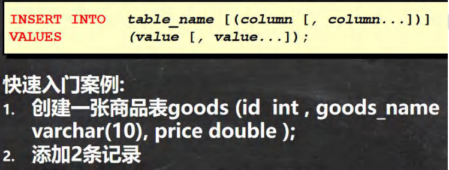
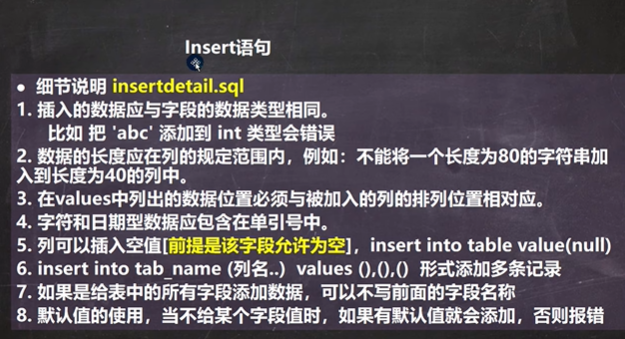
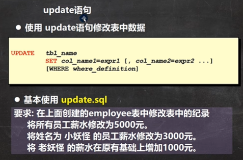
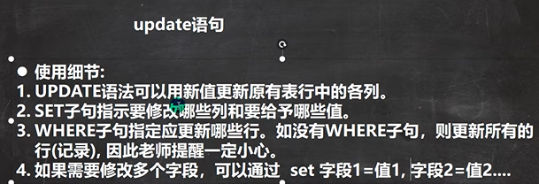
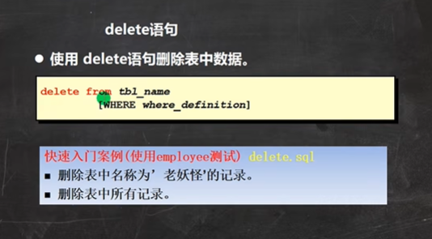
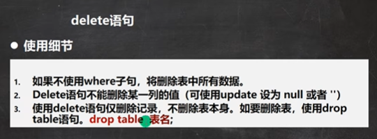
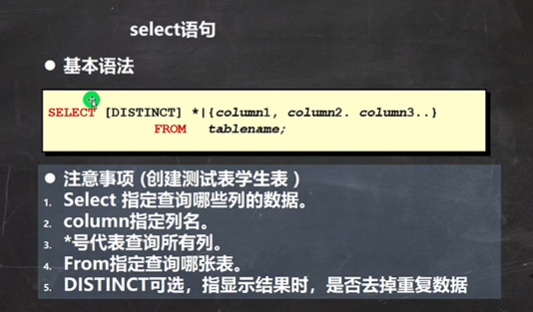
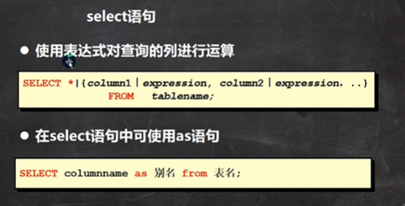
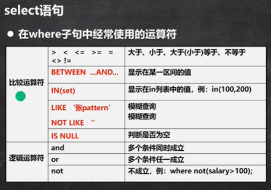
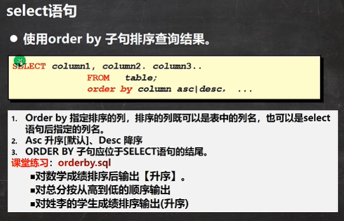

```sql
#练习insert 语句
-- 创建一张商品表goods (id  int , goods_name varchar(10), price double );
-- 添加2条记录
CREATE TABLE `goods` (
	id INT ,
	goods_name VARCHAR(10), -- 长度10
	price DOUBLE NOT NULL DEFAULT 100 );
-- 添加数据
INSERT INTO `goods` (id, goods_name, price) 
	VALUES(10, '华为手机', 2000);
INSERT INTO `goods` (id, goods_name, price) 
	VALUES(20, '苹果手机', 3000);
SELECT * FROM goods;

CREATE TABLE `goods2` (
	id INT ,
	goods_name VARCHAR(10), -- 长度10
	price DOUBLE NOT NULL DEFAULT 100 );
```




```sql
#说明insert 语句的细节
-- 1.插入的数据应与字段的数据类型相同。
--       比如 把 'abc' 添加到 int 类型会错误
INSERT INTO `goods` (id, goods_name, price) 
	VALUES(30, '小米手机', 2000);--'30'可以传进去，MySQL底层把30的字符串转成int
-- 2. 数据的长度应在列的规定范围内，例如：不能将一个长度为80的字符串加入到长度为40的列中。
INSERT INTO `goods` (id, goods_name, price) 
	VALUES(40, 'vovo手机vovo手机vovo手机vovo手机vovo手机', 3000);
-- 3. 在values中列出的数据位置必须与被加入的列的排列位置相对应。
INSERT INTO `goods` (id, goods_name, price)  -- 不对
	VALUES('vovo手机',40, 2000);
-- 4. 字符和日期型数据应包含在单引号中。
INSERT INTO `goods` (id, goods_name, price) 
	VALUES(40, vovo手机, 3000); -- 错误的 vovo手机 应该 'vovo手机'
-- 5. 列可以插入空值[前提是该字段允许为空]，insert into table value(null)
INSERT INTO `goods` (id, goods_name, price) 
	VALUES(40, 'vovo手机', NULL);
-- 6. insert into tab_name (列名..)  values (),(),()  形式添加多条记录
INSERT INTO `goods` (id, goods_name, price) 
	VALUES(50, '三星手机', 2300),(60, '海尔手机', 1800);
-- 7. 如果是给表中的所有字段添加数据，可以不写前面的字段名称
INSERT INTO `goods`   
	VALUES(70, 'IBM手机', 5000);
-- 8. 默认值的使用，当不给某个字段值时，如果有默认值就会添加默认值，否则报错
      -- 如果某个列 没有指定 not null ,那么当添加数据时，没有给定值，则会默认给null
      -- 如果我们希望指定某个列的默认值，可以在创建表时指定
INSERT INTO `goods` (id, goods_name)   
	VALUES(80, '格力手机');

SELECT * FROM goods;

INSERT INTO `goods2` (id, goods_name)   
	VALUES(10, '顺平手机');
SELECT * FROM goods2;
```






```sql
-- 演示update语句
-- 要求: 在上面创建的employee表中修改表中的纪录
-- 1. 将所有员工薪水修改为5000元。[如果没有带where 条件，会修改所有的记录，因此要小心]
UPDATE employee SET salary = 5000 
-- 2. 将姓名为 小妖怪 的员工薪水修改为3000元。
UPDATE employee 
	SET salary = 3000 
	WHERE user_name = '小妖怪' 
-- 3. 将 老妖怪 的薪水在原有基础上增加1000元
INSERT INTO employee 
	VALUES(200, '老妖怪', '1990-11-11', '2000-11-11 10:10:10', '捶背的', 5000, '给大王捶背', 'd:\\a.jpg');

UPDATE employee 
	SET salary = salary + 1000 
	WHERE user_name = '老妖怪' 

-- 可以修改多个列的值
UPDATE employee 
	SET salary = salary + 1000 , job = '出主意的'
	WHERE user_name = '老妖怪' 
SELECT * FROM employee;
```






```sql
-- delete 语句演示

--  删除表中名称为’老妖怪’的记录。
DELETE FROM employee 
	WHERE user_name = '老妖怪';
--  删除表中所有记录, 老师提醒，一定要小心
DELETE FROM employee;

-- Delete语句不能删除某一列的值（可使用update 设为 null 或者 ''）
UPDATE employee SET job = '' WHERE user_name = '老妖怪';

SELECT * FROM employee

-- 要删除这个表
DROP TABLE employee;
```




```sql
-- select 语句【重点 难点】
CREATE TABLE student(
	id INT NOT NULL DEFAULT 1,
	NAME VARCHAR(20) NOT NULL DEFAULT '',
	chinese FLOAT NOT NULL DEFAULT 0.0,
	english FLOAT NOT NULL DEFAULT 0.0,
	math FLOAT NOT NULL DEFAULT 0.0
);

INSERT INTO student(id,NAME,chinese,english,math) VALUES(1,'韩顺平',89,78,90);
INSERT INTO student(id,NAME,chinese,english,math) VALUES(2,'张飞',67,98,56);
INSERT INTO student(id,NAME,chinese,english,math) VALUES(3,'宋江',87,78,77);
INSERT INTO student(id,NAME,chinese,english,math) VALUES(4,'关羽',88,98,90);
INSERT INTO student(id,NAME,chinese,english,math) VALUES(5,'赵云',82,84,67);
INSERT INTO student(id,NAME,chinese,english,math) VALUES(6,'欧阳锋',55,85,45);
INSERT INTO student(id,NAME,chinese,english,math) VALUES(7,'黄蓉',75,65,30);
INSERT INTO student(id,NAME,chinese,english,math) VALUES(8,'韩信',45,65,99);

SELECT * FROM student;

-- 查询表中所有学生的信息。
SELECT * FROM student;
-- 查询表中所有学生的姓名和对应的英语成绩。
SELECT `name`,english FROM student;
-- 过滤表中重复数据 distinct 。
SELECT DISTINCT english FROM student;
-- 要查询的记录，每个字段都相同，才会去重
SELECT DISTINCT `name`, english FROM student;
```



```sql
-- select 语句的使用

-- 统计每个学生的总分
SELECT `name`, (chinese+english+math) FROM student;
-- 在所有学生总分加10分的情况
SELECT `name`, (chinese + english + math + 10) FROM student;
-- 使用别名表示学生分数。
SELECT `name` AS '名字', (chinese + english + math + 10) AS total_score 
	FROM student;
```



```sql
-- select 语句
-- 查询姓名为赵云的学生成绩
SELECT * FROM student 
	WHERE `name` = '赵云'
-- 查询英语成绩大于90分的同学
SELECT * FROM student 
	WHERE english > 90
-- 查询总分大于200分的所有同学
SELECT * FROM student 
	WHERE (chinese + english + math) > 200
	
-- 查询math大于60 并且(and) id大于4的学生成绩
SELECT * FROM student
	WHERE math >60 AND id > 4
-- 查询英语成绩大于语文成绩的同学
SELECT * FROM student
	WHERE english > chinese
-- 查询总分大于200分 并且 数学成绩小于语文成绩,的姓赵的学生.
-- 赵% 表示 名字以赵开头的就可以
SELECT * FROM student
	WHERE (chinese + english + math) > 200 AND 
		math < chinese AND `name` LIKE '赵%'
-- 查询英语分数在 80－90之间的同学。
SELECT * FROM student
	WHERE english >= 80 AND english <= 90;
SELECT * FROM student
	WHERE english BETWEEN 80 AND 90; -- between .. and .. 是 闭区间
-- 查询数学分数为89,90,91的同学。
SELECT * FROM student 
	WHERE math = 89 OR math = 90 OR math = 91;
SELECT * FROM student 
	WHERE math IN (89, 90, 91);
-- 查询所有姓李的学生成绩。
SELECT * FROM student 
	WHERE `name` LIKE '韩%'
-- 查询数学分>80，语文分>80的同学
```



```sql
-- 演示order by使用
-- 对数学成绩排序后输出【升序】。
SELECT * FROM student 
	ORDER BY math;
-- 对总分按从高到低的顺序输出 [降序] -- 使用别名排序
SELECT `name` , (chinese + english + math) AS total_score FROM student 
	ORDER BY total_score DESC;
-- 对姓韩的学生成绩[总分]排序输出(升序) where + order by
SELECT `name`, (chinese + english + math) AS total_score FROM student
	WHERE `name` LIKE '韩%'
	ORDER BY total_score;
```

