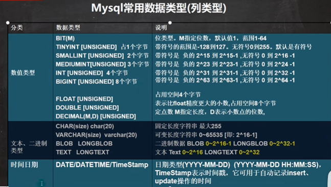


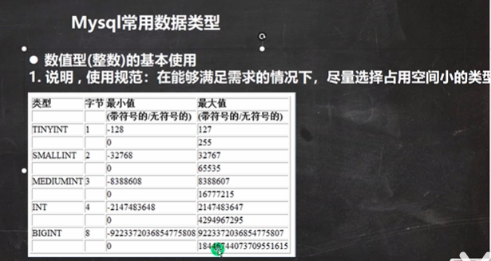

```sql
#演示整型的使用
#使用tinyint 来演示范围 有符号 -128 ~ 127  如果没有符号 0-255
#说明： 表的字符集，校验规则, 存储引擎，老师使用默认
#1. 如果没有指定 unsinged , 则TINYINT就是有符号
#2. 如果指定 unsinged , 则TINYINT就是无符号 0-255
CREATE TABLE t3 (
	id TINYINT);
CREATE TABLE t4 (
	id TINYINT UNSIGNED);
	
INSERT INTO t3 VALUES(127); #这是非常简单的添加语句
SELECT * FROM t3

INSERT INTO t4 VALUES(255);
SELECT * FROM t4;
```


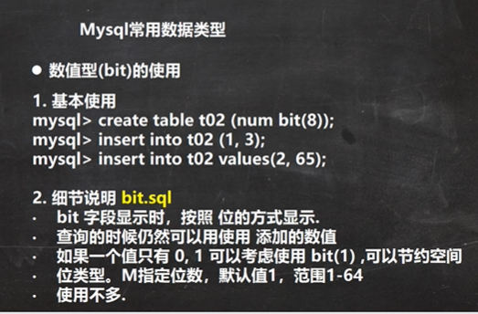

```sql
#演示bit类型使用
#说明
#1. bit(m) m 在 1-64
#2. 添加数据 范围 按照你给的位数来确定，比如m = 8 表示一个字节 0~255
#3. 显示按照bit 
#4. 查询时，仍然可以按照数来查询
CREATE TABLE t05 (num BIT(8));
INSERT INTO t05 VALUES(255); 
SELECT * FROM t05;
SELECT * FROM t05 WHERE num = 1;
```


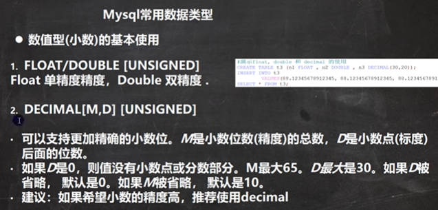

```sql
#演示decimal类型、float、double使用

#创建表
CREATE TABLE t06 (
	num1 FLOAT,
	num2 DOUBLE,
	num3 DECIMAL(30,20));
#添加数据
INSERT INTO t06 VALUES(88.12345678912345, 88.12345678912345,88.12345678912345);
SELECT * FROM t06;

#decimal可以存放很大的数
CREATE TABLE t07 (
	num DECIMAL(65));
INSERT INTO t07 VALUES(8999999933338388388383838838383009338388383838383838383);
SELECT * FROM t07;

CREATE TABLE t08(
	num BIGINT UNSIGNED)
INSERT INTO t08 VALUES(8999999933338388388383838838383009338388383838383838383);
SELECT * FROM t08;
```


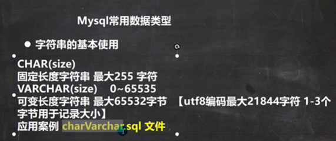

```sql
#演示字符串类型使用char varchar
#注释的快捷键 shift+ctrl+c , 注销注释 shift+ctrl+r
-- CHAR(size)
-- 固定长度字符串 最大255 字符 
-- VARCHAR(size)    0~65535字节
-- 可变长度字符串 最大65532字节  【utf8编码最大21844字符 1-3个字节用于记录大小】
-- 如果表的编码是 utf8 varchar(size) size = (65535-3) / 3 = 21844
-- 如果表的编码是 gbk varchar(size) size = (65535-3) / 2 = 32766
CREATE TABLE t09 (
	`name` CHAR(255));

CREATE TABLE t10 (
	`name` VARCHAR(32766)) CHARSET gbk;

DROP TABLE t10;
```


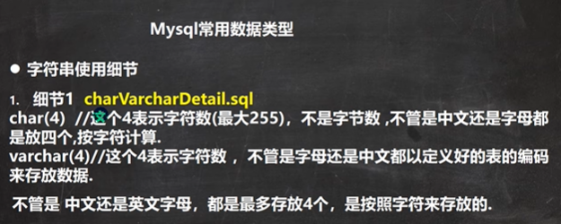

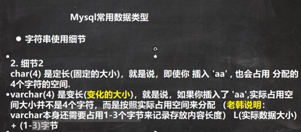

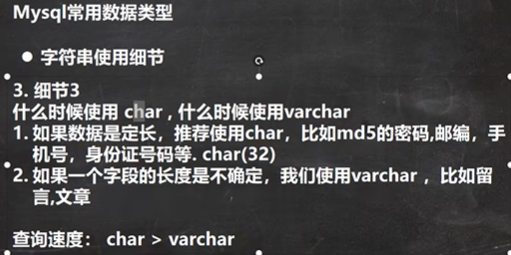

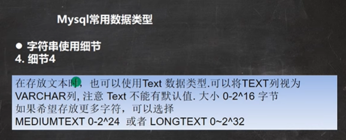

```sql
#演示字符串类型的使用细节
#char(4) 和 varchar(4) 这个4表示的是字符，而不是字节, 不区分字符是汉字还是字母
CREATE TABLE t11(
	`name` CHAR(4));
INSERT INTO t11 VALUES('韩顺平好');

SELECT * FROM t11;

CREATE TABLE t12(
	`name` VARCHAR(4));
INSERT INTO t12 VALUES('韩顺平好');
INSERT INTO t12 VALUES('ab北京');
SELECT * FROM t12;

#如果varchar 不够用，可以考试使用mediumtext 或者longtext, 
#如果想简单点，可以使用直接使用text
CREATE TABLE t13( content TEXT, content2 MEDIUMTEXT , content3 LONGTEXT);
INSERT INTO t13 VALUES('韩顺平教育', '韩顺平教育100', '韩顺平教育1000~~');
SELECT * FROM t13;
```


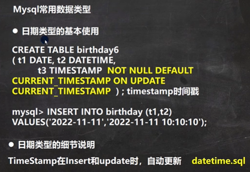

```sql
#演示时间相关的类型
#创建一张表, date , datetime , timestamp
CREATE TABLE t14 (
	birthday DATE , -- 生日
	job_time DATETIME, -- 记录年月日 时分秒
	login_time TIMESTAMP 
		NOT NULL DEFAULT CURRENT_TIMESTAMP 
		ON UPDATE CURRENT_TIMESTAMP); -- 登录时间, 如果希望login_time列自动更新, 需要配置
		
SELECT * FROM t14;
INSERT INTO t14(birthday, job_time) 
	VALUES('2022-11-11','2022-11-11 10:10:10');
-- 如果我们更新 t14表的某条记录，login_time列会自动的以当前时间进行更新
```


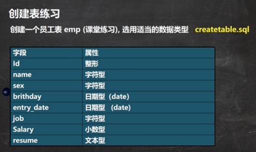

```sql
#创建表的课堂练习
CREATE TABLE `emp` (
	id INT,
	`name` VARCHAR(32),
	sex CHAR(1), 
	brithday DATE,
	entry_date DATETIME,
	job VARCHAR(32),
	salary DOUBLE,
	`resume` TEXT) CHARSET utf8 COLLATE utf8_bin ENGINE INNODB;
-- 添加一条
INSERT INTO `emp`
	VALUES(100, '小妖怪', '男', '2000-11-11', 
		'2010-11-10 11:11:11', '巡山的', 3000, '大王叫我来巡山');
		
SELECT * FROM `emp`;
```


