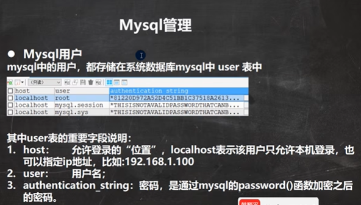
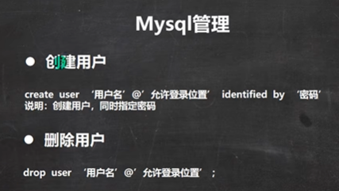
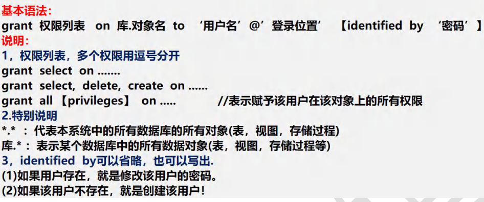
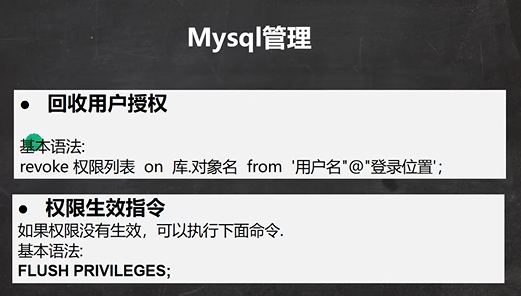
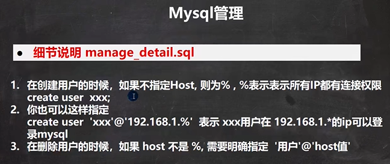

```sql
-- Mysql用户的管理
-- 原因：当我们做项目开发时，可以根据不同的开发人员，赋给他相应的Mysql操作权限
-- 所以，Mysql数据库管理人员(root), 根据需要创建不同的用户，赋给相应的权限，供人员使用

-- 1. 创建新的用户
-- 解读 (1) 'hsp_edu'@'localhost' 表示用户的完整信息 'hsp_edu' 用户名 'localhost' 登录的IP
-- (2) 123456 密码, 但是注意 存放到 mysql.user表时，是password('123456') 加密后的密码
--     *6BB4837EB74329105EE4568DDA7DC67ED2CA2AD9
CREATE USER 'hsp_edu'@'localhost' IDENTIFIED BY '123456'

SELECT `host`, `user`, authentication_string  
	FROM mysql.user

-- 2. 删除用户
DROP USER 'hsp_edu'@'localhost'

-- 3. 登录

-- root 用户修改 hsp_edu@localhost 密码, 是可以成功.
SET PASSWORD FOR 'hsp_edu'@'localhost' = PASSWORD('123456')
```

```sql
--  修改自己的密码, 没问题
SET PASSWORD = PASSWORD('abcdef')

-- 修改其他人的密码， 需要权限
SET PASSWORD FOR 'root'@'localhost' = PASSWORD('123456')
```


Mysql中的权限


给用户授权





```sql
-- 演示 用户权限的管理

-- 创建用户 shunping  密码 123 , 从本地登录
CREATE USER 'shunping'@'localhost' IDENTIFIED BY '123'

-- 使用root 用户创建 testdb  ,表 news
CREATE DATABASE testdb
CREATE TABLE news (
	id INT ,
	content VARCHAR(32));
-- 添加一条测试数据
INSERT INTO news VALUES(100, '北京新闻');
SELECT * FROM news;

-- 给 shunping 分配查看 news 表和 添加news的权限
GRANT SELECT , INSERT 
	ON testdb.news
	TO 'shunping'@'localhost'
	
-- 可以增加update权限
GRANT UPDATE  
	ON testdb.news
	TO 'shunping'@'localhost'
	
	
-- 修改 shunping的密码为 abc
SET PASSWORD FOR 'shunping'@'localhost' = PASSWORD('abc');

-- 回收 shunping 用户在 testdb.news 表的所有权限
REVOKE SELECT , UPDATE, INSERT ON testdb.news FROM 'shunping'@'localhost'
REVOKE ALL ON testdb.news FROM 'shunping'@'localhost'

-- 删除 shunping
DROP USER 'shunping'@'localhost'
```




```sql
-- 说明 用户管理的细节
-- 在创建用户的时候，如果不指定Host, 则为% , %表示表示所有IP都有连接权限 
-- create user  xxx;

CREATE USER jack

SELECT `host`, `user` FROM mysql.user

-- 你也可以这样指定 
-- create user  'xxx'@'192.168.1.%'  表示 xxx用户在 192.168.1.*的ip可以登录mysql

CREATE USER 'smith'@'192.168.1.%'

-- 在删除用户的时候，如果 host 不是 %, 需要明确指定  '用户'@'host值'

DROP USER jack -- 默认就是 DROP USER 'jack'@'%'

DROP USER 'smith'@'192.168.1.%'
```

