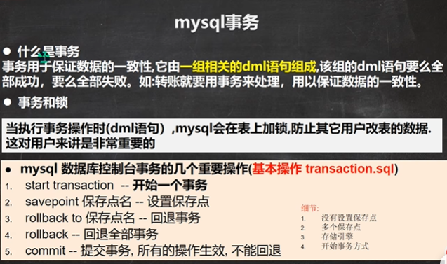

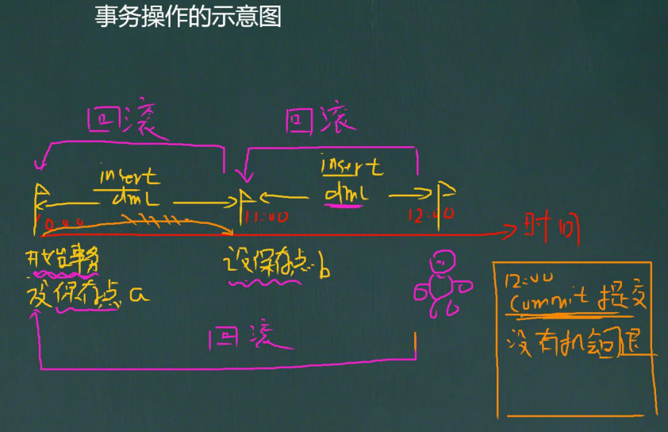

```sql
-- 事务的一个重要的概念和具体操作
-- 看一个图[看示意图]
-- 演示
-- 1. 创建一张测试表
CREATE TABLE t27
	( id INT,
	  `name` VARCHAR(32));
-- 2. 开始事务
START TRANSACTION 
-- 3. 设置保存点
SAVEPOINT a
-- 执行dml 操作
INSERT INTO t27 VALUES(100, 'tom');
SELECT * FROM t27;

SAVEPOINT b
-- 执行dml操作
INSERT INTO t27 VALUES(200, 'jack');

-- 回退到 b
ROLLBACK TO b
-- 继续回退 a
ROLLBACK TO a
-- 如果这样, 表示直接回退到事务开始的状态.
ROLLBACK 
COMMIT
```

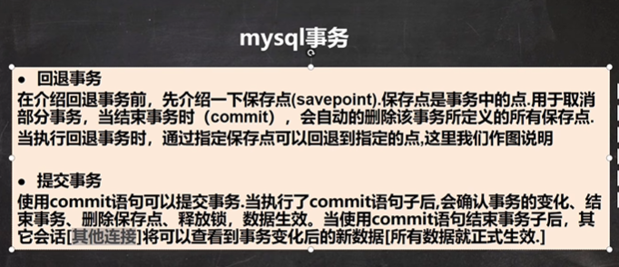

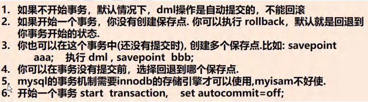

```sql
-- 讨论 事务细节
-- 1. 如果不开始事务，默认情况下，dml操作是自动提交的，不能回滚
INSERT INTO t27 VALUES(300, 'milan'); -- 自动提交 commit

SELECT * FROM t27

-- 2. 如果开始一个事务，你没有创建保存点. 你可以执行 rollback，
-- 默认就是回退到你事务开始的状态
START TRANSACTION 
INSERT INTO t27 VALUES(400, 'king');
INSERT INTO t27 VALUES(500, 'scott');
ROLLBACK -- 表示直接回退到事务开始的的状态
COMMIT;

-- 3. 你也可以在这个事务中(还没有提交时), 创建多个保存点.比如: savepo int 	aaa;    
-- 执行 dml , savepoint  bbb

-- 4. 你可以在事务没有提交前，选择回退到哪个保存点
-- 5. InnoDB 存储引擎支持事务 , MyISAM 不支持
-- 6. 开始一个事务 start  transaction,    set autocommit=off;
```


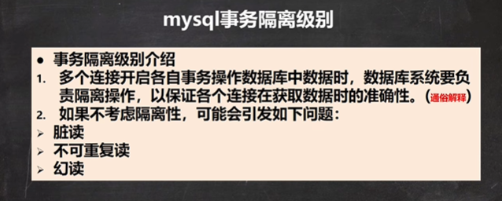

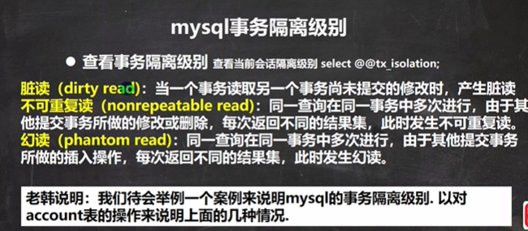

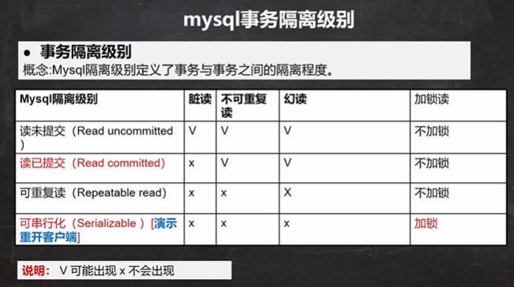

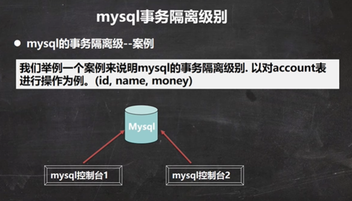

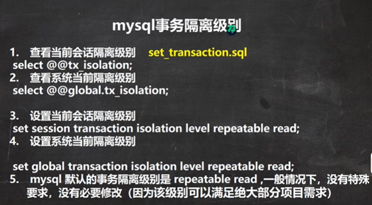

```sql
-- 演示mysql的事务隔离级别

-- 1. 开了两个mysql的控制台
-- 2. 查看当前mysql的隔离级别
SELECT @@tx_isolation;

-- mysql> SELECT @@tx_isolation;
-- +-----------------+
-- | @@tx_isolation  |
-- +-----------------+
-- | REPEATABLE-READ |
-- +-----------------+

-- 3.把其中一个控制台的隔离级别设置 Read uncommitted

SET SESSION TRANSACTION ISOLATION LEVEL READ UNCOMMITTED

-- 4. 创建表
CREATE TABLE `account`(
	id INT,
	`name` VARCHAR(32),
	money INT);

-- 查看当前会话隔离级别 
SELECT @@tx_isolation
-- 查看系统当前隔离级别
SELECT @@global.tx_isolation
-- 设置当前会话隔离级别
SET SESSION TRANSACTION ISOLATION LEVEL READ UNCOMMITTED
-- 设置系统当前隔离级别
SET GLOBAL TRANSACTION ISOLATION LEVEL [你设置的级别]
```


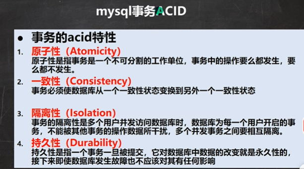


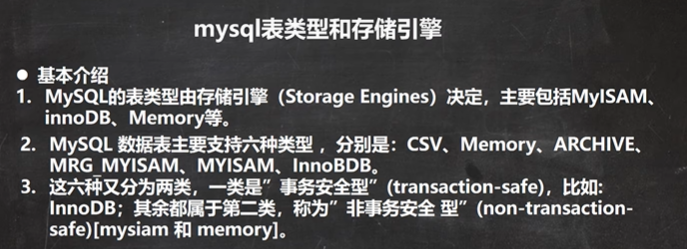

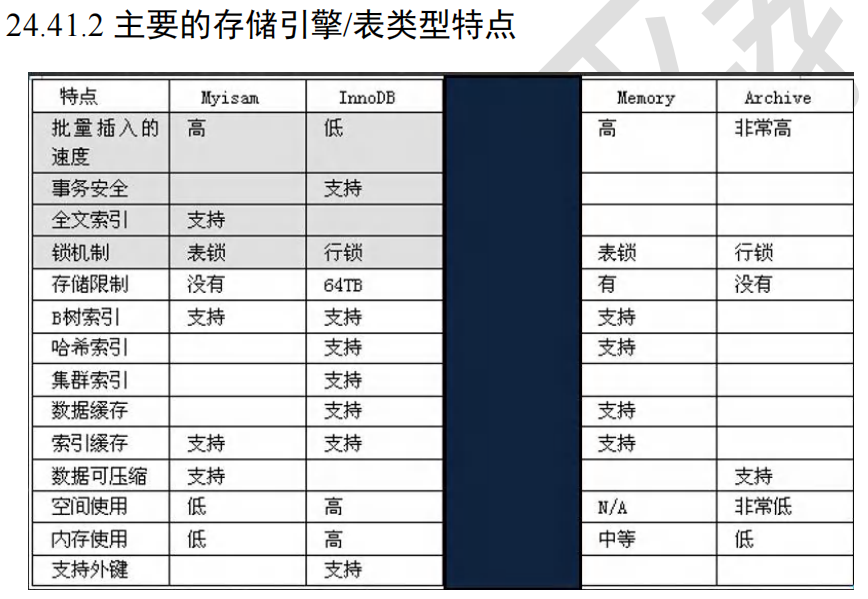

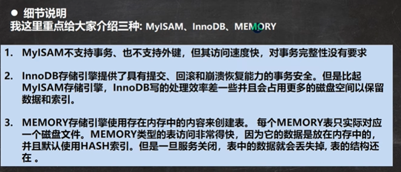

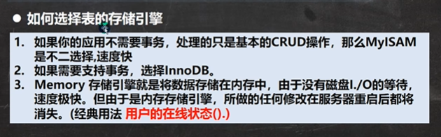

```sql
-- 表类型和存储引擎

-- 查看所有的存储引擎
SHOW ENGINES
-- innodb 存储引擎，是前面使用过.
-- 1. 支持事务 2. 支持外键 3. 支持行级锁

-- myisam 存储引擎
CREATE TABLE t28 (
	id INT,
	`name` VARCHAR(32)) ENGINE MYISAM
-- 1. 添加速度快 2. 不支持外键和事务 3. 支持表级锁

START TRANSACTION;
SAVEPOINT t1
INSERT INTO t28 VALUES(1, 'jack');
SELECT * FROM t28;
ROLLBACK TO t1

-- memory 存储引擎
-- 1. 数据存储在内存中[关闭了Mysql服务，数据丢失, 但是表结构还在] 
-- 2. 执行速度很快(没有IO读写) 3. 默认支持索引(hash表)

CREATE TABLE t29 (
	id INT,
	`name` VARCHAR(32)) ENGINE MEMORY
DESC t29
INSERT INTO t29
	VALUES(1,'tom'), (2,'jack'), (3, 'hsp');
SELECT * FROM t29

-- 指令修改存储引擎
ALTER TABLE `t29` ENGINE = INNODB
```

