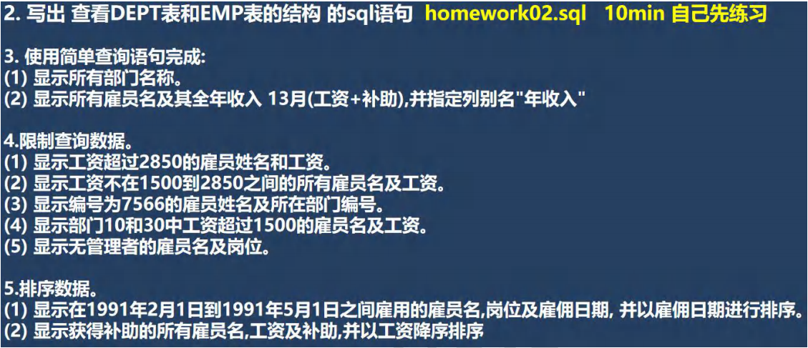
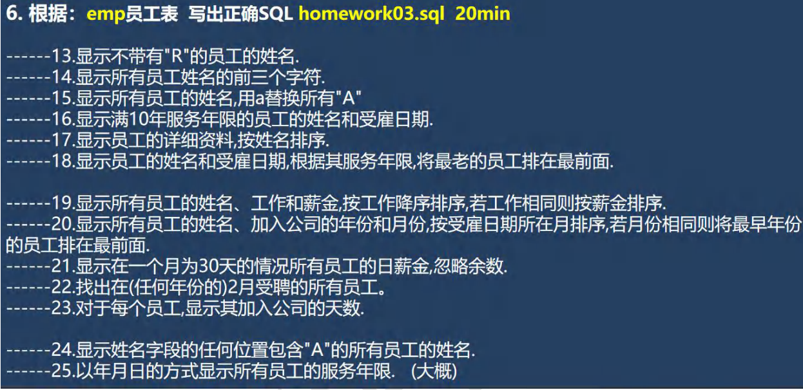
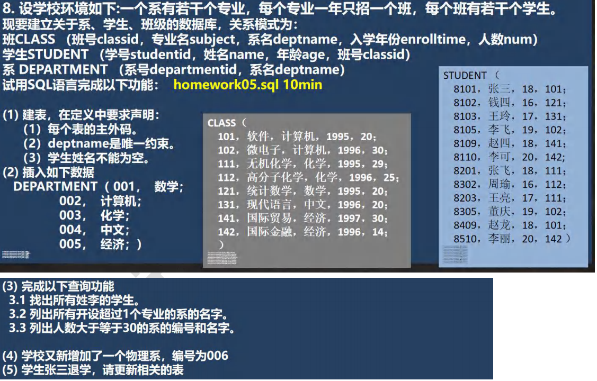

```sql
-- 2. 写出 查看DEPT表和EMP表的结构 的sql语句  
-- 
	DESC dept
	DESC emp
-- 3. 使用简单查询语句完成:
-- (1) 显示所有部门名称。
SELECT dname 
	FROM dept;
-- (2) 显示所有雇员名及其全年收入 13月(工资+补助),并指定列别名"年收入"
SELECT ename, (sal + IFNULL(comm,0)) * 13 AS "年收入"--comm可能是空的
	FROM emp 
SELECT * FROM emp;

-- 
-- 4.限制查询数据。
-- (1) 显示工资超过2850的雇员姓名和工资。
SELECT ename, sal
	FROM emp 
	WHERE sal > 2850
-- (2) 显示工资不在1500到2850之间的所有雇员名及工资。
SELECT ename, sal
	FROM emp 
	WHERE sal < 1500 OR sal > 2850
	
SELECT ename, sal
	FROM emp 
	WHERE NOT (sal >= 1500 AND sal <= 2850)
-- (3) 显示编号为7566的雇员姓名及所在部门编号。
SELECT ename, deptno
	FROM emp 
	WHERE empno = 7566
-- (4) 显示部门10和30中工资超过1500的雇员名及工资。
SELECT ename, job
	FROM emp 
	WHERE (deptno = 10 OR deptno = 30) AND sal > 1500
-- (5) 显示无管理者的雇员名及岗位。
SELECT ename, job 
	FROM emp
	WHERE mgr IS NULL;
	
-- 
-- 5.排序数据。
-- (1) 显示在1991年2月1日到1991年5月1日之间雇用的雇员名,岗位及雇佣日期, 
-- 并以雇佣日期进行排序[默认]。
-- 思路 1. 先查询到对应结果 2. 考虑排序
SELECT ename, job, hiredate
	FROM emp
	WHERE hiredate >= '1991-02-01' AND hiredate <= '1991-05-01'
	ORDER BY hiredate

-- (2) 显示获得补助的所有雇员名,工资及补助,并以工资降序排序
SELECT ename, sal, comm
	FROM emp
	ORDER BY sal DESC
```




```sql
-- homework03

-- ------1.选择部门30中的所有员工.
SELECT * FROM 
	emp
	WHERE deptno = 30
-- ------2.列出所有办事员(CLERK)的姓名，编号和部门编号. 
SELECT ename, empno, deptno, job FROM 
	emp
	WHERE job = 'CLERK'
-- ------3.找出佣金高于薪金的员工.
SELECT * FROM 
	emp
	WHERE IFNULL(comm, 0) > sal
-- ------4.找出佣金高于薪金60%的员工.
SELECT * FROM 
	emp
	WHERE IFNULL(comm, 0) > sal * 0.6
-- ------5.找出部门10中所有经理(MANAGER)和部门20中所有办事员(CLERK)的详细资料.
-- 
SELECT * FROM
	emp
	WHERE (deptno = 10 AND job = 'MANAGER') 
	OR (deptno = 20 AND job = 'CLERK')
-- ------6.找出部门10中所有经理(MANAGER),部门20中所有办事员(CLERK), 
 -- 还有既不是经理又不是办事员但其薪金大于或等于2000的所有员工的详细资料.
SELECT * FROM
	emp
	WHERE (deptno = 10 AND job = 'MANAGER') 
	OR (deptno = 20 AND job = 'CLERK')
	OR (job != 'MANAGER' AND job != 'CLERK' AND sal >= 2000 )
-- ------7.找出收取佣金的员工的不同工作.
SELECT DISTINCT job
	FROM emp
	WHERE comm IS NOT NULL

-- ------8.找出不收取佣金或收取的佣金低于100的员工.
SELECT *
	FROM emp
	WHERE comm IS  NULL OR IFNULL(comm, 0) < 100
-- ------9.找出各月倒数第3天受雇的所有员工.
-- 老韩提示: last_day(日期)， 可以返回该日期所在月份的最后一天
-- last_day(日期) - 2 得到日期所有月份的倒数第3天
SELECT * 
	FROM emp
	WHERE LAST_DAY(hiredate) - 2  =  hiredate

-- ------10.找出早于12年前受雇的员工.（即： 入职时间超过12年）
SELECT * 
	FROM emp
	WHERE DATE_ADD(hiredate, INTERVAL 12 YEAR) < NOW() 

-- 
-- ------11.以首字母小写的方式显示所有员工的姓名.
SELECT CONCAT(LCASE(SUBSTRING(ename,1,1)), SUBSTRING(ename,2))
	FROM emp;
-- ------12.显示正好为5个字符的员工的姓名.

SELECT * 
	FROM emp
	WHERE LENGTH(ename) = 5

-- ------13.显示不带有"R"的员工的姓名.
SELECT * 
	FROM emp
	WHERE ename NOT LIKE '%R%'
-- ------14.显示所有员工姓名的前三个字符.
SELECT LEFT(ename,3)
	FROM emp
-- ------15.显示所有员工的姓名,用a替换所有"A"
SELECT REPLACE(ename, 'A', 'a') 
	FROM emp
-- ------16.显示满10年服务年限的员工的姓名和受雇日期.
SELECT ename, hiredate
	FROM emp
	WHERE DATE_ADD(hiredate, INTERVAL 10 YEAR) <= NOW()
-- ------17.显示员工的详细资料,按姓名排序.

-- ------18.显示员工的姓名和受雇日期,根据其服务年限,将最老的员工排在最前面.
-- 
SELECT ename, hiredate
	FROM emp
	ORDER BY hiredate 
-- ------19.显示所有员工的姓名、工作和薪金,按工作降序排序,若工作相同则按薪金排序.
SELECT ename, job, sal
	FROM emp
	ORDER BY job DESC, sal 
-- ------20.显示所有员工的姓名、加入公司的年份和月份,按受雇日期所在月排序,
-- 若月份相同则将最早年份的员工排在最前面.
SELECT ename, CONCAT(YEAR(hiredate),'-', MONTH(hiredate))
	FROM emp
	ORDER BY MONTH(hiredate), YEAR(hiredate)

-- ------21.显示在一个月为30天的情况所有员工的日薪金,忽略余数.
SELECT ename, FLOOR(sal / 30), sal / 30 
	FROM emp; 
-- ------22.找出在(任何年份的)2月受聘的所有员工。
SELECT * 
	FROM emp
	WHERE MONTH(hiredate) = 2
-- ------23.对于每个员工,显示其加入公司的天数.
-- 
SELECT ename, DATEDIFF(NOW(), hiredate) 
	FROM emp
-- ------24.显示姓名字段的任何位置包含"A"的所有员工的姓名.
SELECT *
	FROM emp
	WHERE ename LIKE '%A%'
-- ------25.以年月日的方式显示所有员工的服务年限.   (大概)

-- 思路 1. 先求出 工作了多少天 
SELECT ename, FLOOR(DATEDIFF(NOW(), hiredate) / 365) AS " 工作年 ", 
	FLOOR((DATEDIFF(NOW(), hiredate) % 365) / 31) AS " 工作月 ",
	DATEDIFF(NOW(), hiredate) % 31 AS " 工作天"
	FROM emp;
```


```sql
-- 
-- (1)．列出至少有一个员工的所有部门

/*
	先查出各个部门有多少人
	使用 having 子句过滤
*/
SELECT COUNT(*) AS c, deptno
	FROM emp 
	GROUP BY deptno 
	HAVING c > 1
-- (2)．列出薪金比“SMITH”多的所有员工。
/*
	先查出 smith 的 sal => 作为子查询
	然后其他员工 sal 大于 smith 即可
*/
SELECT * 
	FROM emp
	WHERE sal > (
		SELECT sal 
			FROM emp 
			WHERE ename = 'SMITH'
	)
-- (3)．列出受雇日期晚于其直接上级的所有员工。
/*
	先把 emp 表 当做两张表 worker , leader
	条件 1. worker.hiredate > leader.hiredate
	     2. worker.mgr = leader.empno
*/

SELECT worker.ename AS '员工名', worker.hiredate AS '员工入职时间',
	leader.ename  AS '上级名', leader.hiredate AS '上级入职时间' 
	FROM emp worker , emp leader
	WHERE worker.hiredate > leader.hiredate 
	AND worker.mgr = leader.empno;

-- (4)．列出部门名称和这些部门的员工信息，同时列出那些没有员工的部门。

/*
	这里因为需要显示所有部门，因此考虑使用外连接，(左外连接)
	如果没有印象了，去看看老师讲的外连接.
*/
SELECT dname, emp.*
	FROM dept 
	LEFT JOIN emp ON dept.deptno = emp.deptno 

-- (5)．列出所有“CLERK”（办事员）的姓名及其部门名称。

SELECT ename, dname , job
	FROM emp, dept
	WHERE job = 'CLERK' AND emp.deptno = dept.deptno

-- (6)．列出最低薪金大于1500的各种工作。

/*
	查询各个部门的最低工资
	使用having 子句进行过滤
*/
SELECT MIN(sal) AS min_sal , job
	FROM emp
	GROUP BY job
	HAVING min_sal > 1500
-- (7)．列出在部门“SALES”（销售部）工作的员工的姓名。

SELECT ename, dname
	FROM emp , dept
	WHERE emp.deptno = dept.deptno AND dname = 'SALES'

-- (8)．列出薪金高于公司平均薪金的所有员工。

SELECT *
	FROM emp
	WHERE sal > (
		SELECT AVG(sal) 
			FROM emp
	)

-- (9)．列出与“SCOTT”从事相同工作的所有员工。

SELECT * 
	FROM emp
	WHERE job = (
		SELECT job 
			FROM emp
			WHERE ename = 'SCOTT'
	) AND ename != 'SCOTT'

-- (10)．列出薪金高于所在部门30的工作的所有员工的薪金的员工姓名和薪金。


-- 先查询出30部门的最高工资
SELECT ename, sal 
	FROM emp 
	WHERE sal > (
		SELECT MAX(sal) 
			FROM emp
			WHERE deptno = 30
	) 
-- (11)．列出在每个部门工作的员工数量、平均工资和平均服务期限(时间单位)。
-- 老师建议 ， 写sql 也是一步一步完成的
SELECT COUNT(*) AS "部门员工数量", deptno , AVG(sal) AS "部门平均工资" , 
	FORMAT(AVG(DATEDIFF(NOW(), hiredate) / 365 ),2) AS " 平均服务期限(年)"
	FROM emp 
	GROUP BY deptno

-- (12)．列出所有员工的姓名、部门名称和工资。

-- 就是 emp 和 dept 联合查询 ，连接条件就是 emp.deptno = dept.deptno

-- (13)．列出所有部门的详细信息和部门人数。

-- 1. 先得到各个部门人数 , 把下面的结果看成临时表 和 dept表联合查询
SELECT COUNT(*) AS c , deptno 
	FROM emp
	GROUP BY deptno

-- 2. 
SELECT dept.*, tmp.c AS "部门人数"
	FROM dept, (
		SELECT COUNT(*) AS c , deptno 
		FROM emp
		GROUP BY deptno
	) tmp 
	WHERE dept.deptno = tmp.deptno

-- (14)．列出各种工作的最低工资。

SELECT MIN(sal), job
	FROM emp
	GROUP BY job
-- (15)．列出MANAGER（经理）的最低薪金。

SELECT MIN(sal), job
	FROM emp
	WHERE job = 'MANAGER'
-- (16)．列出所有员工的年工资,按年薪从低到高排序。

-- 1. 先得到员工的年工资
SELECT ename, (sal + IFNULL(comm, 0)) * 12 year_sal
	FROM emp
	ORDER BY year_sal 
```



```sql
-- 完成最后一个综合的练习

-- 创建表 系 DEPARTMENT （系号departmentid，系名deptname）
CREATE TABLE DEPARTMENT (
	departmentid VARCHAR(32) PRIMARY KEY,
	deptname VARCHAR(32) UNIQUE NOT NULL);
	
-- 班CLASS （班号classid，专业名subject，系名deptname，入学年份enrolltime，人数num）
CREATE TABLE `class` (
	classid INT PRIMARY KEY,
	`subject` VARCHAR(32) NOT NULL DEFAULT '',
	deptname VARCHAR(32) , -- 外键字段，在表定义后指定
	enrolltime INT NOT NULL DEFAULT 2000,
	num INT NOT NULL DEFAULT 0,
	FOREIGN KEY (deptname) REFERENCES  DEPARTMENT(deptname));
	
-- 学生STUDENT （学号studentid，姓名name，年龄age，班号classid）
CREATE TABLE hsp_student (
	studentid INT PRIMARY KEY,
	`name` VARCHAR(32) NOT NULL DEFAULT '',
	age INT NOT NULL DEFAULT 0,
	classid INT, -- 外键
	FOREIGN KEY (classid) REFERENCES  `class`(classid));
	
-- 添加测试数据

INSERT INTO department VALUES('001','数学');
INSERT INTO department VALUES('002','计算机');
INSERT INTO department VALUES('003','化学');
INSERT INTO department VALUES('004','中文');
INSERT INTO department VALUES('005','经济');

INSERT INTO class VALUES(101,'软件','计算机',1995,20);
INSERT INTO class VALUES(102,'微电子','计算机',1996,30);
INSERT INTO class VALUES(111,'无机化学','化学',1995,29);
INSERT INTO class VALUES(112,'高分子化学','化学',1996,25);
INSERT INTO class VALUES(121,'统计数学','数学',1995,20);
INSERT INTO class VALUES(131,'现代语言','中文',1996,20);
INSERT INTO class VALUES(141,'国际贸易','经济',1997,30);
INSERT INTO class VALUES(142,'国际金融','经济',1996,14);

INSERT INTO hsp_student VALUES(8101,'张三',18,101);
INSERT INTO hsp_student VALUES(8102,'钱四',16,121);
INSERT INTO hsp_student VALUES(8103,'王玲',17,131);
INSERT INTO hsp_student VALUES(8105,'李飞',19,102);
INSERT INTO hsp_student VALUES(8109,'赵四',18,141);
INSERT INTO hsp_student VALUES(8110,'李可',20,142);
INSERT INTO hsp_student VALUES(8201,'张飞',18,111);
INSERT INTO hsp_student VALUES(8302,'周瑜',16,112);
INSERT INTO hsp_student VALUES(8203,'王亮',17,111);
INSERT INTO hsp_student VALUES(8305,'董庆',19,102);
INSERT INTO hsp_student VALUES(8409,'赵龙',18,101);

SELECT * FROM department
SELECT * FROM class
SELECT * FROM hsp_student

-- (3) 完成以下查询功能
--   3.1 找出所有姓李的学生。
-- 查表 hsp_student , like
SELECT * 
	FROM hsp_student
	WHERE `name` LIKE '李%' 
--   3.2 列出所有开设超过1个专业的系的名字。

-- 1. 先查询各个系有多少个专业
SELECT COUNT(*) AS nums, deptname 
	FROM class
	GROUP BY deptname HAVING nums > 1
--   3.3 列出人数大于等于30的系的编号和名字。
-- 1. 先查出各个系有多少人, 并得到 >= 30 的系

SELECT SUM(num) AS nums, deptname  
	FROM class 
	GROUP BY  deptname 
	HAVING nums >= 30
	
-- 2. 将上面的结果看成一个临时表 和 department 联合查询即可

SELECT  tmp.*, department.departmentid
	FROM department , (
		SELECT SUM(num) AS nums, deptname  
		FROM class 
		GROUP BY  deptname 
		HAVING nums >= 30
	) tmp 
	WHERE department.deptname = tmp.deptname;
	


-- (4) 学校又新增加了一个物理系，编号为006
-- 添加一条数据
INSERT INTO department VALUES('006','物理系');
-- (5) 学生张三退学，请更新相关的表

-- 分析：1. 张三所在班级的人数-1 2. 将张三从学生表删除  3. 需要使用事务控制

-- 开启事务
START TRANSACTION;
-- 张三所在班级的人数-1 
UPDATE class SET num = num - 1
	WHERE classid = (
		SELECT classid 
			FROM hsp_student 
			WHERE NAME = '张三'
	);

DELETE 
	FROM hsp_student
	WHERE NAME = '张三';
	
-- 提交事务
COMMIT;

SELECT * FROM hsp_student;
SELECT * FROM class
```

