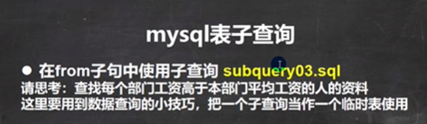

```sql
-- 多表查询的 自连接

-- 思考题: 显示公司员工名字和他的上级的名字

-- 老韩分析： 员工名字 在emp, 上级的名字 emp
-- 员工和上级是通过 emp表的 mgr 列关联
-- 这里老师小结：
-- 自连接的特点 1. 把同一张表当做两张表使用
--               2. 需要给表取别名 表名  表别名 
--		 3. 列名不明确，可以指定列的别名 列名 as 列的别名		
SELECT worker.ename AS '职员名' ,  boss.ename AS '上级名'
	FROM emp worker, emp boss
	WHERE worker.mgr = boss.empno;
SELECT * FROM emp;
```


```sql
-- 子查询的演示
-- 请思考：如何显示与SMITH同一部门的所有员工?
/*
	1. 先查询到 SMITH的部门号得到
	2. 把上面的select 语句当做一个子查询来使用
*/
SELECT deptno 
	FROM emp 
	WHERE ename = 'SMITH'

-- 下面的答案.	
SELECT * 
	FROM emp
	WHERE deptno = (
		SELECT deptno 
		FROM emp 
		WHERE ename = 'SMITH'
	)

-- 课堂练习:如何查询和部门10的工作相同的雇员的
-- 名字、岗位、工资、部门号, 但是不含10号部门自己的雇员.

/*
	1. 查询到10号部门有哪些工作
	2. 把上面查询的结果当做子查询使用
*/
select distinct job 
	from emp 
	where deptno = 10;
	
--  下面语句完整

select ename, job, sal, deptno
	from emp
	where job in (
		SELECT DISTINCT job 
		FROM emp 
		WHERE deptno = 10
	) and deptno <> 10 
```


```sql
-- ecshop.sql
-- 查询ecshop中各个类别中，价格最高的商品

-- 查询 商品表
-- 先得到 各个类别中，价格最高的商品 max + group by cat_id, 当做临时表
-- 把子查询当做一张临时表可以解决很多很多复杂的查询

select cat_id , max(shop_price) 
	from ecs_goods
	group by cat_id
	
	
-- 这个最后答案	
select goods_id, ecs_goods.cat_id, goods_name, shop_price 
	from (
		SELECT cat_id , MAX(shop_price) as max_price
		FROM ecs_goods
		GROUP BY cat_id
	) temp , ecs_goods
	where  temp.cat_id = ecs_goods.cat_id 
	and temp.max_price = ecs_goods.shop_price 
```


```sql
-- all 和 any的使用

-- 请思考:显示工资比部门30的所有员工的工资高的员工的姓名、工资和部门号

SELECT ename, sal, deptno
	FROM emp
	WHERE sal > ALL(
		SELECT sal 
			FROM emp
			WHERE deptno = 30
		) 
-- 可以这样写
SELECT ename, sal, deptno
	FROM emp
	WHERE sal > (
		SELECT MAX(sal) 
			FROM emp
			WHERE deptno = 30
		) 

-- 请思考:如何显示工资比部门30的其中一个员工的工资高的员工的姓名、工资和部门号

SELECT ename, sal, deptno
	FROM emp
	WHERE sal > any(
		SELECT sal 
			FROM emp
			WHERE deptno = 30
		)

 SELECT ename, sal, deptno
	FROM emp
	WHERE sal > (
		SELECT min(sal) 
			FROM emp
			WHERE deptno = 30
		)
```


```sql
-- 多列子查询

-- 请思考如何查询与allen的部门和岗位完全相同的所有雇员(并且不含allen本人)
-- (字段1， 字段2 ...) = (select 字段 1，字段2 from 。。。。)

-- 分析: 1. 得到smith的部门和岗位

SELECT deptno , job
	FROM emp 
	WHERE ename = 'ALLEN'
	
-- 分析: 2  把上面的查询当做子查询来使用，并且使用多列子查询的语法进行匹配
SELECT * 
	FROM emp
	WHERE (deptno , job) = (
		SELECT deptno , job
		FROM emp 
		WHERE ename = 'ALLEN'
	) AND ename != 'ALLEN'


-- 请查询 和宋江数学，英语，语文   
-- 成绩 完全相同的学生
SELECT * 
	FROM student
	WHERE (math, english, chinese) = (
		SELECT math, english, chinese
		FROM student
		WHERE `name` = '宋江'
	)

SELECT * FROM student;
```




```sql
-- 子查询练习

-- 请思考：查找每个部门工资高于本部门平均工资的人的资料
-- 这里要用到数据查询的小技巧，把一个子查询当作一个临时表使用

-- 1. 先得到每个部门的 部门号和 对应的平均工资

SELECT deptno, AVG(sal) AS avg_sal
	FROM emp GROUP BY deptno
	
-- 2. 把上面的结果当做子查询, 和 emp 进行多表查询
--    
SELECT ename, sal, temp.avg_sal, emp.deptno
	FROM emp, (
		SELECT deptno, AVG(sal) AS avg_sal
		FROM emp 
		GROUP BY deptno
	) temp 
	where emp.deptno = temp.deptno and emp.sal > temp.avg_sal
	
-- 查找每个部门工资最高的人的详细资料

SELECT ename, sal, temp.max_sal, emp.deptno
	FROM emp, (
		SELECT deptno, max(sal) AS max_sal
		FROM emp 
		GROUP BY deptno
	) temp 
	WHERE emp.deptno = temp.deptno AND emp.sal = temp.max_sal
	

-- 查询每个部门的信息(包括：部门名,编号,地址)和人员数量,我们一起完成。

-- 1. 部门名,编号,地址 来自 dept表
-- 2. 各个部门的人员数量 -》 构建一个临时表

select count(*), deptno 
	from emp
	group by deptno;
	

select dname, dept.deptno, loc , tmp.per_num as '人数'
	from dept, (
		SELECT COUNT(*) as per_num, deptno 
		FROM emp
		GROUP BY deptno
	) tmp 
	where tmp.deptno = dept.deptno

-- 还有一种写法 表.* 表示将该表所有列都显示出来, 可以简化sql语句
-- 在多表查询中，当多个表的列不重复时，才可以直接写列名

SELECT tmp.* , dname, loc
	FROM dept, (
		SELECT COUNT(*) AS per_num, deptno 
		FROM emp
		GROUP BY deptno
	) tmp 
	WHERE tmp.deptno = dept.deptno
```


```sql
-- 表的复制
-- 为了对某个sql语句进行效率测试，我们需要海量数据时，可以使用此法为表创建海量数据

CREATE TABLE my_tab01 
	( id INT,
	  `name` VARCHAR(32),
	  sal DOUBLE,
	  job VARCHAR(32),
	  deptno INT);
DESC my_tab01
SELECT * FROM my_tab01;

-- 演示如何自我复制
-- 1. 先把emp 表的记录复制到 my_tab01
INSERT INTO my_tab01 
	(id, `name`, sal, job,deptno)
	SELECT empno, ename, sal, job, deptno FROM emp;
-- 2. 自我复制
INSERT INTO my_tab01
	SELECT * FROM my_tab01;
SELECT COUNT(*) FROM my_tab01;

-- 如何删除掉一张表重复记录
-- 1. 先创建一张表 my_tab02, 
-- 2. 让 my_tab02 有重复的记录

CREATE TABLE my_tab02 LIKE emp; -- 这个语句 把emp表的结构(列)，复制到my_tab02

desc my_tab02;

insert into my_tab02
	select * from emp;
select * from my_tab02;
-- 3. 考虑去重 my_tab02的记录
/*
	思路 
	(1) 先创建一张临时表 my_tmp , 该表的结构和 my_tab02一样
	(2) 把my_tmp 的记录 通过 distinct 关键字 处理后 把记录复制到 my_tmp
	(3) 清除掉 my_tab02 记录
	(4) 把 my_tmp 表的记录复制到 my_tab02
	(5) drop 掉 临时表my_tmp
*/
-- (1) 先创建一张临时表 my_tmp , 该表的结构和 my_tab02一样

create table my_tmp like my_tab02
-- (2) 把my_tmp 的记录 通过 distinct 关键字 处理后 把记录复制到 my_tmp
insert into my_tmp 
	select distinct * from my_tab02;

-- (3) 清除掉 my_tab02 记录
delete from my_tab02;
-- (4) 把 my_tmp 表的记录复制到 my_tab02
insert into my_tab02
	select * from my_tmp;
-- (5) drop 掉 临时表my_tmp
drop table my_tmp;

select * from my_tab02;
```


```sql
-- 合并查询

SELECT ename,sal,job FROM emp WHERE sal>2500 -- 5

SELECT ename,sal,job FROM emp WHERE job='MANAGER' -- 3

-- union all 就是将两个查询结果合并，不会去重
SELECT ename,sal,job FROM emp WHERE sal>2500 -- 5
UNION ALL
SELECT ename,sal,job FROM emp WHERE job='MANAGER' -- 3

-- union  就是将两个查询结果合并，会去重
SELECT ename,sal,job FROM emp WHERE sal>2500 -- 5
UNION 
SELECT ename,sal,job FROM emp WHERE job='MANAGER' -- 3
```

