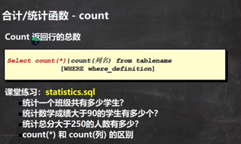

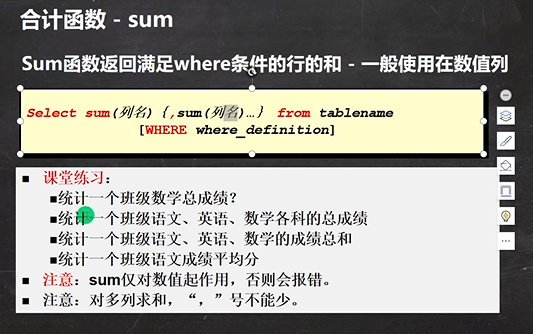

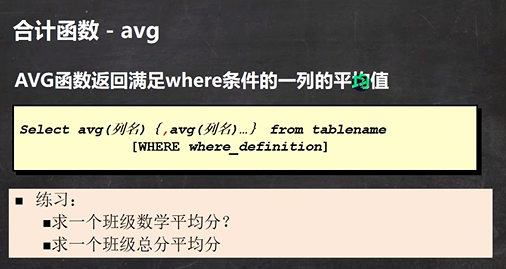

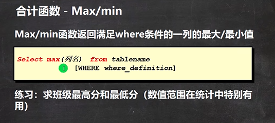

```sql
-- 演示mysql的统计函数的使用
-- 统计一个班级共有多少学生？
SELECT COUNT(*) FROM student;
-- 统计数学成绩大于90的学生有多少个？
SELECT COUNT(*) FROM student
	WHERE math > 90
-- 统计总分大于250的人数有多少？
SELECT COUNT(*) FROM student
	WHERE (math + english + chinese) > 250
-- count(*) 和 count(列) 的区别 
-- 解释 :count(*) 返回满足条件的记录的行数
-- count(列): 统计满足条件的某列有多少个，但是会排除 为null的情况
CREATE TABLE t15 (
	`name` VARCHAR(20));
INSERT INTO t15 VALUES('tom');
INSERT INTO t15 VALUES('jack');
INSERT INTO t15 VALUES('mary');
INSERT INTO t15 VALUES(NULL);
SELECT * FROM t15;

SELECT COUNT(*) FROM t15; -- 4
SELECT COUNT(`name`) FROM t15;-- 3


-- 演示sum函数的使用
-- 统计一个班级数学总成绩？
SELECT SUM(math) FROM student;
-- 统计一个班级语文、英语、数学各科的总成绩
SELECT SUM(math) AS math_total_score,SUM(english),SUM(chinese) FROM student;
-- 统计一个班级语文、英语、数学的成绩总和
SELECT SUM(math + english + chinese) FROM student;
-- 统计一个班级语文成绩平均分
SELECT SUM(chinese)/ COUNT(*)  FROM student;
SELECT SUM(`name`) FROM student;

-- 演示avg的使用
-- 练习：
-- 求一个班级数学平均分？
SELECT AVG(math) FROM student;
-- 求一个班级总分平均分
SELECT AVG(math + english + chinese) FROM student;

-- 演示max 和 min的使用
-- 求班级最高分和最低分（数值范围在统计中特别有用）
SELECT MAX(math + english + chinese), MIN(math + english + chinese) 
	FROM student;

-- 求出班级数学最高分和最低分
SELECT MAX(math) AS math_high_socre, MIN(math)  AS math_low_socre
	FROM student;
```


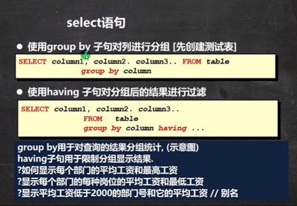

```sql
CREATE TABLE dept( /*部门表*/
deptno MEDIUMINT   UNSIGNED  NOT NULL  DEFAULT 0, 
dname VARCHAR(20)  NOT NULL  DEFAULT "",
loc VARCHAR(13) NOT NULL DEFAULT ""
);

INSERT INTO dept VALUES(10, 'ACCOUNTING', 'NEW YORK'), 
(20, 'RESEARCH', 'DALLAS'), 
(30, 'SALES', 'CHICAGO'), 
(40, 'OPERATIONS', 'BOSTON');

SELECT * FROM dept;

-- 员工表

CREATE TABLE emp
(empno  MEDIUMINT UNSIGNED  NOT NULL  DEFAULT 0, /*编号*/
ename VARCHAR(20) NOT NULL DEFAULT "", /*名字*/
job VARCHAR(9) NOT NULL DEFAULT "",/*工作*/
mgr MEDIUMINT UNSIGNED ,/*上级编号*/
hiredate DATE NOT NULL,/*入职时间*/
sal DECIMAL(7,2)  NOT NULL,/*薪水*/
comm DECIMAL(7,2) ,/*红利 奖金*/
deptno MEDIUMINT UNSIGNED NOT NULL DEFAULT 0 /*部门编号*/
);

-- 添加测试数据
 INSERT INTO emp VALUES(7369, 'SMITH', 'CLERK', 7902, '1990-12-17', 800.00,NULL , 20), 
(7499, 'ALLEN', 'SALESMAN', 7698, '1991-2-20', 1600.00, 300.00, 30),  
(7521, 'WARD', 'SALESMAN', 7698, '1991-2-22', 1250.00, 500.00, 30),  
(7566, 'JONES', 'MANAGER', 7839, '1991-4-2', 2975.00,NULL,20),  
(7654, 'MARTIN', 'SALESMAN', 7698, '1991-9-28',1250.00,1400.00,30),  
(7698, 'BLAKE','MANAGER', 7839,'1991-5-1', 2850.00,NULL,30),  
(7782, 'CLARK','MANAGER', 7839, '1991-6-9',2450.00,NULL,10),  
(7788, 'SCOTT','ANALYST',7566, '1997-4-19',3000.00,NULL,20),  
(7839, 'KING','PRESIDENT',NULL,'1991-11-17',5000.00,NULL,10),  
(7844, 'TURNER', 'SALESMAN',7698, '1991-9-8', 1500.00, NULL,30),  
(7900, 'JAMES','CLERK',7698, '1991-12-3',950.00,NULL,30),  
(7902, 'FORD', 'ANALYST',7566,'1991-12-3',3000.00, NULL,20),  
(7934,'MILLER','CLERK',7782,'1992-1-23', 1300.00, NULL,10);

SELECT * FROM emp;

-- 工资级别
#工资级别表
CREATE TABLE salgrade
(
grade MEDIUMINT UNSIGNED NOT NULL DEFAULT 0, /*工资级别*/ 
losal DECIMAL(17,2)  NOT NULL, /* 该级别的最低工资 */
hisal DECIMAL(17,2)  NOT NULL /* 该级别的最高工资*/
);

INSERT INTO salgrade VALUES (1,700,1200);
INSERT INTO salgrade VALUES (2,1201,1400);
INSERT INTO salgrade VALUES (3,1401,2000);
INSERT INTO salgrade VALUES (4,2001,3000);
INSERT INTO salgrade VALUES (5,3001,9999);

SELECT * FROM salgrade;
SELECT * FROM dept;
SELECT * FROM emp;

# 演示group by + having
GROUP by用于对查询的结果分组统计, (示意图)
-- having子句用于限制分组显示结果.
-- ?如何显示每个部门的平均工资和最高工资
-- 老韩分析: avg(sal) max(sal)
-- 按照部分来分组查询
SELECT AVG(sal), MAX(sal) , deptno 
	FROM  emp GROUP BY deptno; 
-- 使用数学方法，对小数点进行处理
SELECT FORMAT(AVG(sal),2), MAX(sal) , deptno 
	FROM  emp GROUP BY deptno; 

-- ?显示每个部门的每种岗位的平均工资和最低工资
-- 老师分析 1. 显示每个部门的平均工资和最低工资
--          2. 显示每个部门的每种岗位的平均工资和最低工资
SELECT AVG(sal), MIN(sal) , deptno, job 
	FROM  emp GROUP BY deptno, job; 

-- ?显示平均工资低于2000的部门号和它的平均工资 // 别名

-- 老师分析 [写sql语句的思路是化繁为简,各个击破]
-- 1. 显示各个部门的平均工资和部门号
-- 2. 在1的结果基础上，进行过滤，保留 AVG(sal) < 2000
-- 3. 使用别名进行过滤 

SELECT AVG(sal), deptno 
	FROM emp GROUP BY deptno
		HAVING AVG(sal) < 2000;
-- 使用别名		
SELECT AVG(sal) AS avg_sal, deptno 
	FROM emp GROUP BY deptno
		HAVING avg_sal < 2000;	
```


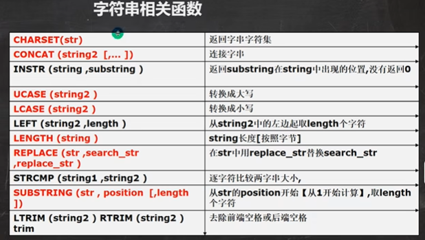

```sql
-- 演示字符串相关函数的使用  ， 使用emp表来演示
-- CHARSET(str)	返回字串字符集
SELECT CHARSET(ename) FROM emp;
-- CONCAT (string2  [,... ])	连接字串, 将多个列拼接成一列
SELECT CONCAT(ename, ' 工作是 ', job) FROM emp;

-- INSTR (string ,substring )	返回substring在string中出现的位置,没有返回0
-- dual 亚元表, 系统表 可以作为测试表使用
SELECT INSTR('hanshunping', 'ping') FROM DUAL; 

-- UCASE (string2 )	转换成大写
SELECT UCASE(ename) FROM emp;

-- LCASE (string2 )	转换成小写

SELECT LCASE(ename) FROM emp;
-- LEFT (string2 ,length )	从string2中的左边起取length个字符
-- RIGHT (string2 ,length )	从string2中的右边起取length个字符
SELECT LEFT(ename, 2) FROM emp;

-- LENGTH (string )	string长度[按照字节]
SELECT LENGTH(ename) FROM emp;
-- REPLACE (str ,search_str ,replace_str ) 	
-- 在str中用replace_str替换search_str
-- 如果是manager 就替换成 经理
SELECT ename, REPLACE(job,'MANAGER', '经理')  FROM emp;

-- STRCMP (string1 ,string2 )	逐字符比较两字串大小
SELECT STRCMP('hsp', 'hsp') FROM DUAL;
-- SUBSTRING (str , position  [,length ])	
-- 从str的position开始【从1开始计算】,取length个字符
-- 从ename 列的第一个位置开始取出2个字符
SELECT SUBSTRING(ename, 1, 2) FROM emp;

-- LTRIM (string2 ) RTRIM (string2 )  TRIM(string)
-- 去除前端空格或后端空格
SELECT LTRIM('  韩顺平教育') FROM DUAL;
SELECT RTRIM('韩顺平教育   ') FROM DUAL;
SELECT TRIM('    韩顺平教育   ') FROM DUAL;

-- 练习: 以首字母小写的方式显示所有员工emp表的姓名
-- 方法1 
-- 思路先取出ename 的第一个字符，转成小写的
-- 把他和后面的字符串进行拼接输出即可

SELECT CONCAT(LCASE(SUBSTRING(ename,1,1)),  SUBSTRING(ename,2)) AS new_name
	FROM emp;  

SELECT CONCAT(LCASE(LEFT(ename,1)),  SUBSTRING(ename,2)) AS new_name
	FROM emp; 
```


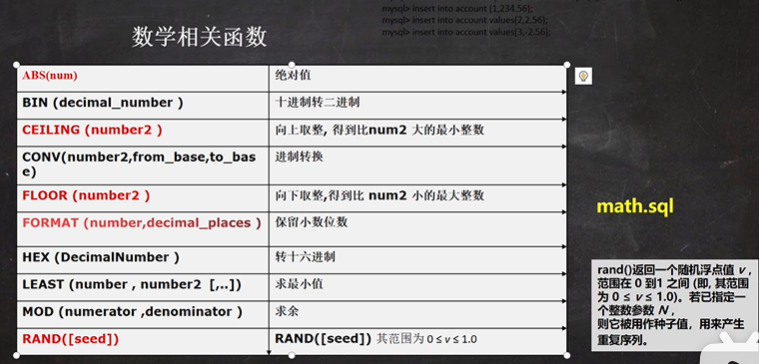

```sql
-- 演示数学相关函数

-- ABS(num)	绝对值
SELECT ABS(-10) FROM DUAL;
-- BIN (decimal_number )十进制转二进制
SELECT BIN(10) FROM DUAL;
-- CEILING (number2 )	向上取整, 得到比num2 大的最小整数
SELECT CEILING(-1.1) FROM DUAL;

-- CONV(number2,from_base,to_base)	进制转换
-- 下面的含义是 8 是十进制的8, 转成 2进制输出
SELECT CONV(8, 10, 2) FROM DUAL;
-- 下面的含义是 8 是16进制的8, 转成 2进制输出
SELECT CONV(16, 16, 10) FROM DUAL;

-- FLOOR (number2 )	向下取整,得到比 num2 小的最大整数
SELECT FLOOR(-1.1) FROM DUAL;

-- FORMAT (number,decimal_places )	保留小数位数(四舍五入)
SELECT FORMAT(78.125458,2) FROM DUAL;

-- HEX (DecimalNumber )	转十六进制

-- LEAST (number , number2  [,..])	求最小值
SELECT LEAST(0,1, -10, 4) FROM DUAL;
-- MOD (numerator ,denominator )	求余
SELECT MOD(10, 3) FROM DUAL;

-- RAND([seed])	RAND([seed]) 返回随机数 其范围为 0 ≤ v ≤ 1.0
-- 老韩说明
-- 1. 如果使用 rand() 每次返回不同的随机数 ，在 0 ≤ v ≤ 1.0
-- 2. 如果使用 rand(seed) 返回随机数, 范围 0 ≤ v ≤ 1.0, 如果seed不变，
--    该随机数也不变了
SELECT RAND() FROM DUAL;

SELECT CURRENT_TIMESTAMP() FROM DUAL;
```


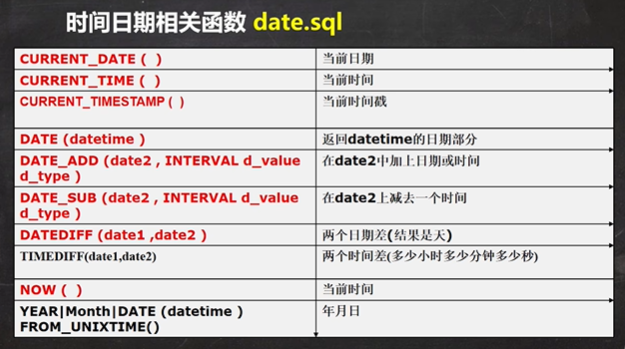

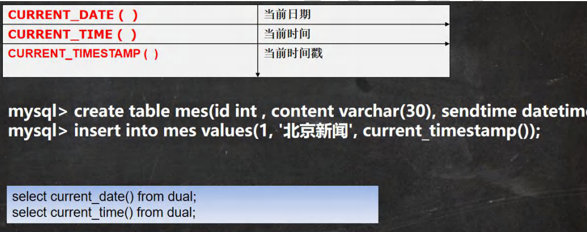

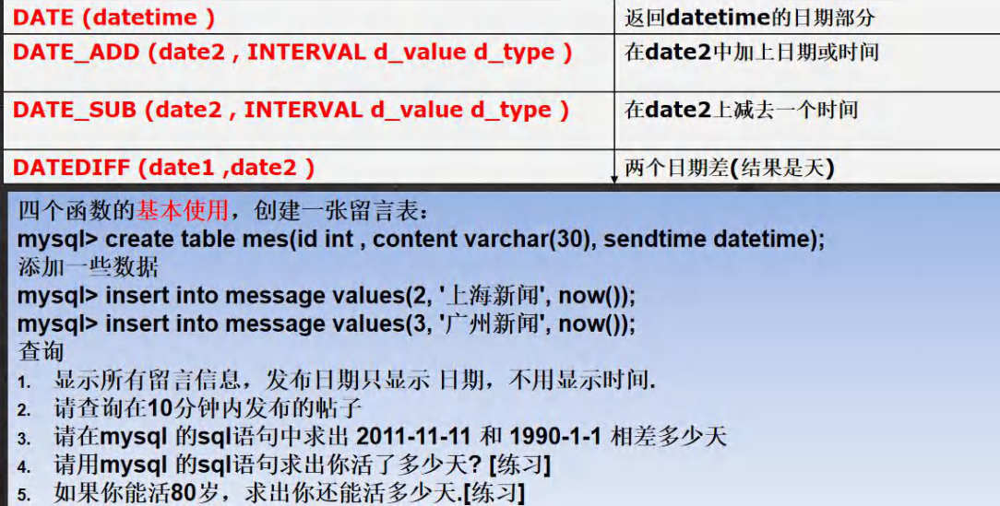

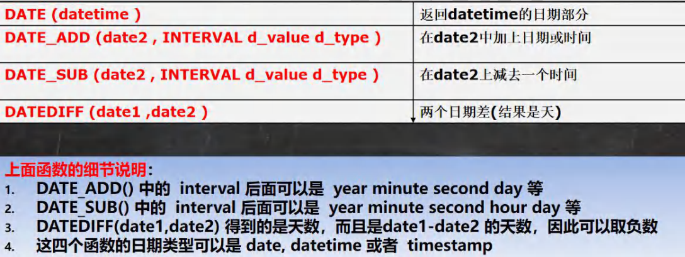

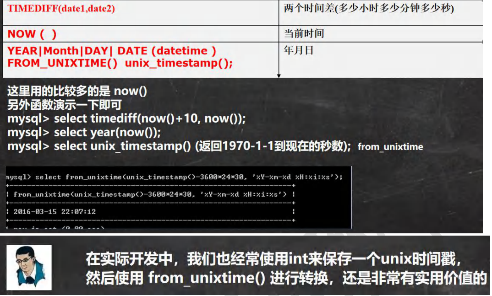

```sql
-- 日期时间相关函数

-- CURRENT_DATE (  )	当前日期
SELECT CURRENT_DATE() FROM DUAL;
-- CURRENT_TIME (  )	当前时间
SELECT CURRENT_TIME()  FROM DUAL;
-- CURRENT_TIMESTAMP (  ) 当前时间戳
SELECT CURRENT_TIMESTAMP()  FROM DUAL;

-- 创建测试表 信息表
CREATE TABLE mes(
	id INT , 
	content VARCHAR(30), 
	send_time DATETIME);
	
-- 添加一条记录
INSERT INTO mes 
	VALUES(1, '北京新闻', CURRENT_TIMESTAMP()); 
INSERT INTO mes VALUES(2, '上海新闻', NOW());
INSERT INTO mes VALUES(3, '广州新闻', NOW());

SELECT * FROM mes;
SELECT NOW() FROM DUAL;

-- 上应用实例
-- 显示所有新闻信息，发布日期只显示 日期，不用显示时间.
SELECT id, content, DATE(send_time) 
	FROM mes;
-- 请查询在10分钟内发布的新闻, 思路一定要梳理一下.
SELECT * 
	FROM mes
	WHERE DATE_ADD(send_time, INTERVAL 10 MINUTE) >= NOW()

SELECT * 
	FROM mes
	WHERE send_time >= DATE_SUB(NOW(), INTERVAL 10 MINUTE) 

-- 请在mysql 的sql语句中求出 2011-11-11 和 1990-1-1 相差多少天
SELECT DATEDIFF('2011-11-11', '1990-01-01') FROM DUAL;
-- 请用mysql 的sql语句求出你活了多少天? [练习] 1986-11-11 出生
SELECT DATEDIFF(NOW(), '1986-11-11') FROM DUAL;
-- 如果你能活80岁，求出你还能活多少天.[练习] 1986-11-11 出生
-- 先求出活80岁 时, 是什么日期 X
-- 然后在使用 datediff(x, now()); 1986-11-11->datetime
-- INTERVAL 80 YEAR ： YEAR 可以是 年月日，时分秒
-- '1986-11-11' 可以date,datetime timestamp 
SELECT DATEDIFF(DATE_ADD('1986-11-11', INTERVAL 80 YEAR), NOW()) 
	FROM DUAL;
	
SELECT TIMEDIFF('10:11:11', '06:10:10') FROM DUAL;

-- YEAR|Month|DAY| DATE (datetime )
SELECT YEAR(NOW()) FROM DUAL;
SELECT MONTH(NOW()) FROM DUAL;
SELECT DAY(NOW()) FROM DUAL;
SELECT MONTH('2013-11-10') FROM DUAL;
-- unix_timestamp() : 返回的是1970-1-1 到现在的秒数
SELECT UNIX_TIMESTAMP() FROM DUAL;
-- FROM_UNIXTIME() : 可以把一个unix_timestamp 秒数[时间戳]，转成指定格式的日期
-- %Y-%m-%d 格式是规定好的，表示年月日
-- 意义：在开发中，可以存放一个整数，然后表示时间，通过FROM_UNIXTIME转换
--   
SELECT FROM_UNIXTIME(1618483484, '%Y-%m-%d') FROM DUAL;
SELECT FROM_UNIXTIME(1618483100, '%Y-%m-%d %H:%i:%s') FROM DUAL;

SELECT * FROM mysql.user \G 
```


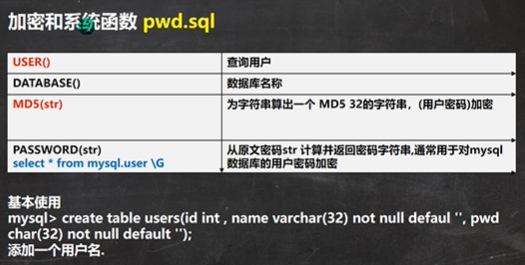

```sql
-- 演示加密函数和系统函数

-- USER()	查询用户
-- 可以查看登录到mysql的有哪些用户，以及登录的IP
SELECT USER() FROM DUAL; -- 用户@IP地址
-- DATABASE()	查询当前使用数据库名称
SELECT DATABASE();

-- MD5(str)	为字符串算出一个 MD5 32的字符串，常用(用户密码)加密
-- root 密码是 hsp -> 加密md5 -> 在数据库中存放的是加密后的密码
SELECT MD5('hsp') FROM DUAL;
SELECT LENGTH(MD5('hsp')) FROM DUAL;

-- 演示用户表，存放密码时，是md5
CREATE TABLE hsp_user
	(id INT , 
	`name` VARCHAR(32) NOT NULL DEFAULT '', 
	pwd CHAR(32) NOT NULL DEFAULT '');
INSERT INTO hsp_user 
	VALUES(100, '韩顺平', MD5('hsp'));
SELECT * FROM hsp_user;

SELECT * FROM hsp_user  -- SQL注入问题
	WHERE `name`='韩顺平' AND pwd = MD5('hsp')  


-- PASSWORD(str) -- 加密函数, MySQL数据库的用户密码就是 PASSWORD函数加密

SELECT PASSWORD('hsp') FROM DUAL; -- 数据库的 *81220D972A52D4C51BB1C37518A2613706220DAC


-- select * from mysql.user \G 	从原文密码str 计算并返回密码字符串
-- 通常用于对mysql数据库的用户密码加密
-- mysql.user 表示 数据库.表 
SELECT * FROM mysql.user
```


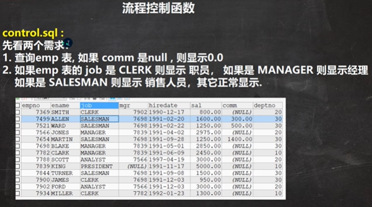

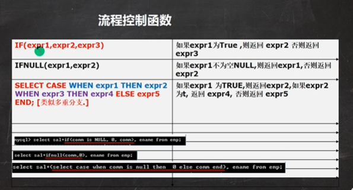

```sql
# 演示流程控制语句

# IF(expr1,expr2,expr3)	如果expr1为True ,则返回 expr2 否则返回 expr3
SELECT IF(TRUE, '北京', '上海') FROM DUAL;
# IFNULL(expr1,expr2)	如果expr1不为空NULL,则返回expr1,否则返回expr2
SELECT IFNULL( NULL, '韩顺平教育') FROM DUAL;
# SELECT CASE WHEN expr1 THEN expr2 WHEN expr3 THEN expr4 ELSE expr5 END; [类似多重分支.]
# 如果expr1 为TRUE,则返回expr2,如果expr2 为t, 返回 expr4, 否则返回 expr5

SELECT CASE 
	WHEN TRUE THEN 'jack'  -- jack
	WHEN FALSE THEN 'tom' 
	ELSE 'mary' END

-- 1. 查询emp 表, 如果 comm 是null , 则显示0.0
--    老师说明，判断是否为null 要使用 is null, 判断不为空 使用 is not
SELECT ename, IF(comm IS NULL , 0.0, comm)
	FROM emp;
SELECT ename, IFNULL(comm, 0.0)
	FROM emp;
-- 2. 如果emp 表的 job 是 CLERK 则显示 职员， 如果是 MANAGER 则显示经理
--     如果是 SALESMAN 则显示 销售人员，其它正常显示

SELECT ename, (SELECT CASE 
		WHEN job = 'CLERK' THEN '职员' 
		WHEN job = 'MANAGER' THEN '经理'
		WHEN job = 'SALESMAN' THEN '销售人员' 
		ELSE job END) AS 'job'
	FROM emp; 

SELECT * FROM emp;
SELECT * FROM dept;
SELECT * FROM salgrade;
```


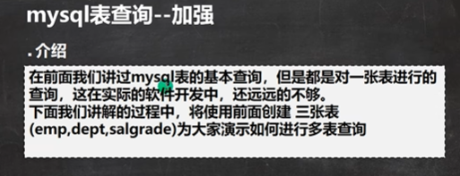

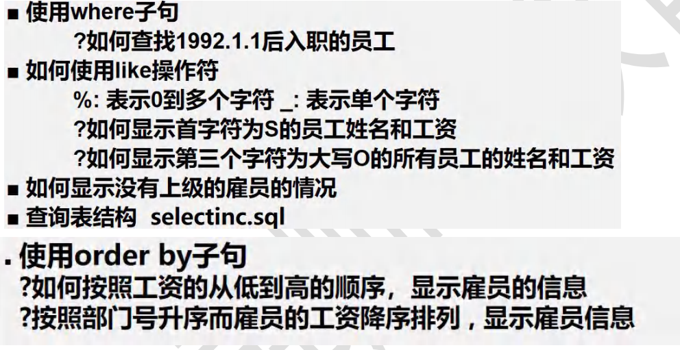

```sql
-- 查询加强
-- ■ 使用where子句
-- 	?如何查找1992.1.1后入职的员工
-- 老师说明： 在mysql中,日期类型可以直接比较, 需要注意格式
SELECT * FROM emp
	WHERE hiredate > '1992-01-01'
-- ■ 如何使用like操作符(模糊)
-- 	%: 表示0到多个任意字符 _: 表示单个任意字符
-- 	?如何显示首字符为S的员工姓名和工资
SELECT ename, sal FROM emp
	WHERE ename LIKE 'S%'
-- 	?如何显示第三个字符为大写O的所有员工的姓名和工资
SELECT ename, sal FROM emp
	WHERE ename LIKE '__O%'

-- ■ 如何显示没有上级的雇员的情况
SELECT * FROM emp
	WHERE mgr IS NULL;
-- ■ 查询表结构 
DESC emp 

-- 使用order by子句
--   ?如何按照工资的从低到高的顺序[升序]，显示雇员的信息
SELECT * FROM emp
	ORDER BY sal 
--   ?按照部门号升序而雇员的工资降序排列 , 显示雇员信息

SELECT * FROM emp
	ORDER BY deptno ASC , sal DESC;
```


```sql
-- 分页查询
-- 按雇员的id号升序取出， 每页显示3条记录，请分别显示 第1页，第2页，第3页

-- 第1页
SELECT * FROM emp 
	ORDER BY empno 
	LIMIT 0, 3;
-- 第2页
SELECT * FROM emp 
	ORDER BY empno 
	LIMIT 3, 3;
-- 第3页
SELECT * FROM emp 
	ORDER BY empno 
	LIMIT 6, 3;
-- 推导一个公式 
SELECT * FROM emp
	ORDER BY empno 
	LIMIT 每页显示记录数 * (第几页-1) , 每页显示记录数
	
	
-- 测试
SELECT job, COUNT(*) FROM emp GROUP BY  job;
-- 显示雇员总数，以及获得补助的雇员数
SELECT COUNT(*) FROM emp  WHERE mgr IS NOT NULL;
SELECT MAX(sal) - MIN(sal) FROM emp;
```


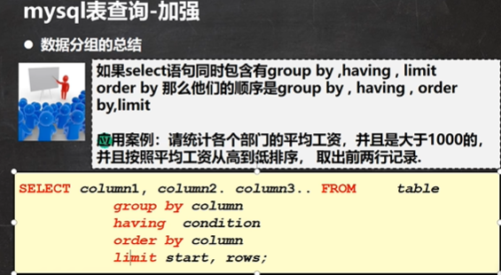

```sql
-- 增强group by 的使用

-- (1) 显示每种岗位的雇员总数、平均工资。
SELECT COUNT(*), AVG(sal), job 
	FROM emp 
	GROUP BY job; 
-- (2) 显示雇员总数，以及获得补助的雇员数。
--  思路: 获得补助的雇员数 就是 comm 列为非null, 就是count(列)，如果该列的值为null, 是
--  不会统计 , SQL 非常灵活，需要我们动脑筋.
SELECT COUNT(*), COUNT(comm)
	FROM emp 

--  老师的扩展要求：统计没有获得补助的雇员数
SELECT COUNT(*), COUNT(IF(comm IS NULL, 1, NULL))--只要1的位置不是NULL就可以
	FROM emp 

SELECT COUNT(*), COUNT(*) - COUNT(comm)
	FROM emp 

-- (3) 显示管理者的总人数。小技巧:尝试写->修改->尝试[正确的]
SELECT COUNT(DISTINCT mgr) 
	FROM emp; 

-- (4) 显示雇员工资的最大差额。
-- 思路： max(sal) - min(sal)
SELECT MAX(sal) - MIN(sal) 
	FROM emp;

SELECT * FROM e
mp;
select * from dept;

-- 应用案例：请统计各个部门group by 的平均工资 avg，
-- 并且是大于1000的 having，并且按照平均工资从高到低排序， order by
-- 取出前两行记录 limit 0, 2

SELECT deptno, AVG(sal) AS avg_sal
	FROM emp
	GROUP BY deptno
	HAVING  avg_sal > 1000
	ORDER BY avg_sal DESC
	LIMIT 0,2 
```


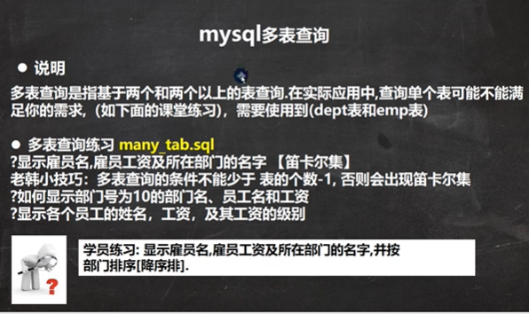

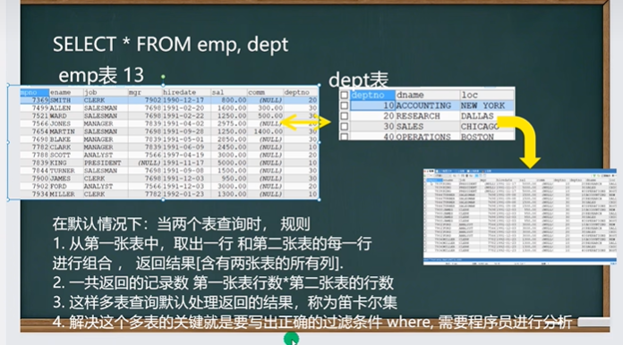

```sql
-- 多表查询
-- ?显示雇员名,雇员工资及所在部门的名字 【笛卡尔集】
/*
	老韩分析
	1. 雇员名,雇员工资 来自 emp表
	2. 部门的名字 来自 dept表
	3. 需求对 emp 和 dept查询  ename,sal,dname,deptno
	4. 当我们需要指定显示某个表的列是，需要 表.列表
*/
SELECT ename,sal,dname,emp.deptno
	FROM emp, dept 
	WHERE emp.deptno = dept.deptno
	
select * from emp;
select * from dept;
select * from salgrade;
-- 老韩小技巧：多表查询的条件不能少于 表的个数-1, 否则会出现笛卡尔集
-- ?如何显示部门号为10的部门名、员工名和工资 
SELECT ename,sal,dname,emp.deptno
	FROM emp, dept 
	WHERE emp.deptno = dept.deptno and emp.deptno = 10

-- ?显示各个员工的姓名，工资，及其工资的级别

-- 思路 姓名，工资 来自 emp 13
--      工资级别 salgrade 5
-- 写sql , 先写一个简单，然后加入过滤条件...
select ename, sal, grade 
	from emp , salgrade
	where sal between losal and hisal; 
```

