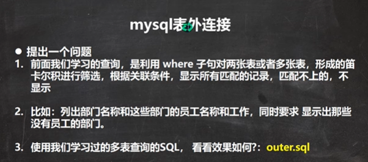
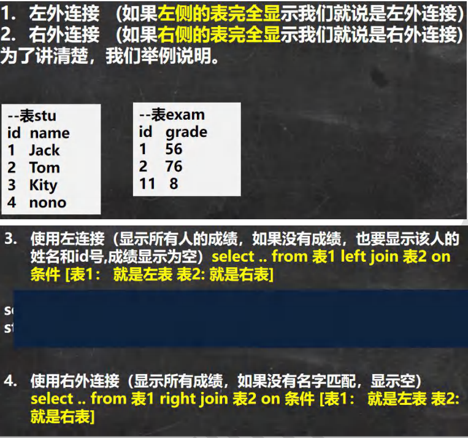

```sql
-- 外连接

-- 比如：列出部门名称和这些部门的员工名称和工作，
-- 同时要求 显示出那些没有员工的部门。

-- 使用我们学习过的多表查询的SQL， 看看效果如何?

SELECT dname, ename, job 
	FROM emp, dept
	WHERE emp.deptno = dept.deptno
	ORDER BY dname
SELECT * FROM dept;

SELECT * FROM emp;


-- 创建 stu
/*
id  name   
1   Jack
2   Tom
3   Kity
4   nono
*/
CREATE TABLE stu (
	id INT,
	`name` VARCHAR(32));
INSERT INTO stu VALUES(1, 'jack'),(2,'tom'),(3, 'kity'),(4, 'nono');
SELECT * FROM stu;
-- 创建 exam
/*
id   grade
1    56
2    76
11   8
*/
CREATE TABLE exam(
	id INT,
	grade INT);
INSERT INTO exam VALUES(1, 56),(2,76),(11, 8);
SELECT * FROM exam;

-- 使用左连接
-- （显示所有人的成绩，如果没有成绩，也要显示该人的姓名和id号,成绩显示为空）

SELECT `name`, stu.id, grade
	FROM stu, exam
	WHERE stu.id = exam.id;
	
-- 改成左外连接
SELECT `name`, stu.id, grade
	FROM stu LEFT JOIN exam
	ON stu.id = exam.id;
	
	
-- 使用右外连接（显示所有成绩，如果没有名字匹配，显示空)
-- 即：右边的表(exam) 和左表没有匹配的记录，也会把右表的记录显示出来
SELECT `name`, stu.id, grade
	FROM stu RIGHT JOIN exam
	ON stu.id = exam.id;

-- 列出部门名称和这些部门的员工信息(名字和工作)，
-- 同时列出那些没有员工的部门名。
-- 使用左外连接实现
SELECT dname, ename, job
	FROM dept LEFT JOIN emp
	ON dept.deptno = emp.deptno
	
-- 使用右外连接实现
SELECT dname, ename, job
	FROM emp RIGHT JOIN dept
	ON dept.deptno = emp.deptno
```

