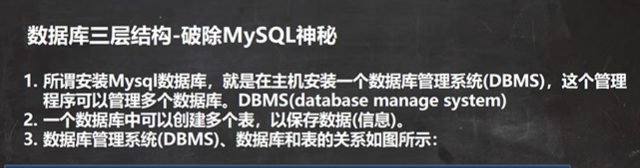
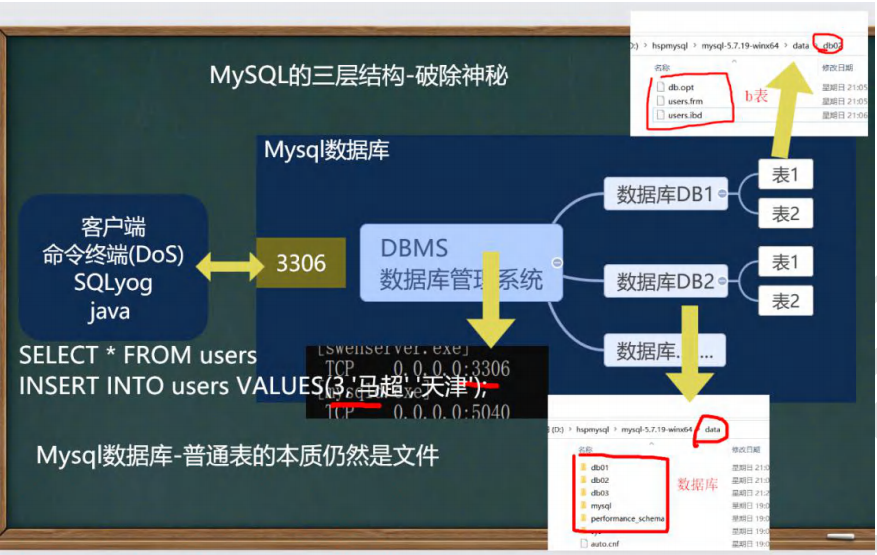
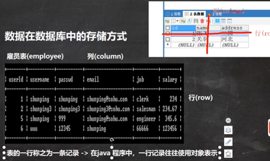
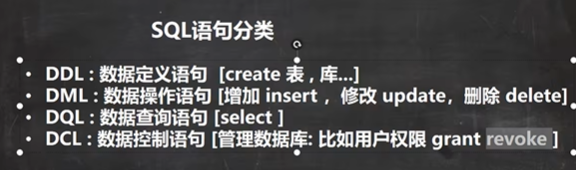
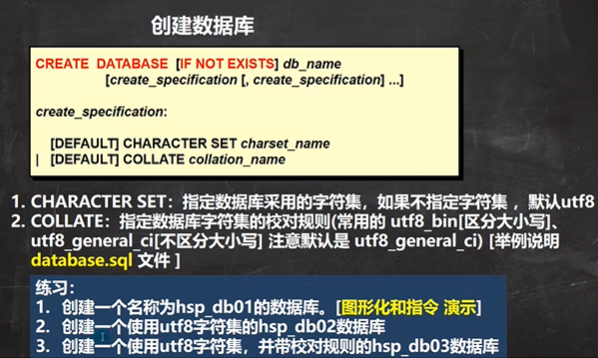
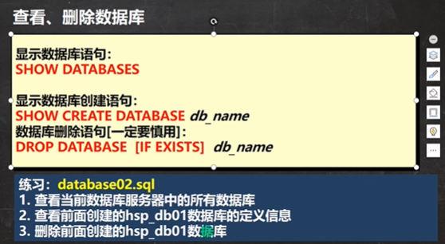
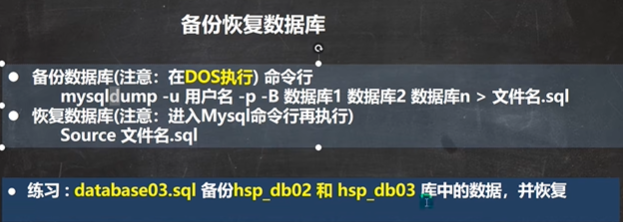
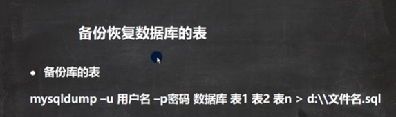

```sql
# 演示数据库的操作
#创建一个名称为hsp_db01的数据库。[图形化和指令 演示]

#使用指令创建数据库
CREATE DATABASE hsp_db01;
#删除数据库指令
DROP DATABASE hsp_db01
#创建一个使用utf8字符集的hsp_db02数据库
CREATE DATABASE hsp_db02 CHARACTER SET utf8
#创建一个使用utf8字符集，并带校对规则的hsp_db03数据库
CREATE DATABASE hsp_db03 CHARACTER SET utf8 COLLATE utf8_bin
#校对规则 utf8_bin 区分大小 默认utf8_general_ci 不区分大小写

#下面是一条查询的sql , select 查询 * 表示所有字段 FROM 从哪个表
#WHERE 从哪个字段 NAME = 'tom' 查询名字是tom
SELECT *  
	FROM t1 
	WHERE NAME = 'tom'
```




```sql
#演示删除和查询数据库
#查看当前数据库服务器中的所有数据库
SHOW DATABASES
#查看前面创建的hsp_db01数据库的定义信息
SHOW CREATE DATABASE `hsp_db01`
#老师说明 在创建数据库,表的时候，为了规避关键字，可以使用反引号解决

#删除前面创建的hsp_db01数据库
DROP DATABASE hsp_db01
```




```sql
#练习 : database03.sql 备份hsp_db02 和 hsp_db03 库中的数据，并恢复

#备份, 要在Dos下执行mysqldump指令其实在mysql安装目录\bin
#这个备份的文件，就是对应的sql语句
mysqldump -u root -p -B hsp_db02 hsp_db03 > d:\\bak.sql

DROP DATABASE ecshop;

#恢复数据库(注意：进入Mysql命令行再执行)
source d:\\bak.sql
#第二个恢复方法， 直接将bak.sql的内容放到查询编辑器中，执行
```


