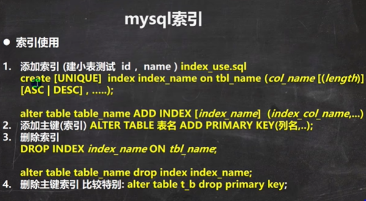

```sql
-- 创建测试数据库 tmp
CREATE DATABASE tmp;

CREATE TABLE dept( /*部门表*/
deptno MEDIUMINT   UNSIGNED  NOT NULL  DEFAULT 0,
dname VARCHAR(20)  NOT NULL  DEFAULT "",
loc VARCHAR(13) NOT NULL DEFAULT ""
) ;

#创建表EMP雇员
CREATE TABLE emp
(empno  MEDIUMINT UNSIGNED  NOT NULL  DEFAULT 0, /*编号*/
ename VARCHAR(20) NOT NULL DEFAULT "", /*名字*/
job VARCHAR(9) NOT NULL DEFAULT "",/*工作*/
mgr MEDIUMINT UNSIGNED NOT NULL DEFAULT 0,/*上级编号*/
hiredate DATE NOT NULL,/*入职时间*/
sal DECIMAL(7,2)  NOT NULL,/*薪水*/
comm DECIMAL(7,2) NOT NULL,/*红利*/
deptno MEDIUMINT UNSIGNED NOT NULL DEFAULT 0 /*部门编号*/
) ;

#工资级别表
CREATE TABLE salgrade
(
grade MEDIUMINT UNSIGNED NOT NULL DEFAULT 0,
losal DECIMAL(17,2)  NOT NULL,
hisal DECIMAL(17,2)  NOT NULL
);

#测试数据
INSERT INTO salgrade VALUES (1,700,1200);
INSERT INTO salgrade VALUES (2,1201,1400);
INSERT INTO salgrade VALUES (3,1401,2000);
INSERT INTO salgrade VALUES (4,2001,3000);
INSERT INTO salgrade VALUES (5,3001,9999);

DELIMITER $$

#创建一个函数，名字 rand_string，可以随机返回我指定的个数字符串
CREATE FUNCTION rand_string(n INT)
RETURNS VARCHAR(255) #该函数会返回一个字符串
BEGIN
#定义了一个变量 chars_str， 类型  varchar(100)
#默认给 chars_str 初始值   'abcdefghijklmnopqrstuvwxyzABCDEFJHIJKLMNOPQRSTUVWXYZ'
 DECLARE chars_str VARCHAR(100) DEFAULT
   'abcdefghijklmnopqrstuvwxyzABCDEFJHIJKLMNOPQRSTUVWXYZ'; 
 DECLARE return_str VARCHAR(255) DEFAULT '';
 DECLARE i INT DEFAULT 0; 
 WHILE i < n DO
    # concat 函数 : 连接函数mysql函数
   SET return_str =CONCAT(return_str,SUBSTRING(chars_str,FLOOR(1+RAND()*52),1));
   SET i = i + 1;
   END WHILE;
  RETURN return_str;
  END $$


 #这里我们又自定了一个函数,返回一个随机的部门号
CREATE FUNCTION rand_num( )
RETURNS INT(5)
BEGIN
DECLARE i INT DEFAULT 0;
SET i = FLOOR(10+RAND()*500);
RETURN i;
END $$

 #创建一个存储过程， 可以添加雇员
CREATE PROCEDURE insert_emp(IN START INT(10),IN max_num INT(10))
BEGIN
DECLARE i INT DEFAULT 0;
#set autocommit =0 把autocommit设置成0
 #autocommit = 0 含义: 不要自动提交
 SET autocommit = 0; #默认不提交sql语句
 REPEAT
 SET i = i + 1;
 #通过前面写的函数随机产生字符串和部门编号，然后加入到emp表
 INSERT INTO emp VALUES ((START+i) ,rand_string(6),'SALESMAN',0001,CURDATE(),2000,400,rand_num());
  UNTIL i = max_num
 END REPEAT;
 #commit整体提交所有sql语句，提高效率
   COMMIT;
 END $$

 #添加8000000数据
CALL insert_emp(100001,8000000)$$

#命令结束符，再重新设置为;
DELIMITER ;
```

```sql
SELECT COUNT(*) FROM emp;

-- 在没有创建索引时，我们的查询一条记录
SELECT * 
	FROM emp 
	WHERE empno = 1234567 
-- 使用索引来优化一下， 体验索引的牛

-- 在没有创建索引前 , emp.ibd 文件大小 是 524m
-- 创建索引后 emp.ibd 文件大小 是 655m [索引本身也会占用空间.]
-- 创建ename列索引,emp.ibd 文件大小 是 827m

-- empno_index 索引名称 
-- ON emp (empno) : 表示在 emp表的 empno列创建索引
CREATE INDEX empno_index ON emp (empno)

-- 创建索引后， 查询的速度如何

SELECT * 
	FROM emp 
	WHERE empno = 1234578 -- 0.003s 原来是4.5s


-- 创建索引后，只对创建了索引的列有效 
SELECT * 
	FROM emp 
	WHERE ename = 'PjDlwy' -- 没有在ename创建索引时，时间4.7s

CREATE INDEX ename_index ON emp (ename) -- 在ename上创建索引
```


 




```sql
-- 演示mysql的索引的使用
-- 创建索引
CREATE TABLE t25 (
	id INT ,
	`name` VARCHAR(32));
	
-- 查询表是否有索引
SHOW INDEXES FROM t25;
-- 添加索引
-- 添加唯一索引 
CREATE UNIQUE INDEX id_index ON t25 (id);
-- 添加普通索引方式1
CREATE INDEX id_index ON t25 (id);
-- 如何选择 
-- 1. 如果某列的值，是不会重复的，则优先考虑使用unique索引, 否则使用普通索引
-- 添加普通索引方式2
ALTER TABLE t25 ADD INDEX id_index (id)

-- 添加主键索引
CREATE TABLE t26 (
	id INT ,
	`name` VARCHAR(32));
ALTER TABLE t26 ADD PRIMARY KEY (id)

SHOW INDEX FROM t25

-- 删除索引
DROP INDEX id_index ON t25
-- 删除主键索引
ALTER TABLE t26 DROP PRIMARY KEY

-- 修改索引 ，先删除，再添加新的索引

-- 查询索引
-- 1. 方式
SHOW INDEX FROM t25
-- 2. 方式
SHOW INDEXES FROM t25
-- 3. 方式
SHOW KEYS FROM t25
-- 4 方式
DESC t25
```


