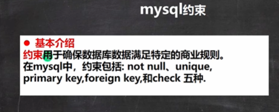

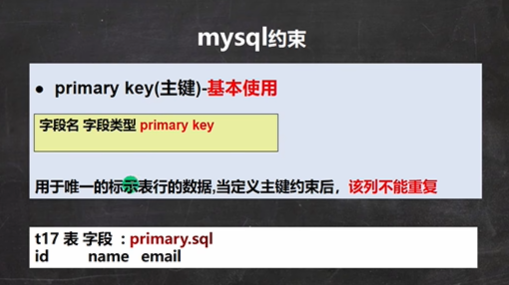

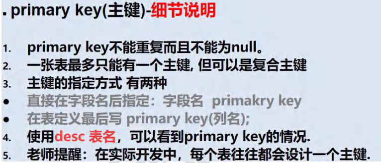

```sql
-- 主键使用

-- id	name 	email
CREATE TABLE t17
	(id INT PRIMARY KEY, -- 表示id列是主键 
	`name` VARCHAR(32),
	email VARCHAR(32));
	
-- 主键列的值是不可以重复
INSERT INTO t17
	VALUES(1, 'jack', 'jack@sohu.com');
INSERT INTO t17
	VALUES(2, 'tom', 'tom@sohu.com');
INSERT INTO t17
	VALUES(1, 'hsp', 'hsp@sohu.com');
	
SELECT * FROM t17;

-- 主键使用的细节讨论
-- primary key不能重复而且不能为 null。
INSERT INTO t17
	VALUES(NULL, 'hsp', 'hsp@sohu.com');
-- 一张表最多只能有一个主键, 但可以是复合主键(比如 id+name)
CREATE TABLE t18
	(id INT PRIMARY KEY, -- 表示id列是主键 
	`name` VARCHAR(32), PRIMARY KEY -- 错误的
	email VARCHAR(32));
-- 演示复合主键 (id 和 name 做成复合主键)
CREATE TABLE t18
	(id INT , 
	`name` VARCHAR(32), 
	email VARCHAR(32),
	PRIMARY KEY (id, `name`) -- 这里就是复合主键
	);

INSERT INTO t18
	VALUES(1, 'tom', 'tom@sohu.com');
INSERT INTO t18
	VALUES(1, 'jack', 'jack@sohu.com');
INSERT INTO t18
	VALUES(1, 'tom', 'xx@sohu.com'); -- 这里就违反了复合主键
SELECT * FROM t18;

-- 主键的指定方式 有两种 
-- 1. 直接在字段名后指定：字段名  primakry key
-- 2. 在表定义最后写 primary key(列名); 
CREATE TABLE t19
	(id INT , 
	`name` VARCHAR(32) PRIMARY KEY, 
	email VARCHAR(32)
	);

CREATE TABLE t20
	(id INT , 
	`name` VARCHAR(32) , 
	email VARCHAR(32),
	PRIMARY KEY(`name`) -- 在表定义最后写 primary key(列名)
	);
 
-- 使用desc 表名，可以看到primary key的情况

DESC t20 -- 查看 t20表的结果，显示约束的情况
DESC t18
```


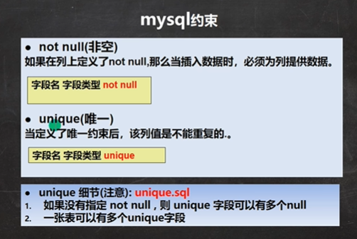

```sql
-- unique的使用

CREATE TABLE t21
	(id INT UNIQUE ,  -- 表示 id 列是不可以重复的.
	`name` VARCHAR(32) , 
	email VARCHAR(32)
	);
	
INSERT INTO t21
	VALUES(1, 'jack', 'jack@sohu.com');

INSERT INTO t21
	VALUES(1, 'tom', 'tom@sohu.com');
	
-- unqiue使用细节
-- 1. 如果没有指定 not null , 则 unique 字段可以有多个null
-- 如果一个列(字段)， 是 unique not null 使用效果类似 primary key
INSERT INTO t21
	VALUES(NULL, 'tom', 'tom@sohu.com');
SELECT * FROM t21;
-- 2. 一张表可以有多个unique字段

CREATE TABLE t22
	(id INT UNIQUE ,  -- 表示 id 列是不可以重复的.
	`name` VARCHAR(32) UNIQUE , -- 表示name不可以重复 
	email VARCHAR(32)
	);
DESC t22
```


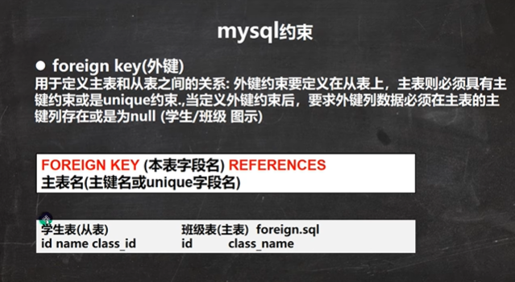

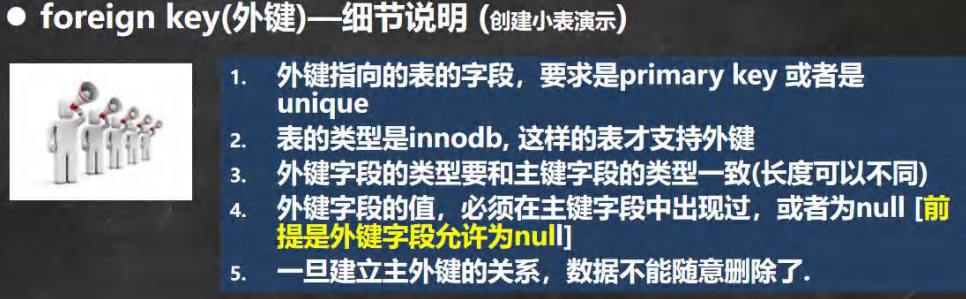

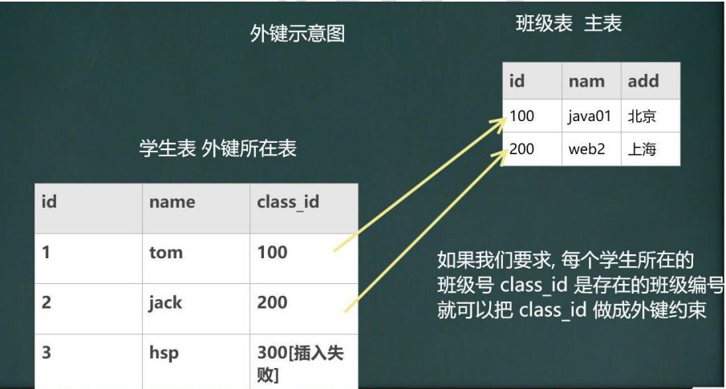

```sql
-- 外键演示

-- 创建 主表 my_class
CREATE TABLE my_class (
	id INT PRIMARY KEY , -- 班级编号
	`name` VARCHAR(32) NOT NULL DEFAULT '');

-- 创建 从表 my_stu
CREATE TABLE my_stu (
	id INT PRIMARY KEY , -- 学生编号
	`name` VARCHAR(32) NOT NULL DEFAULT '',
	class_id INT , -- 学生所在班级的编号
	-- 下面指定外键关系
	FOREIGN KEY (class_id) REFERENCES my_class(id))
-- 测试数据
INSERT INTO my_class 
	VALUES(100, 'java'), (200, 'web');
INSERT INTO my_class 
	VALUES(300, 'php');
	
SELECT * FROM my_class;
INSERT INTO my_stu 
	VALUES(1, 'tom', 100);
INSERT INTO my_stu 
	VALUES(2, 'jack', 200);
INSERT INTO my_stu 
	VALUES(3, 'hsp', 300);
INSERT INTO my_stu 
	VALUES(4, 'mary', 400); -- 这里会失败...因为400班级不存在

INSERT INTO my_stu 
	VALUES(5, 'king', NULL); -- 可以, 外键 没有写 not null
SELECT * FROM my_class;

-- 一旦建立主外键的关系，数据不能随意删除了
DELETE FROM my_class
	WHERE id = 100; 
```


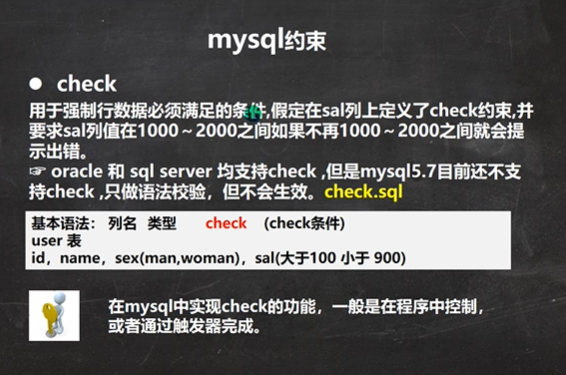

```sql
-- 演示check的使用
-- mysql5.7目前还不支持check ,只做语法校验，但不会生效
-- 了解 
-- 学习 oracle, sql server, 这两个数据库是真的生效.

-- 测试
CREATE TABLE t23 (
	id INT PRIMARY KEY,
	`name` VARCHAR(32) ,
	sex VARCHAR(6) CHECK (sex IN('man','woman')),
	sal DOUBLE CHECK ( sal > 1000 AND sal < 2000)
	);
	
-- 添加数据
INSERT INTO t23 
	VALUES(1, 'jack', 'mid', 1);
SELECT * FROM t23;
```


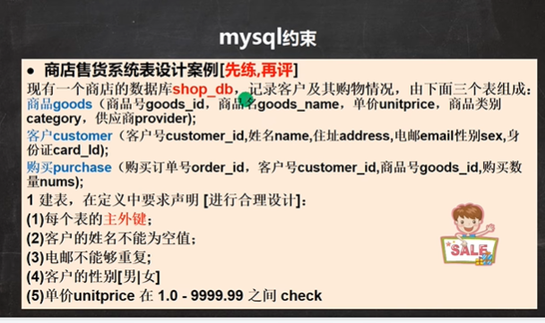

```sql
-- 使用约束的课堂练习

CREATE DATABASE shop_db;

-- 商品goods
CREATE TABLE goods (
	goods_id INT PRIMARY KEY,
	goods_name VARCHAR(64) NOT NULL DEFAULT '',
	unitprice DECIMAL(10,2) NOT NULL DEFAULT 0 
		CHECK (unitprice >= 1.0 AND unitprice <= 9999.99),
	category INT NOT NULL DEFAULT 0,
	provider VARCHAR(64) NOT NULL DEFAULT '');
	
-- 客户customer（客户号customer_id,姓名name,住址address,电邮email性别sex,
-- 身份证card_Id);
CREATE TABLE customer(
	customer_id CHAR(8) PRIMARY KEY, -- 程序员自己决定
	`name` VARCHAR(64) NOT NULL DEFAULT '',
	address VARCHAR(64) NOT NULL DEFAULT '',
	email VARCHAR(64) UNIQUE NOT NULL,
	sex ENUM('男','女') NOT NULL ,  -- 这里老师使用的枚举类型, 是生效的
	card_Id CHAR(18)); 
	
-- 购买purchase（购买订单号order_id，客户号customer_id,商品号goods_id,
-- 购买数量nums);
CREATE TABLE purchase(
	order_id INT UNSIGNED PRIMARY KEY,
	customer_id CHAR(8) NOT NULL DEFAULT '', -- 外键约束在后
	goods_id INT NOT NULL DEFAULT 0 , -- 外键约束在后
	nums INT NOT NULL DEFAULT 0,
	FOREIGN KEY (customer_id) REFERENCES customer(customer_id),
	FOREIGN KEY (goods_id) REFERENCES goods(goods_id));
DESC goods;
DESC customer;
DESC purchase;
```


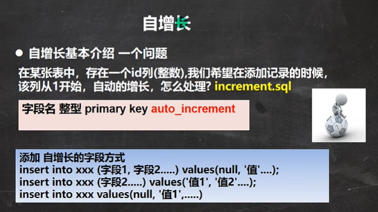

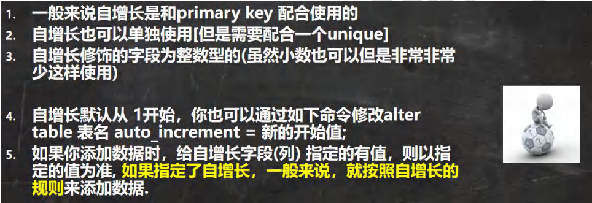

```sql
-- 演示自增长的使用
-- 创建表
CREATE TABLE t24
	(id INT PRIMARY KEY AUTO_INCREMENT,
	 email VARCHAR(32)NOT NULL DEFAULT '',
	 `name` VARCHAR(32)NOT NULL DEFAULT ''); 
DESC t24
-- 测试自增长的使用
INSERT INTO t24
	VALUES(NULL, 'tom@qq.com', 'tom');

INSERT INTO t24
	(email, `name`) VALUES('hsp@sohu.com', 'hsp');

SELECT * FROM t24;

-- 修改默认的自增长开始值
CREATE TABLE t25
	(id INT PRIMARY KEY AUTO_INCREMENT,
	 email VARCHAR(32)NOT NULL DEFAULT '',
	 `name` VARCHAR(32)NOT NULL DEFAULT ''); 
ALTER TABLE t25 AUTO_INCREMENT = 100
INSERT INTO t25
	VALUES(NULL, 'mary@qq.com', 'mary');
INSERT INTO t25
	VALUES(666, 'hsp@qq.com', 'hsp');
SELECT * FROM t25;
```

