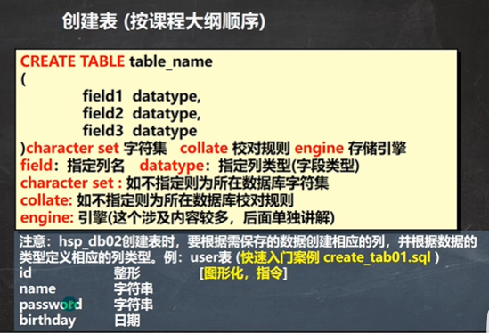
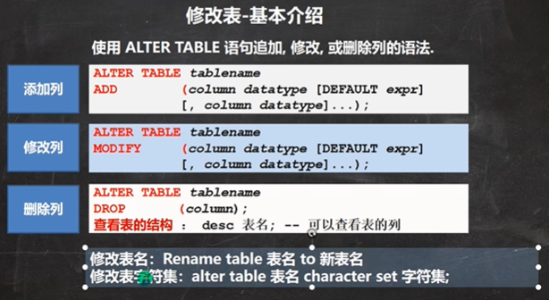
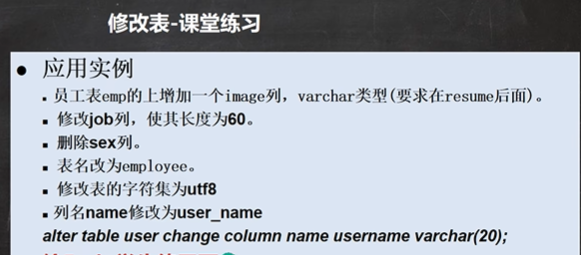

```sql
#指令创建表
#注意：hsp_db02创建表时，要根据需保存的数据创建相应的列，并根据数据的类型定义相应的列类型。例：user表 (快速入门案例 create_tab01.sql )
#id        	整形               [图形化，指令]                
#name 		字符串
#password 	字符串
#birthday 	日期
CREATE TABLE `user` (
	id INT, 
	`name` VARCHAR(255),
	`password` VARCHAR(255), 
	`birthday` DATE)
	CHARACTER SET utf8 COLLATE utf8_bin ENGINE INNODB;
```






```sql
#修改表的操作练习
--  员工表emp的上增加一个image列，varchar类型(要求在resume后面)。
ALTER TABLE emp 
	ADD image VARCHAR(32) NOT NULL DEFAULT '' 
	AFTER RESUME
DESC employee -- 显示表结构，可以查看表的所有列
--  修改job列，使其长度为60。
ALTER TABLE emp 
	MODIFY job VARCHAR(60) NOT NULL DEFAULT ''
--  删除sex列。
ALTER TABLE emp
	DROP sex
--  表名改为employee。
RENAME TABLE emp TO employee
--  修改表的字符集为utf8 
ALTER TABLE employee CHARACTER SET utf8
--  列名name修改为user_name
ALTER TABLE employee 
	CHANGE `name` `user_name` VARCHAR(64) NOT NULL DEFAULT ''
DESC employee
```

