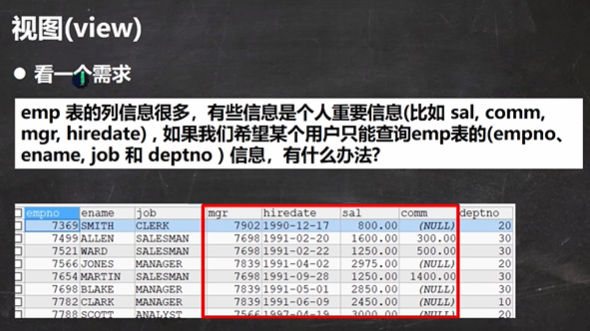
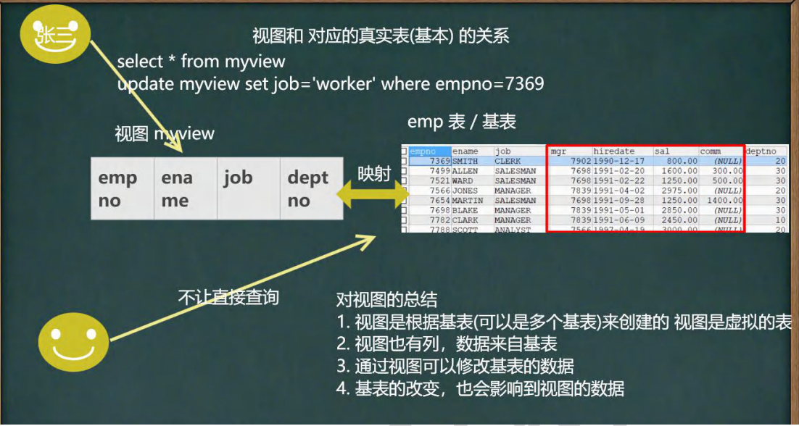
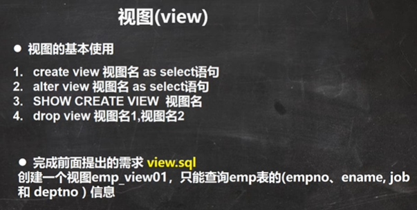
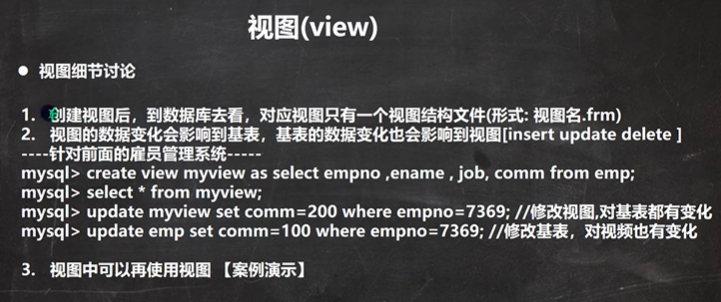

```sql
-- 视图的使用
-- 创建一个视图emp_view01，只能查询emp表的(empno、ename, job 和 deptno ) 信息

-- 创建视图
CREATE VIEW emp_view01
	AS
	SELECT empno, ename, job, deptno FROM emp; 

-- 查看视图
DESC emp_view01

SELECT * FROM emp_view01;
SELECT empno, job  FROM emp_view01;

-- 查看创建视图的指令
SHOW CREATE VIEW emp_view01
-- 删除视图
DROP VIEW emp_view01;


-- 视图的细节

-- 1. 创建视图后，到数据库去看，对应视图只有一个视图结构文件(形式: 视图名.frm) 
-- 2. 视图的数据变化会影响到基表，基表的数据变化也会影响到视图[insert update delete ]

-- 修改视图 会影响到基表

UPDATE emp_view01 
	SET job = 'MANAGER' 
	WHERE empno = 7369
	
SELECT * FROM emp; -- 查询基表


SELECT * FROM emp_view01

-- 修改基本表， 会影响到视图

UPDATE emp 
	SET job = 'SALESMAN' 
	WHERE empno = 7369

-- 3. 视图中可以再使用视图 , 比如从emp_view01 视图中，选出empno,和ename做出新视图
DESC emp_view01

CREATE VIEW emp_view02
	AS
	SELECT empno, ename FROM emp_view01
	
SELECT * FROM emp_view02
```


```sql
-- 视图的课堂练习
-- 针对 emp ，dept , 和  salgrade 张三表.创建一个视图 emp_view03，
-- 可以显示雇员编号，雇员名，雇员部门名称和 薪水级别[即使用三张表，构建一个视图]
/*
	分析: 使用三表联合查询，得到结果
	将得到的结果，构建成视图
*/
CREATE VIEW emp_view03
	AS
	SELECT empno, ename, dname, grade
	FROM emp, dept, salgrade
	WHERE emp.deptno = dept.deptno AND 
	(sal BETWEEN losal AND hisal) 

DESC emp_view03
SELECT * FROM emp_view03
```

