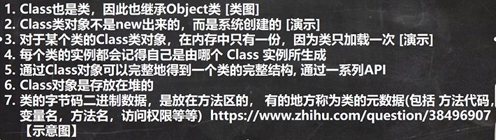
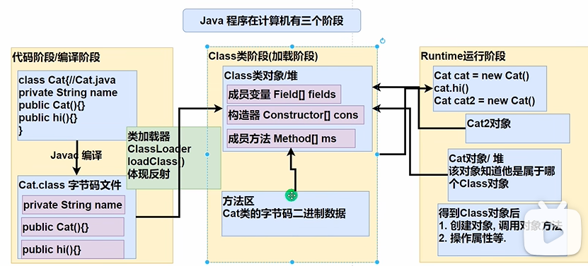
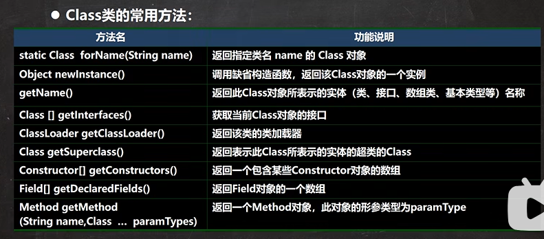
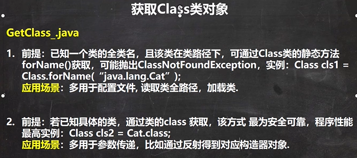
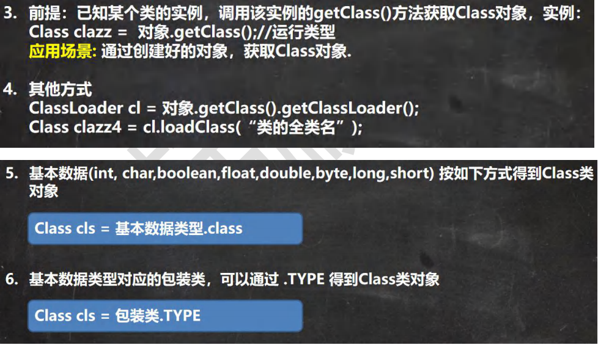
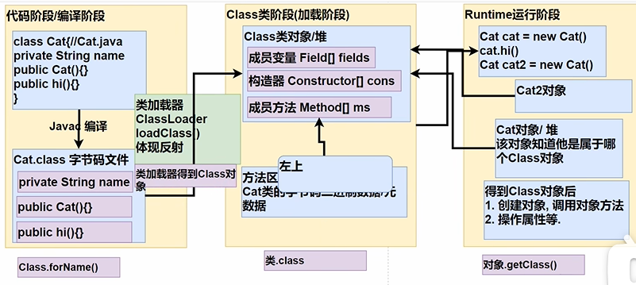
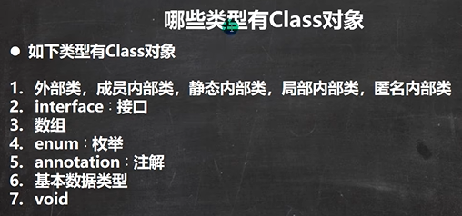

```java
public class Class01 {
    public static void main(String[] args) throws ClassNotFoundException {
        //看看Class类图
        //1. Class也是类，因此也继承Object类
        //Class
        //2. Class类对象不是new出来的，而是系统创建的
        //(1) 传统new对象
        /*  ClassLoader类
            public Class<?> loadClass(String name) throws ClassNotFoundException {
                return loadClass(name, false);
            }
         */
        //Cat cat = new Cat();
        //(2) 反射方式, 刚才老师没有debug到 ClassLoader类的 loadClass, 原因是，我没有注销Cat cat = new Cat();
        //    此时已经把Cat类对应的Class类对象生成了，同一个类只会加载一次。
        /*
            ClassLoader类, 仍然是通过 ClassLoader类加载Cat类的 Class对象
            public Class<?> loadClass(String name) throws ClassNotFoundException {
                return loadClass(name, false);
            }
         */
        Class cls1 = Class.forName("com.hspedu.Cat");

        //3. 对于某个类的Class类对象，在内存中只有一份，因为类只加载一次
        Class cls2 = Class.forName("com.hspedu.Cat");
        System.out.println(cls1.hashCode());
        System.out.println(cls2.hashCode());
        Class cls3 = Class.forName("com.hspedu.Dog");
        System.out.println(cls3.hashCode());
    }
}
```




```java
public class Class02 {
    public static void main(String[] args) throws ClassNotFoundException, IllegalAccessException, InstantiationException, NoSuchFieldException {

        String classAllPath = "com.hspedu.Car";
        //1 . 获取到Car类 对应的 Class对象
        //<?> 表示不确定的Java类型
        Class<?> cls = Class.forName(classAllPath);
        //2. 输出cls
        System.out.println(cls); //显示cls对象, 是哪个类的Class对象 com.hspedu.Car
        System.out.println(cls.getClass());//输出cls运行类型 java.lang.Class
        //3. 得到包名
        System.out.println(cls.getPackage().getName());//包名
        //4. 得到全类名
        System.out.println(cls.getName());
        //5. 通过cls创建对象实例
        Car car = (Car) cls.newInstance();
        System.out.println(car);//car.toString()
        //6. 通过反射获取属性 brand
        Field brand = cls.getField("brand");
        System.out.println(brand.get(car));//宝马
        //7. 通过反射给属性赋值
        brand.set(car, "奔驰");
        System.out.println(brand.get(car));//奔驰
        //8 我希望大家可以得到所有的属性(字段)
        System.out.println("=======所有的字段属性====");
        Field[] fields = cls.getFields();
        for (Field f : fields) {
            System.out.println(f.getName());//名称
        }
    }
}

public class Car {
    public String brand = "宝马";//品牌
    public int price = 500000;
    public String color = "白色";

    @Override
    public String toString() {
        return "Car{" +
                "brand='" + brand + '\'' +
                ", price=" + price +
                ", color='" + color + '\'' +
                '}';
    }
}
```








```java
public class GetClass_ {
    public static void main(String[] args) throws ClassNotFoundException {

        //1. Class.forName
        String classAllPath = "com.hspedu.Car"; //通过读取配置文件获取
        Class<?> cls1 = Class.forName(classAllPath);
        System.out.println(cls1);

        //2. 类名.class , 应用场景: 用于参数传递
        Class cls2 = Car.class;
        System.out.println(cls2);

        //3. 对象.getClass(), 应用场景，有对象实例
        //   得到运行类型就是得到对象关联的Class类对象
        Car car = new Car();
        Class cls3 = car.getClass();
        System.out.println(cls3);

        //4. 通过类加载器【4种】来获取到类的Class对象
        //(1)先得到类加载器 car
        ClassLoader classLoader = car.getClass().getClassLoader();
        //(2)通过类加载器得到Class对象
        Class cls4 = classLoader.loadClass(classAllPath);
        System.out.println(cls4);

        //cls1 , cls2 , cls3 , cls4 其实是同一个对象
        System.out.println(cls1.hashCode());
        System.out.println(cls2.hashCode());
        System.out.println(cls3.hashCode());
        System.out.println(cls4.hashCode());

        //5. 基本数据(int, char,boolean,float,double,byte,long,short) 按如下方式得到Class类对象
        Class<Integer> integerClass = int.class;
        Class<Character> characterClass = char.class;
        Class<Boolean> booleanClass = boolean.class;
        System.out.println(integerClass);//int

        //6. 基本数据类型对应的包装类，可以通过 .TYPE 得到Class类对象
        Class<Integer> type1 = Integer.TYPE;
        Class<Character> type2 = Character.TYPE; //其它包装类BOOLEAN, DOUBLE, LONG,BYTE等待
        System.out.println(type1);

        System.out.println(integerClass.hashCode());//相同
        System.out.println(type1.hashCode());//相同
    }
}
```




```java
public class AllTypeClass {
    public static void main(String[] args) {

        Class<String> cls1 = String.class;//外部类
        Class<Serializable> cls2 = Serializable.class;//接口
        Class<Integer[]> cls3 = Integer[].class;//数组
        Class<float[][]> cls4 = float[][].class;//二维数组
        Class<Deprecated> cls5 = Deprecated.class;//注解
        //枚举
        Class<Thread.State> cls6 = Thread.State.class;
        Class<Long> cls7 = long.class;//基本数据类型
        Class<Void> cls8 = void.class;//void数据类型
        Class<Class> cls9 = Class.class;//

        System.out.println(cls1);
        System.out.println(cls2);
        System.out.println(cls3);
        System.out.println(cls4);
        System.out.println(cls5);
        System.out.println(cls6);
        System.out.println(cls7);
        System.out.println(cls8);
        System.out.println(cls9);
    }
}
```

