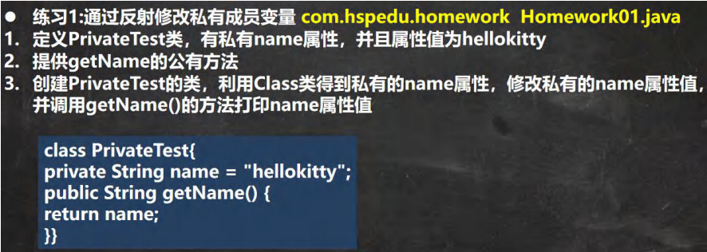
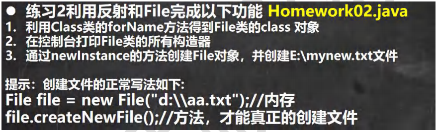

```java
public class Homework01 {
    public static void main(String[] args) throws IllegalAccessException, InstantiationException, NoSuchFieldException, NoSuchMethodException, InvocationTargetException {

        //1. 得到 PrivateTest类对应的Class对象
        Class<PrivateTest> privateTestClass = PrivateTest.class;
        //2. 创建对象实例
        PrivateTest privateTestObj = privateTestClass.newInstance();
        //3. 得到name属性对象
        Field name = privateTestClass.getDeclaredField("name");//name属性是private
        //4. 暴破name
        name.setAccessible(true);
        name.set(privateTestObj, "天龙八部");
        //5. 得到getName方法对象
        Method getName = privateTestClass.getMethod("getName");
        //6. 因为getName() 是public，所有直接调用
        Object invoke = getName.invoke(privateTestObj);
        System.out.println("name属性值=" + invoke);//天龙八部

    }
}

class PrivateTest {
    private String name = "hellokitty";
    //默认无参构造器
    public String getName() {
        return name;
    }
}
```




```java
public class Homework02 {
    public static void main(String[] args) throws ClassNotFoundException, NoSuchMethodException, IllegalAccessException, InvocationTargetException, InstantiationException {

        //1. Class类的forName方法得到File类的class 对象
        Class<?> fileCls = Class.forName("java.io.File");
        //2. 得到所有的构造器
        Constructor<?>[] declaredConstructors = fileCls.getDeclaredConstructors();
        //遍历输出
        for (Constructor<?> declaredConstructor : declaredConstructors) {
            System.out.println("File构造器=" + declaredConstructor);
        }
        //3. 指定的得到 public java.io.File(java.lang.String)
        Constructor<?> declaredConstructor = fileCls.getDeclaredConstructor(String.class);
        String fileAllPath = "e:\\mynew.txt";
        Object file = declaredConstructor.newInstance(fileAllPath);//创建File对象

        //4. 得到createNewFile 的方法对象
        Method createNewFile = fileCls.getMethod("createNewFile");
        createNewFile.invoke(file);//创建文件，调用的是 createNewFile
        //file的运行类型就是File
        System.out.println(file.getClass());
        System.out.println("创建文件成功" + fileAllPath);

    }
}
```

