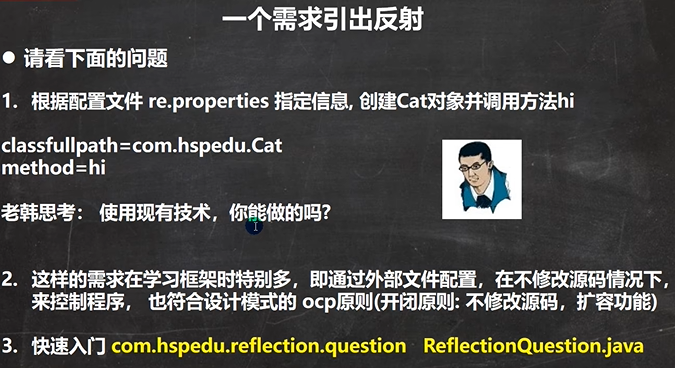
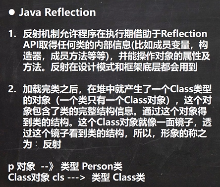
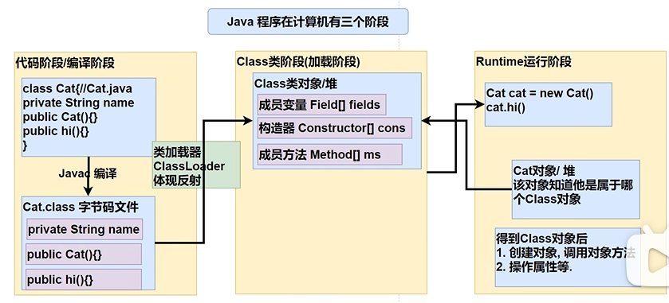
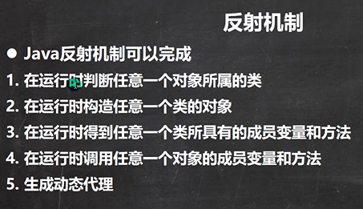
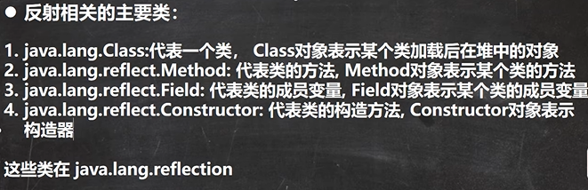
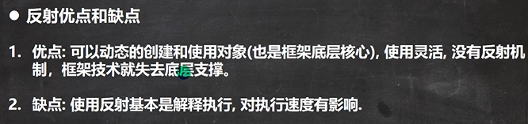
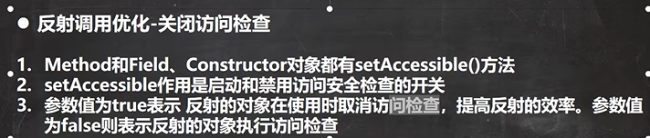

```java
public class ReflectionQuestion {
    public static void main(String[] args) throws IOException, ClassNotFoundException, IllegalAccessException, InstantiationException, NoSuchMethodException, InvocationTargetException, NoSuchFieldException {

        //根据配置文件 re.properties 指定信息, 创建Cat对象并调用方法hi

        //传统的方式 new 对象 -》 调用方法
//        Cat cat = new Cat();
//        cat.hi(); ===> cat.cry() 修改源码.

        //我们尝试做一做 -> 明白反射

        //1. 使用Properties 类, 可以读写配置文件
        Properties properties = new Properties();
        properties.load(new FileInputStream("src\\re.properties"));
        String classfullpath = properties.get("classfullpath").toString();//"com.hspedu.Cat"
        String methodName = properties.get("method").toString();//"hi"
        System.out.println("classfullpath=" + classfullpath);
        System.out.println("method=" + methodName);

        //2. 创建对象，传统的方法，行不通 =》 反射机制
        //new classfullpath();

        //3. 使用反射机制解决
        //(1) 加载类, 返回Class类型的对象cls
        Class cls = Class.forName(classfullpath);
        //(2) 通过 cls 得到你加载的类 com.hspedu.Cat 的对象实例
        Object o = cls.newInstance();
        System.out.println("o的运行类型=" + o.getClass()); //运行类型
        //(3) 通过 cls 得到你加载的类 com.hspedu.Cat 的 methodName"hi" 的方法对象
        //    即：在反射中，可以把方法视为对象（万物皆对象）
        Method method1 = cls.getMethod(methodName);
        //(4) 通过method1 调用方法: 即通过方法对象来实现调用方法
        System.out.println("=============================");
        method1.invoke(o); //传统方法 对象.方法() , 反射机制 方法.invoke(对象)
    }
}

public class Cat {

    private String name = "招财猫";
    public int age = 10; //public的

    public Cat() {} //无参构造器

    public Cat(String name) {
        this.name = name;
    }

    public void hi() { //常用方法
        //System.out.println("hi " + name);
    }
    public void cry() { //常用方法
        System.out.println(name + " 喵喵叫..");
    }
}
```






 new一个对象，会导致类的加载，把字节码文件加载（由类加载器完成）到内存里面的堆，形成一个Class类对象，里面有Cat类的完整对象。

生成的Class类对象在堆里面是数据结构，是可以操作的数据，在底层会把成员变量映射成/当成对象来看待。比如成员变量变成Field[] fields数组，fields就是一个对象。

类加载完之后就生成对象Cat，Cat对象也在堆里面，Cat对象和Class之间可以简单理解成有映射关系。

反射关系形成后，得到Class对象后，就可以做很多操作。



当我们得到某一个类对应的Class类对象后，可以通过Class类对象完成很多操作。



```java
public class Reflection01 {

    public static void main(String[] args) throws Exception {

        //1. 使用Properties 类, 可以读写配置文件
        Properties properties = new Properties();
        properties.load(new FileInputStream("src\\re.properties"));
        String classfullpath = properties.get("classfullpath").toString();//"com.hspedu.Cat"
        String methodName = properties.get("method").toString();//"hi"
        
        //2. 使用反射机制解决
        //(1) 加载类, 返回Class类型的对象cls
        Class cls = Class.forName(classfullpath);
        //(2) 通过 cls 得到你加载的类 com.hspedu.Cat 的对象实例
        Object o = cls.newInstance();
        System.out.println("o的运行类型=" + o.getClass()); //运行类型
        //(3) 通过 cls 得到你加载的类 com.hspedu.Cat 的 methodName"hi"  的方法对象
        //    即：在反射中，可以把方法视为对象（万物皆对象）
        Method method1 = cls.getMethod(methodName);
        //(4) 通过method1 调用方法: 即通过方法对象来实现调用方法
        System.out.println("=============================");
        method1.invoke(o); //传统方法 对象.方法() , 反射机制 方法.invoke(对象)

        //java.lang.reflect.Field: 代表类的成员变量, Field对象表示某个类的成员变量
        //得到name字段
        //getField不能得到私有的属性
        Field nameField = cls.getField("age"); //
        System.out.println(nameField.get(o)); // 传统写法 对象.成员变量 , 反射 :  成员变量对象.get(对象)

        //java.lang.reflect.Constructor: 代表类的构造方法, Constructor对象表示构造器
        Constructor constructor = cls.getConstructor(); //()中可以指定构造器参数类型, 返回无参构造器
        System.out.println(constructor);//Cat()

        Constructor constructor2 = cls.getConstructor(String.class); //这里老师传入的 String.class 就是String类的Class对象
        System.out.println(constructor2);//Cat(String name)
    }
}
```






```java
public class Reflection02 {
    public static void main(String[] args) throws ClassNotFoundException, NoSuchMethodException, InvocationTargetException, InstantiationException, IllegalAccessException {

        //Field
        //Method
        //Constructor
        m1();
        m2();
        m3();
    }

    //传统方法来调用hi
    public static void m1() {

        Cat cat = new Cat();
        long start = System.currentTimeMillis();
        for (int i = 0; i < 90; i++) {
            cat.hi();
        }
        long end = System.currentTimeMillis();
        System.out.println("m1() 耗时=" + (end - start));
    }

    //反射机制调用方法hi
    public static void m2() throws ClassNotFoundException, IllegalAccessException, InstantiationException, NoSuchMethodException, InvocationTargetException {

        Class cls = Class.forName("com.hspedu.Cat");
        Object o = cls.newInstance();
        Method hi = cls.getMethod("hi");
        long start = System.currentTimeMillis();
        for (int i = 0; i < 900000000; i++) {
            hi.invoke(o);//反射调用方法
        }
        long end = System.currentTimeMillis();
        System.out.println("m2() 耗时=" + (end - start));
    }

    //反射调用优化 + 关闭访问检查
    public static void m3() throws ClassNotFoundException, IllegalAccessException, InstantiationException, NoSuchMethodException, InvocationTargetException {

        Class cls = Class.forName("com.hspedu.Cat");
        Object o = cls.newInstance();
        Method hi = cls.getMethod("hi");
        hi.setAccessible(true);//在反射调用方法时，取消访问检查
        long start = System.currentTimeMillis();
        for (int i = 0; i < 900000000; i++) {
            hi.invoke(o);//反射调用方法
        }
        long end = System.currentTimeMillis();
        System.out.println("m3() 耗时=" + (end - start));
    }
}
```

