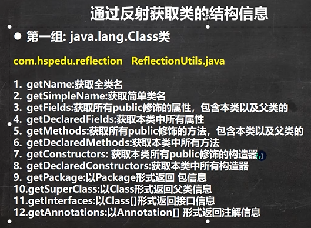

```java
public class ReflectionUtils {
    public static void main(String[] args) {

    }

    @Test
    public void api_02() throws ClassNotFoundException, NoSuchMethodException {
        //得到Class对象
        Class<?> personCls = Class.forName("com.hspedu.reflection.Person");
        //getDeclaredFields:获取本类中所有属性
        //规定 说明: 默认修饰符 是0 ， public  是1 ，private 是 2 ，protected 是 4 , static 是 8 ，final 是 16
        Field[] declaredFields = personCls.getDeclaredFields();
        for (Field declaredField : declaredFields) {
            System.out.println("本类中所有属性=" + declaredField.getName()
                    + " 该属性的修饰符值=" + declaredField.getModifiers()
                    + " 该属性的类型=" + declaredField.getType());
        }

        //getDeclaredMethods:获取本类中所有方法
        Method[] declaredMethods = personCls.getDeclaredMethods();
        for (Method declaredMethod : declaredMethods) {
            System.out.println("本类中所有方法=" + declaredMethod.getName()
                    + " 该方法的访问修饰符值=" + declaredMethod.getModifiers()
                    + " 该方法返回类型" + declaredMethod.getReturnType());

            //输出当前这个方法的形参数组情况
            Class<?>[] parameterTypes = declaredMethod.getParameterTypes();
            for (Class<?> parameterType : parameterTypes) {
                System.out.println("该方法的形参类型=" + parameterType);
            }
        }

        //getDeclaredConstructors:获取本类中所有构造器
        Constructor<?>[] declaredConstructors = personCls.getDeclaredConstructors();
        for (Constructor<?> declaredConstructor : declaredConstructors) {
            System.out.println("====================");
            System.out.println("本类中所有构造器=" + declaredConstructor.getName());//这里老师只是输出名

            Class<?>[] parameterTypes = declaredConstructor.getParameterTypes();
            for (Class<?> parameterType : parameterTypes) {
                System.out.println("该构造器的形参类型=" + parameterType);
            }


        }

    }

    //第一组方法API
    @Test
    public void api_01() throws ClassNotFoundException, NoSuchMethodException {

        //得到Class对象
        Class<?> personCls = Class.forName("com.hspedu.reflection.Person");
        //getName:获取全类名
        System.out.println(personCls.getName());//com.hspedu.reflection.Person
        //getSimpleName:获取简单类名
        System.out.println(personCls.getSimpleName());//Person
        //getFields:获取所有public修饰的属性，包含本类以及父类的
        Field[] fields = personCls.getFields();
        for (Field field : fields) {//增强for
            System.out.println("本类以及父类的属性=" + field.getName());
        }
        //getDeclaredFields:获取本类中所有属性
        Field[] declaredFields = personCls.getDeclaredFields();
        for (Field declaredField : declaredFields) {
            System.out.println("本类中所有属性=" + declaredField.getName());
        }
        //getMethods:获取所有public修饰的方法，包含本类以及父类的
        Method[] methods = personCls.getMethods();
        for (Method method : methods) {
            System.out.println("本类以及父类的方法=" + method.getName());
        }
        //getDeclaredMethods:获取本类中所有方法
        Method[] declaredMethods = personCls.getDeclaredMethods();
        for (Method declaredMethod : declaredMethods) {
            System.out.println("本类中所有方法=" + declaredMethod.getName());
        }
        //getConstructors: 获取所有public修饰的构造器，包含本类
        Constructor<?>[] constructors = personCls.getConstructors();
        for (Constructor<?> constructor : constructors) {
            System.out.println("本类的构造器=" + constructor.getName());
        }
        //getDeclaredConstructors:获取本类中所有构造器
        Constructor<?>[] declaredConstructors = personCls.getDeclaredConstructors();
        for (Constructor<?> declaredConstructor : declaredConstructors) {
            System.out.println("本类中所有构造器=" + declaredConstructor.getName());//这里老师只是输出名
        }
        //getPackage:以Package形式返回 包信息
        System.out.println(personCls.getPackage());//com.hspedu.reflection
        //getSuperClass:以Class形式返回父类信息
        Class<?> superclass = personCls.getSuperclass();
        System.out.println("父类的class对象=" + superclass);//
        //getInterfaces:以Class[]形式返回接口信息
        Class<?>[] interfaces = personCls.getInterfaces();
        for (Class<?> anInterface : interfaces) {
            System.out.println("接口信息=" + anInterface);
        }
        //getAnnotations:以Annotation[] 形式返回注解信息
        Annotation[] annotations = personCls.getAnnotations();
        for (Annotation annotation : annotations) {
            System.out.println("注解信息=" + annotation);//注解
        }

    }
}

class A {
    public String hobby;

    public void hi() {

    }

    public A() {
    }

    public A(String name) {
    }
}

interface IA {
}

interface IB {

}

@Deprecated
class Person extends A implements IA, IB {
    //属性
    public String name;
    protected static int age; // 4 + 8 = 12
    String job;
    private double sal;

    //构造器
    public Person() {
    }

    public Person(String name) {
    }

    //私有的
    private Person(String name, int age) {

    }

    //方法
    public void m1(String name, int age, double sal) {

    }

    protected String m2() {
        return null;
    }

    void m3() {

    }

    private void m4() {

    }
}
```


```java
public class ReflecCreateInstance {
    public static void main(String[] args) throws ClassNotFoundException, IllegalAccessException, InstantiationException, NoSuchMethodException, InvocationTargetException {

        //1. 先获取到User类的Class对象
        Class<?> userClass = Class.forName("com.hspedu.reflection.User");
        //2. 通过public的无参构造器创建实例
        Object o = userClass.newInstance();
        System.out.println(o);
        //3. 通过public的有参构造器创建实例
        /*
            constructor 对象就是
            public User(String name) {//public的有参构造器
                this.name = name;
            }
         */
        //3.1 先得到对应构造器
        Constructor<?> constructor = userClass.getConstructor(String.class);
        //3.2 创建实例，并传入实参
        Object hsp = constructor.newInstance("hsp");
        System.out.println("hsp=" + hsp);
        //4. 通过非public的有参构造器创建实例
        //4.1 得到private的构造器对象
        Constructor<?> constructor1 = userClass.getDeclaredConstructor(int.class, String.class);
        //4.2 创建实例
        //暴破【暴力破解】 , 使用反射可以访问private构造器/方法/属性, 反射面前，都是纸老虎
        constructor1.setAccessible(true);
        Object user2 = constructor1.newInstance(100, "张三丰");
        System.out.println("user2=" + user2);
    }
}

class User { //User类
    private int age = 10;
    private String name = "韩顺平教育";

    public User() {//无参 public
    }

    public User(String name) {//public的有参构造器
        this.name = name;
    }

    private User(int age, String name) {//private 有参构造器
        this.age = age;
        this.name = name;
    }

    public String toString() {
        return "User [age=" + age + ", name=" + name + "]";
    }
}
```


```java
public class ReflecAccessProperty {
    public static void main(String[] args) throws ClassNotFoundException, IllegalAccessException, InstantiationException, NoSuchFieldException {

        //1. 得到Student类对应的 Class对象
        Class<?> stuClass = Class.forName("com.hspedu.reflection.Student");
        //2. 创建对象
        Object o = stuClass.newInstance();//o 的运行类型就是Student
        System.out.println(o.getClass());//Student
        //3. 使用反射得到age 属性对象
        Field age = stuClass.getField("age");
        age.set(o, 88);//通过反射来操作属性
        System.out.println(o);//
        System.out.println(age.get(o));//返回age属性的值

        //4. 使用反射操作name 属性
        Field name = stuClass.getDeclaredField("name");
        //对name 进行暴破, 可以操作private 属性
        name.setAccessible(true);
        //name.set(o, "老韩");
        name.set(null, "老韩~");//因为name是static属性，因此 o 也可以写出null
        System.out.println(o);
        System.out.println(name.get(o)); //获取属性值
        System.out.println(name.get(null));//获取属性值, 要求name是static

    }
}

class Student {//类
    public int age;
    private static String name;

    public Student() {//构造器
    }

    public String toString() {
        return "Student [age=" + age + ", name=" + name + "]";
    }
}
```


```java
public class ReflecAccessMethod {
    public static void main(String[] args) throws ClassNotFoundException, NoSuchMethodException, IllegalAccessException, InstantiationException, InvocationTargetException {

        //1. 得到Boss类对应的Class对象
        Class<?> bossCls = Class.forName("com.hspedu.reflection.Boss");
        //2. 创建对象
        Object o = bossCls.newInstance();
        //3. 调用public的hi方法
        //Method hi = bossCls.getMethod("hi", String.class);//OK
        //3.1 得到hi方法对象
        Method hi = bossCls.getDeclaredMethod("hi", String.class);//OK
        //3.2 调用
        hi.invoke(o, "韩顺平教育~");

        //4. 调用private static 方法
        //4.1 得到 say 方法对象
        Method say = bossCls.getDeclaredMethod("say", int.class, String.class, char.class);
        //4.2 因为say方法是private, 所以需要暴破，原理和前面讲的构造器和属性一样
        say.setAccessible(true);
        System.out.println(say.invoke(o, 100, "张三", '男'));
        //4.3 因为say方法是static的，还可以这样调用 ，可以传入null
        System.out.println(say.invoke(null, 200, "李四", '女'));

        //5. 在反射中，如果方法有返回值，统一返回Object , 但是他运行类型和方法定义的返回类型一致
        Object reVal = say.invoke(null, 300, "王五", '男');
        System.out.println("reVal 的运行类型=" + reVal.getClass());//String


        //在演示一个返回的案例
        Method m1 = bossCls.getDeclaredMethod("m1");
        Object reVal2 = m1.invoke(o);
        System.out.println("reVal2的运行类型=" + reVal2.getClass());//Monster

    }
}

class Monster {}
class Boss {//类
    public int age;
    private static String name;

    public Boss() {//构造器
    }

    public Monster m1() {
        return new Monster();
    }

    private static String say(int n, String s, char c) {//静态方法
        return n + " " + s + " " + c;
    }

    public void hi(String s) {//普通public方法
        System.out.println("hi " + s);
    }
}
```

