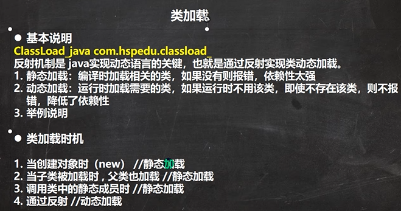
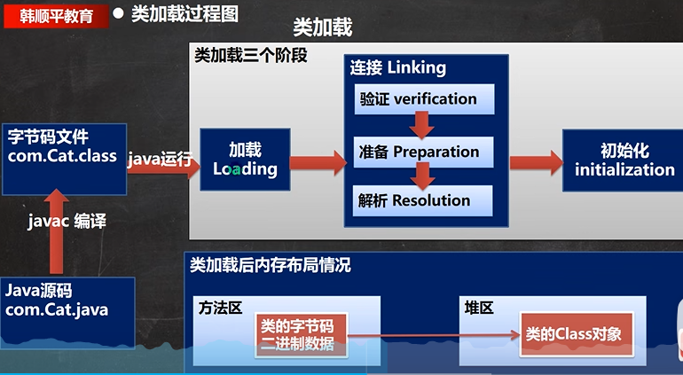
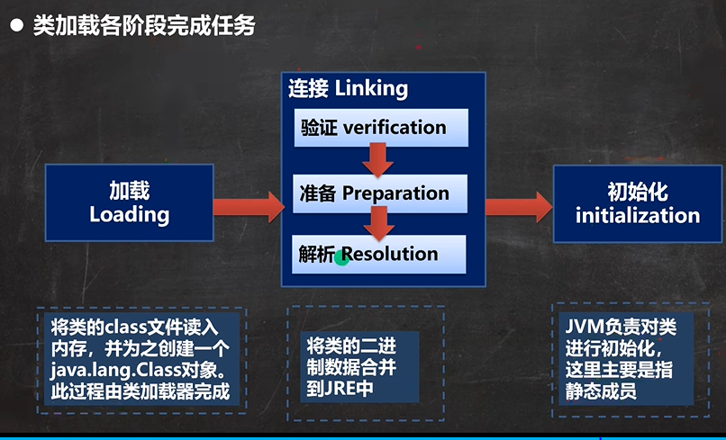
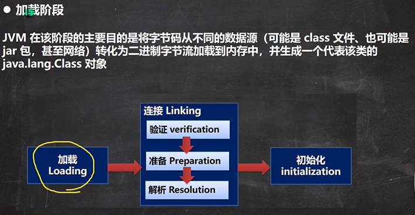
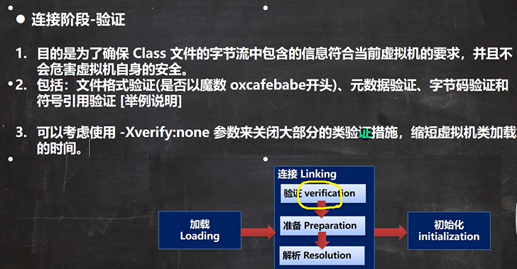
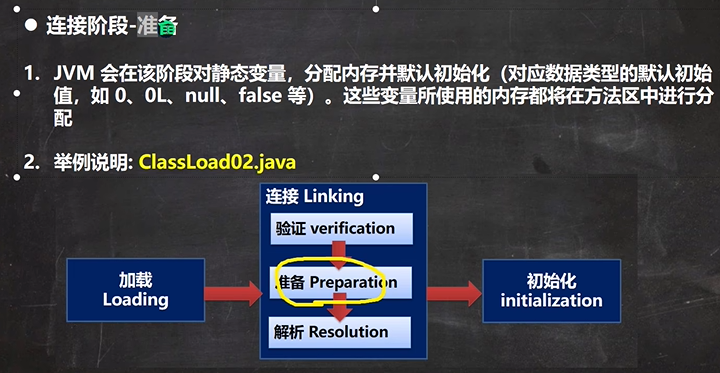
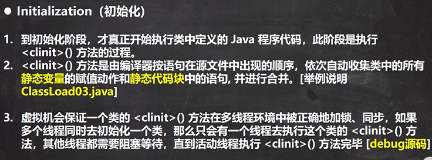

验证：对文件进行安全校验，比如格式是否正确，元数据验证是否正确，字节码是否正确，符号引用是否正确。

准备：给静态变量分配内存，完成默认初始化。

解析：虚拟机将会把常量池中的符号引用替换为直接引用。

初始化：会真正执行在类中定义的Java代码，完成显示初始化。









```java
class A {
    //属性-成员变量-字段
    //分析类加载的链接阶段-准备 属性是如何处理
    //1. n1 是实例属性, 不是静态变量，因此在准备阶段，是不会分配内存
    //2. n2 是静态变量，分配内存 n2 是默认初始化 0 ,而不是20
    //3. n3 是static final 是常量, 他和静态变量不一样, 因为一旦赋值就不变 n3 = 30
    public int n1 = 10;
    public static  int n2 = 20;
    public static final  int n3 = 30;
}
```




```java
public class ClassLoad03 {
    public static void main(String[] args) throws ClassNotFoundException {
        //1. 加载B类，并生成 B的class对象
        //2. 链接 num = 0
        //3. 初始化阶段
        //    依次自动收集类中的所有静态变量的赋值动作和静态代码块中的语句,并合并
        /*
                clinit() {
                    System.out.println("B 静态代码块被执行");
                    //num = 300;
                    num = 100;
                }
                合并: num = 100
         */

        //new B();//类加载
        //System.out.println(B.num);//100, 如果直接使用类的静态属性，也会导致类的加载

        //看看加载类的时候，是有同步机制控制
        /*
        protected Class<?> loadClass(String name, boolean resolve)
        throws ClassNotFoundException
        {
            //正因为有这个机制，才能保证某个类在内存中, 只有一份Class对象
            synchronized (getClassLoadingLock(name)) {
            //....
            }
            }
         */
        B b = new B();
    }
}
```

