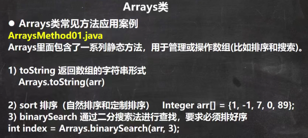
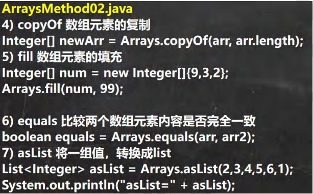
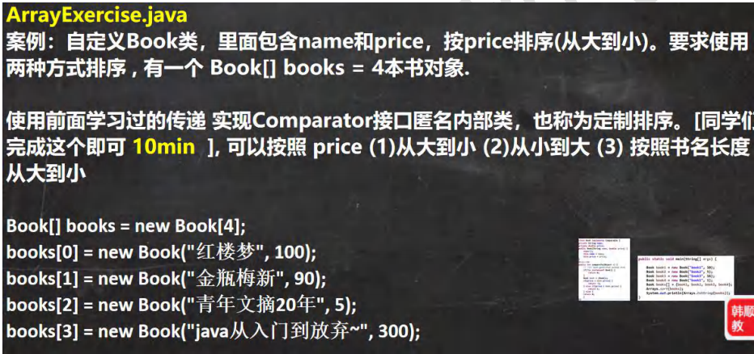

 

```java
package com.czl.stringbuilder;

import java.util.Arrays;
import java.util.Comparator;

public class ArraysMethod01 {
    public static void main(String[] args) {

        Integer[] integers = {1, 20, 90};
        //遍历数组
        for(int i = 0; i < integers.length; i++) {
            System.out.println(integers[i]);
        }
        //直接使用Arrays.toString方法，显示数组
        System.out.println(Arrays.toString(integers));//[1, 20, 90]

        //演示 sort方法的使用
        Integer arr[] = {1, -1, 7, 0, 89};
        //进行排序
        //1. 可以直接使用冒泡排序 , 也可以直接使用Arrays提供的sort方法排序
        //2. 因为数组是引用类型，所以通过sort排序后，会直接影响到 实参 arr
        //3. sort重载的，也可以通过传入一个接口 Comparator 实现定制排序
        //4. 调用 定制排序 时，传入两个参数 (1) 排序的数组 arr
        //   (2) 实现了Comparator接口的匿名内部类 , 要求实现 compare方法
        //5. 先演示效果，再解释
        //6. 这里体现了接口编程的方式 , 看看源码，就明白
        //   源码分析
        //(1) Arrays.sort(arr, new Comparator()
        //(2) 最终到 TimSort类的 private static <T> void binarySort(T[] a, int lo, int hi, int start,
        //                                       Comparator<? super T> c)()
        //(3) 执行到 binarySort方法的代码, 会根据动态绑定机制 c.compare()执行我们传入的
        //    匿名内部类的 compare ()
        //     while (left < right) {
        //                int mid = (left + right) >>> 1;
        //                if (c.compare(pivot, a[mid]) < 0)
        //                    right = mid;
        //                else
        //                    left = mid + 1;
        //            }
        //(4) new Comparator() {
        //            @Override
        //            public int compare(Object o1, Object o2) {
        //                Integer i1 = (Integer) o1;
        //                Integer i2 = (Integer) o2;
        //                return i2 - i1;
        //            }
        //        }
        //(5) public int compare(Object o1, Object o2) 返回的值>0 还是 <0
        //    会影响整个排序结果, 这就充分体现了 接口编程+动态绑定+匿名内部类的综合使用
        //    将来的底层框架和源码的使用方式，会非常常见
        //Arrays.sort(arr); // 默认排序方法
        //定制排序
        Arrays.sort(arr, new Comparator() {
            @Override
            public int compare(Object o1, Object o2) {
                Integer i1 = (Integer) o1;
                Integer i2 = (Integer) o2;
                return i2 - i1;
            }
        });
        System.out.println("===排序后===");
        System.out.println(Arrays.toString(arr));
    }
}
```

```java
public class ArraysSortCustom {
    public static void main(String[] args) {

        int[] arr = {1, -1, 8, 0, 20};
        //bubble01(arr);

        bubble02(arr, new Comparator() {
            @Override
            public int compare(Object o1, Object o2) {
                int i1 = (Integer) o1;
                int i2 = (Integer) o2;
                return i2 - i1;// return i2 - i1;
            }
        });

        System.out.println("==定制排序后的情况==");
        System.out.println(Arrays.toString(arr));
    }

    //使用冒泡完成排序
    public static void bubble01(int[] arr) {
        int temp = 0;
        for (int i = 0; i < arr.length - 1; i++) {
            for (int j = 0; j < arr.length - 1 - i; j++) {
                //从小到大
                if (arr[j] > arr[j + 1]) {
                    temp = arr[j];
                    arr[j] = arr[j + 1];
                    arr[j + 1] = temp;
                }
            }
        }
    }

    //结合冒泡 + 定制
    public static void bubble02(int[] arr, Comparator c) {
        int temp = 0;
        for (int i = 0; i < arr.length - 1; i++) {
            for (int j = 0; j < arr.length - 1 - i; j++) {
                //数组排序由 c.compare(arr[j], arr[j + 1])返回的值决定
                if (c.compare(arr[j], arr[j + 1]) > 0) {
                    temp = arr[j];
                    arr[j] = arr[j + 1];
                    arr[j + 1] = temp;
                }
            }
        }
    }
}
```


 

```java
public class ArraysMethod02 {
    public static void main(String[] args) {
        Integer[] arr = {1, 2, 90, 123, 567};
        // binarySearch 通过二分搜索法进行查找，要求必须排好
        //1. 使用 binarySearch 二叉查找
        //2. 要求该数组是有序的. 如果该数组是无序的，不能使用binarySearch
        //3. 如果数组中不存在该元素，就返回 return -(low + 1);
        int index = Arrays.binarySearch(arr, 567);
        System.out.println("index=" + index);

        //copyOf 数组元素的复制
        //1. 从 arr 数组中，拷贝 arr.length个元素到 newArr数组中
        //2. 如果拷贝的长度 > arr.length 就在新数组的后面 增加 null
        //3. 如果拷贝长度 < 0 就抛出异常NegativeArraySizeException
        //4. 该方法的底层使用的是 System.arraycopy()
        Integer[] newArr = Arrays.copyOf(arr, arr.length);
        System.out.println("==拷贝执行完毕后==");
        System.out.println(Arrays.toString(newArr));

        //fill 数组元素的填充
        Integer[] num = new Integer[]{9,3,2};
        //1. 使用 99 去填充 num数组，可以理解成是替换原理的元素
        Arrays.fill(num, 99);
        System.out.println("==num数组填充后==");
        System.out.println(Arrays.toString(num));//[99,99,99]

        //equals 比较两个数组元素内容是否完全一致
        Integer[] arr2 = {1, 2, 90, 123};
        //1. 如果arr 和 arr2 数组的元素一样，则方法true;
        //2. 如果不是完全一样，就返回 false
        boolean equals = Arrays.equals(arr, arr2);
        System.out.println("equals=" + equals);

        //asList 将一组值，转换成list
        //1. asList方法，会将 (2,3,4,5,6,1)数据转成一个List集合
        //2. 返回的 asList 编译类型 List(接口)
        //3. asList 运行类型 java.util.Arrays$ArrayList, 是Arrays类的
        //   静态内部类 private static class ArrayList<E> extends AbstractList<E>
        //              implements RandomAccess, java.io.Serializable
        List asList = Arrays.asList(2,3,4,5,6,1);
        System.out.println("asList=" + asList);
        System.out.println("asList的运行类型" + asList.getClass());
    }
}
```


 

```java
package com.czl.stringbuilder;

import java.util.Arrays;
import java.util.Comparator;

public class ArrayExercise {
    public static void main(String[] args) {
        Book[] books = new Book[4];
        books[0] = new Book("红楼梦", 100);
        books[1] = new Book("金瓶梅新", 90);
        books[2] = new Book("青年文摘20年", 5);
        books[3] = new Book("java从入门到放弃~", 300);

//        //(1)price从大到小
//        Arrays.sort(books, new Comparator() {
//            //这里是对Book数组排序，因此  o1 和 o2 就是Book对象
//            @Override
//            public int compare(Object o1, Object o2) {
//                Book book1 = (Book) o1;
//                Book book2 = (Book) o2;
//                double priceVal = book2.getPrice() - book1.getPrice();
//                //如果发现返回结果和我们输出的不一致，就修改一下返回的 1 和 -1
//                if(priceVal > 0) {
//                    return 1;
//                } else if(priceVal < 0) {
//                    return -1;
//                } else {
//                    return 0;
//                }
//            }
//        });

//        //(2)price从小到大
//        Arrays.sort(books, new Comparator() {
//            //这里是对Book数组排序，因此  o1 和 o2 就是Book对象
//            //o1运行类型是Book，编译类型是Object，所以要向下转型
//            @Override
//            public int compare(Object o1, Object o2) {
//                Book book1 = (Book) o1;
//                Book book2 = (Book) o2;
//                double priceVal = book2.getPrice() - book1.getPrice();
//                //这里进行了一个转换 book2.getPrice() - book1.getPrice()是double类型
//                //如果发现返回结果和我们输出的不一致，就修改一下返回的 1 和 -1
//                if(priceVal > 0) {
//                    return  -1;
//                } else  if(priceVal < 0) {
//                    return 1;
//                } else {
//                    return 0;
//                }
//            }
//        });

        //(3)按照书名长度从大到小
        Arrays.sort(books, new Comparator() {
            //这里是对Book数组排序，因此  o1 和 o2 就是Book对象
            @Override
            public int compare(Object o1, Object o2) {
                Book book1 = (Book) o1;
                Book book2 = (Book) o2;
                //要求按照书名的长度来进行排序
                return book2.getName().length() - book1.getName().length();
            }
        });
        System.out.println(Arrays.toString(books));
    }
}

class Book {
    private String name;
    private double price;

    public Book(String name, double price) {
        this.name = name;
        this.price = price;
    }

    public String getName() {
        return name;
    }

    public void setName(String name) {
        this.name = name;
    }

    public double getPrice() {
        return price;
    }

    public void setPrice(double price) {
        this.price = price;
    }

    @Override
    public String toString() {
        return "Book{" +
                "name='" + name + '\'' +
                ", price=" + price +
                '}';
    }
}
```

