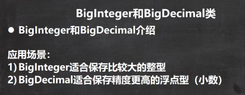
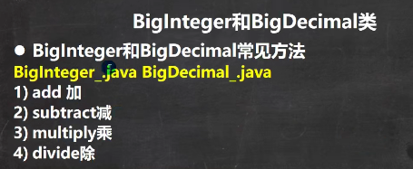

 

 

```java
public class BigInteger_ {
    public static void main(String[] args) {
        //当我们编程中，需要处理很大的整数，long 不够用
        //可以使用BigInteger的类来搞定
//        long l = 23788888899999999999999999999l;
//        System.out.println("l=" + l);

        BigInteger bigInteger = new BigInteger("23788888899999999999999999999");
        BigInteger bigInteger2 = new BigInteger("10099999999");
        System.out.println(bigInteger);
        //1. 在对 BigInteger 进行加减乘除的时候，需要使用对应的方法，不能直接进行 + - * /
        //2. 可以创建一个 要操作的 BigInteger 然后进行相应操作
        BigInteger add = bigInteger.add(bigInteger2);
        System.out.println(add);
        BigInteger subtract = bigInteger.subtract(bigInteger2);
        System.out.println(subtract);
        BigInteger multiply = bigInteger.multiply(bigInteger2);
        System.out.println(multiply);
        BigInteger divide = bigInteger.divide(bigInteger2);
        System.out.println(divide);
    }
}
```


```java
public class BigDecimal_ {
    public static void main(String[] args) {
        //当我们需要保存一个精度很高的数时，double 不够用
        //可以是 BigDecimal
//        double d = 1999.11111111111999999999999977788d;
//        System.out.println(d);
        BigDecimal bigDecimal = new BigDecimal("1999.11");
        BigDecimal bigDecimal2 = new BigDecimal("3");
        System.out.println(bigDecimal);

        //1. 如果对 BigDecimal进行运算，比如加减乘除，需要使用对应的方法
        //2. 创建一个需要操作的 BigDecimal 然后调用相应的方法即可
        System.out.println(bigDecimal.add(bigDecimal2));
        System.out.println(bigDecimal.subtract(bigDecimal2));
        System.out.println(bigDecimal.multiply(bigDecimal2));
        //System.out.println(bigDecimal.divide(bigDecimal2));//可能抛出异常ArithmeticException
        //在调用divide 方法时，指定精度即可. BigDecimal.ROUND_CEILING
        //如果有无限循环小数，就会保留 分子 的精度
        System.out.println(bigDecimal.divide(bigDecimal2, BigDecimal.ROUND_CEILING));
    }
}
```

