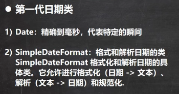
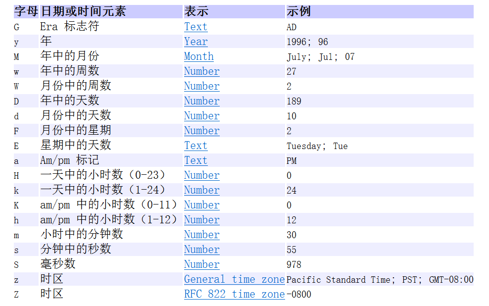
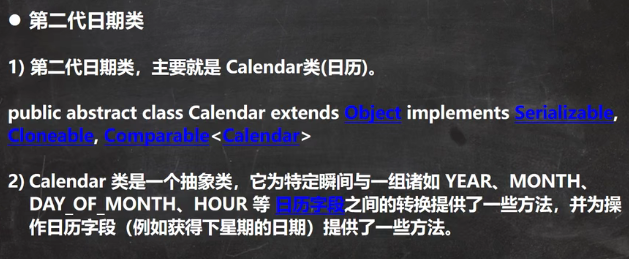
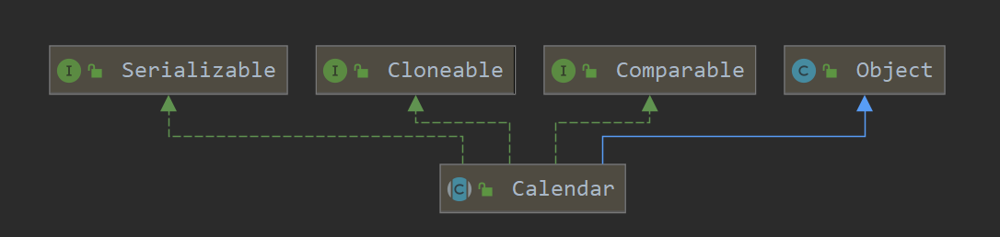
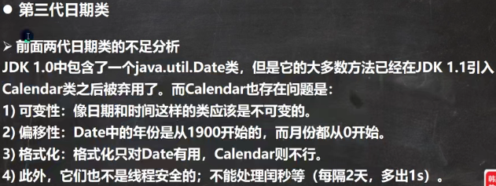
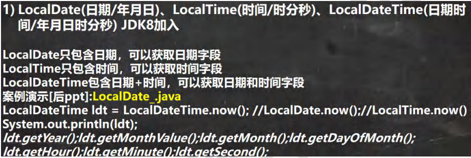
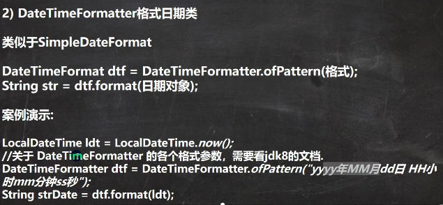
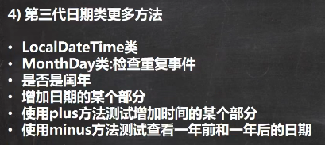
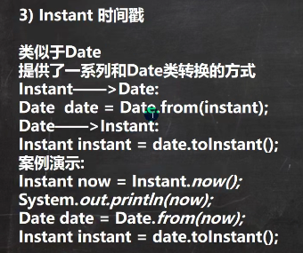

 

 

```java
public class Date01 {
    public static void main(String[] args) throws ParseException {
        //1. 获取当前系统时间
        //2. 这里的Date 类是在java.util包
        //3. 默认输出的日期格式是国外的方式, 因此通常需要对格式进行转换
        Date d1 = new Date(); //获取当前系统时间
        System.out.println("当前日期=" + d1);
//        Date d2 = new Date(9234567); //通过指定毫秒数得到时间
//        System.out.println("d2=" + d2); //获取某个时间对应的毫秒数

        //1. 创建 SimpleDateFormat对象，可以指定相应的格式
        //2. 这里的格式使用的字母是规定好，不能乱写
        SimpleDateFormat sdf = new SimpleDateFormat("yyyy年MM月dd日 hh:mm:ss E");
        String format = sdf.format(d1); // format:将日期转换成指定格式的字符串
        System.out.println("当前日期=" + format);

        //1. 可以把一个格式化的String 转成对应的 Date
        //2. 得到Date 仍然在输出时，还是按照国外的形式，如果希望指定格式输出，需要转换
        //3. 在把String -> Date，使用的 sdf 格式需要和你给的String的格式一样，否则会抛出转换异常
        String s = "1996年01月01日 10:20:30 星期一";
        Date parse = sdf.parse(s);
        System.out.println(parse);
        System.out.println("parse=" + sdf.format(parse));
    }
}
```


 

 

```java
package com.czl.date_;

import java.util.Calendar;

public class Calendar_ {
    public static void main(String[] args) {
        //1. Calendar是一个抽象类， 并且构造器是private
        //2. 可以通过 getInstance() 来获取实例
        //3. 提供大量的方法和字段提供给程序员
        //4. Calendar没有提供对应的格式化的类，因此需要程序员自己组合来输出(灵活)
        //5. 如果我们需要按照 24小时进制来获取时间， Calendar.HOUR ==改成=> Calendar.HOUR_OF_DAY
        Calendar c = Calendar.getInstance(); //创建日历类对象//比较简单，自由
        System.out.println("c=" + c);
        //2.获取日历对象的某个日历字段
        System.out.println("年：" + c.get(Calendar.YEAR));
        // 这里为什么要 + 1, 因为Calendar 返回月时候，是按照 0 开始编号
        System.out.println("月：" + (c.get(Calendar.MONTH) + 1));
        System.out.println("日：" + c.get(Calendar.DAY_OF_MONTH));
        System.out.println("小时：" + c.get(Calendar.HOUR));
        System.out.println("分钟：" + c.get(Calendar.MINUTE));
        System.out.println("秒：" + c.get(Calendar.SECOND));
        //Calender 没有专门的格式化方法，所以需要程序员自己来组合显示
        System.out.println(c.get(Calendar.YEAR) + "-" + (c.get(Calendar.MONTH) + 1) + "-" + c.get(Calendar.DAY_OF_MONTH) +
                " " + c.get(Calendar.HOUR_OF_DAY) + ":" + c.get(Calendar.MINUTE) + ":" + c.get(Calendar.SECOND) );

    }
}
```


 

 

  

 

```java
package com.czl.date_;

import java.time.LocalDate;
import java.time.LocalDateTime;
import java.time.LocalTime;
import java.time.format.DateTimeFormatter;

public class LocalDate_ {
    public static void main(String[] args) {
        //1. 使用now() 返回表示当前日期时间的 对象
        LocalDateTime ldt = LocalDateTime.now(); //LocalDate.now();//LocalTime.now()
        System.out.println(ldt);

        //2. 使用DateTimeFormatter 对象来进行格式化
        // 创建 DateTimeFormatter对象
        DateTimeFormatter dateTimeFormatter = DateTimeFormatter.ofPattern("yyyy-MM-dd HH:mm:ss");
        String format = dateTimeFormatter.format(ldt);
        System.out.println("格式化的日期=" + format);

        System.out.println("年=" + ldt.getYear());
        System.out.println("月=" + ldt.getMonth());//月=NOVEMBER
        System.out.println("月=" + ldt.getMonthValue());//月=11
        System.out.println("日=" + ldt.getDayOfMonth());
        System.out.println("时=" + ldt.getHour());
        System.out.println("分=" + ldt.getMinute());
        System.out.println("秒=" + ldt.getSecond());

        LocalDate now = LocalDate.now(); //可以获取年月日
        LocalTime now2 = LocalTime.now();//获取到时分秒


        //提供 plus 和 minus方法可以对当前时间进行加或者减
        //看看890天后，是什么时候 把 年月日-时分秒
        LocalDateTime localDateTime = ldt.plusDays(890);
        System.out.println("890天后=" + dateTimeFormatter.format(localDateTime));

        //看看在 3456分钟前是什么时候，把 年月日-时分秒输出
        LocalDateTime localDateTime2 = ldt.minusMinutes(3456);
        System.out.println("3456分钟前 日期=" + dateTimeFormatter.format(localDateTime2));
    }
}
```


 

```java
public class Instant_ {
    public static void main(String[] args) {
        //1.通过 静态方法 now() 获取表示当前时间戳的对象
        Instant now = Instant.now();
        System.out.println(now);
        //2. 通过 from 可以把 Instant转成 Date
        Date date = Date.from(now);
        System.out.println(date);
        //3. 通过 date的toInstant() 可以把 date 转成Instant对象
        Instant instant = date.toInstant();
    }
}
```

