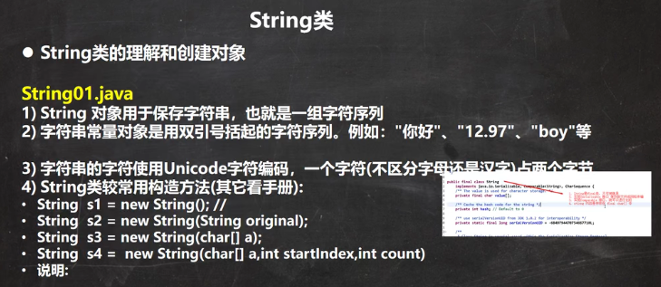 

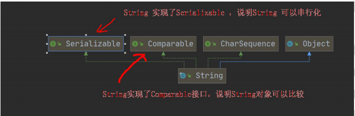 

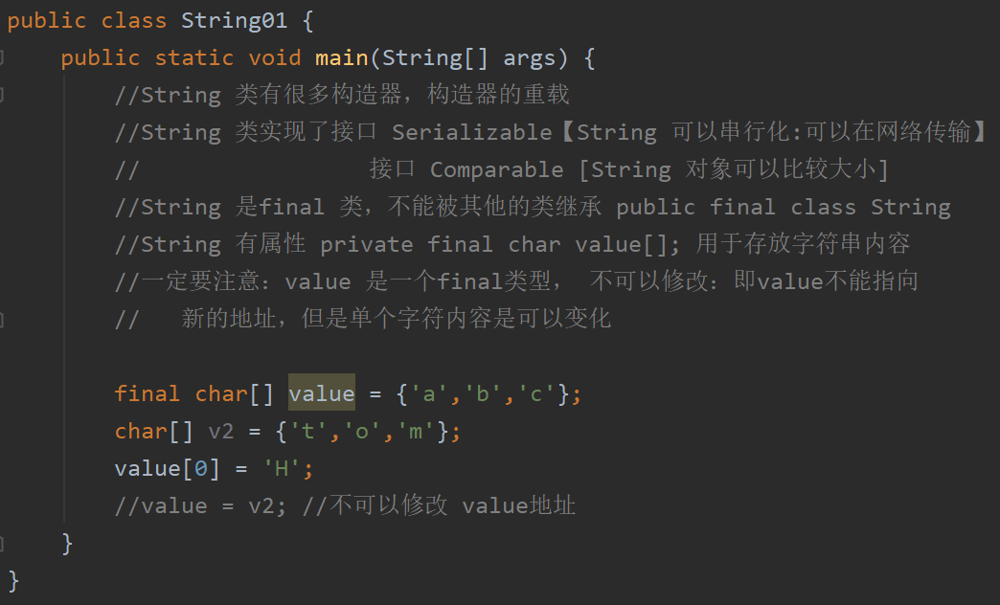 


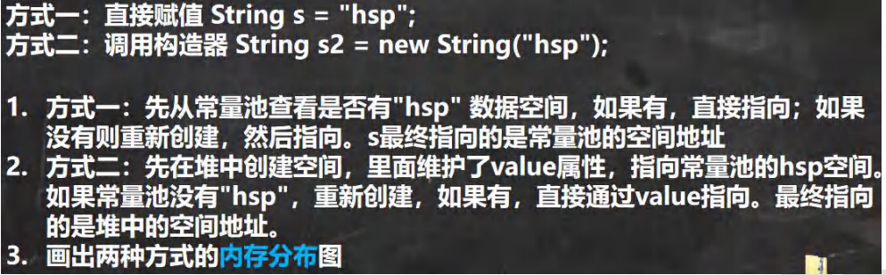

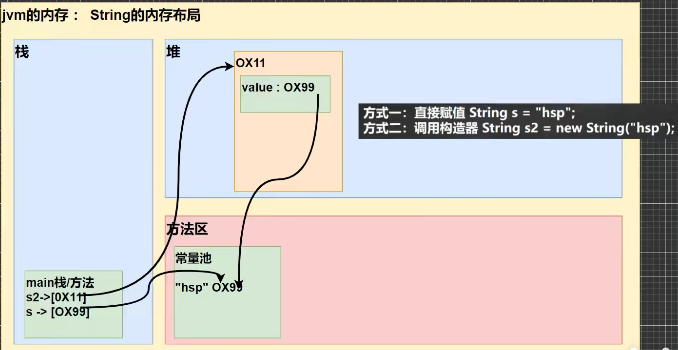 

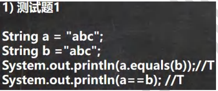 

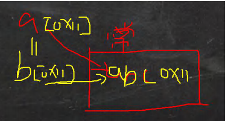 

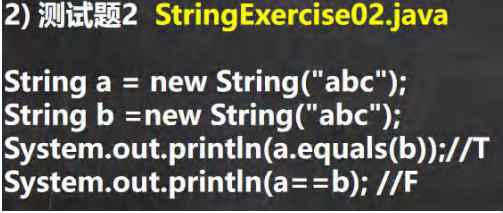 

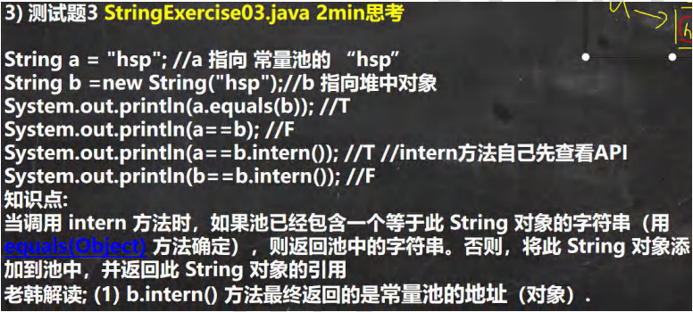 

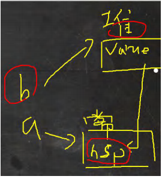 

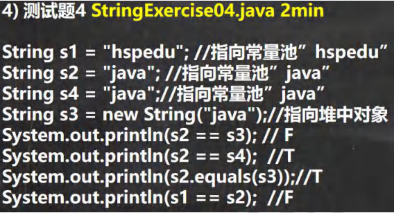 

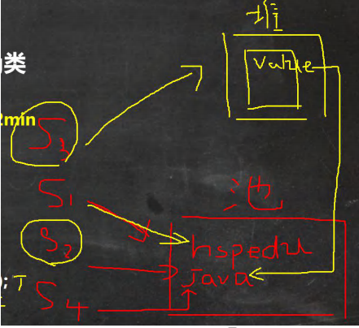 

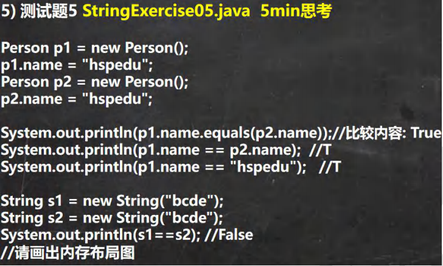 

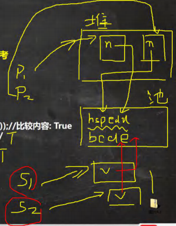 

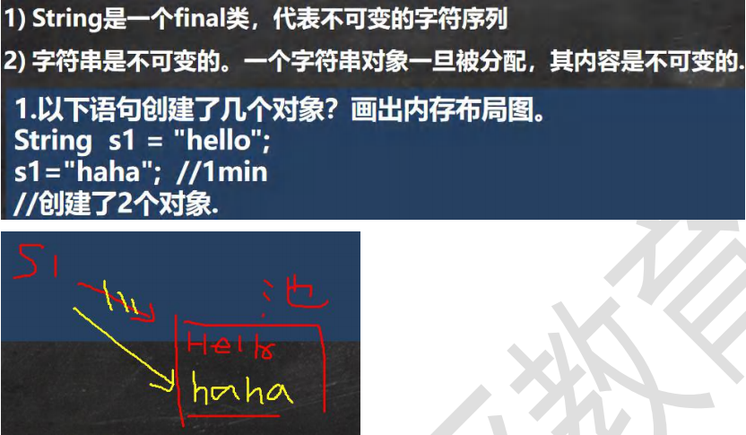 


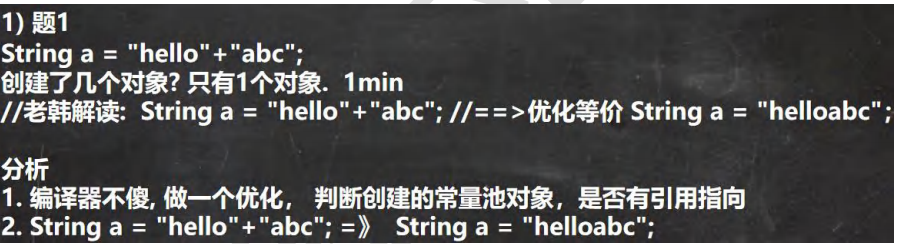 

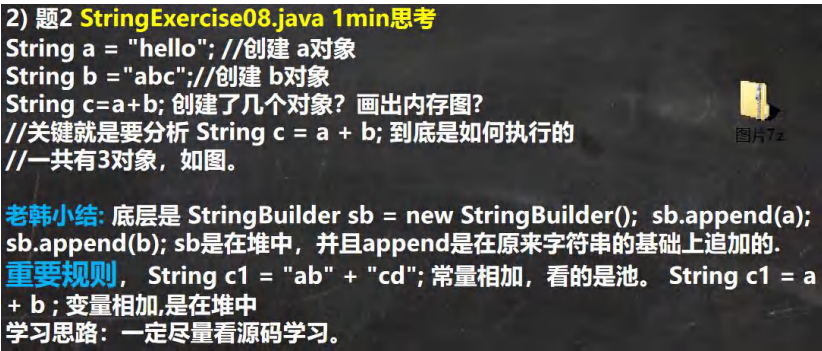 

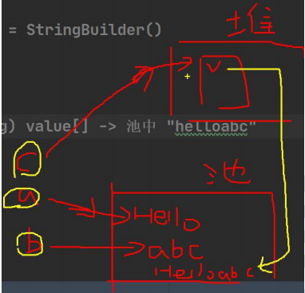 

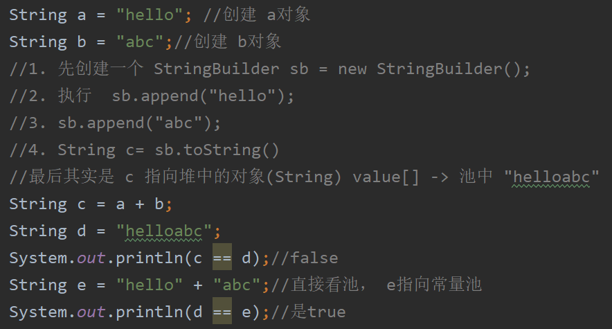 

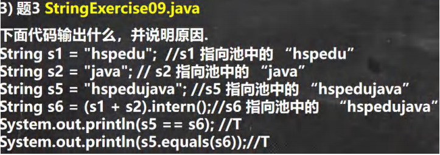 

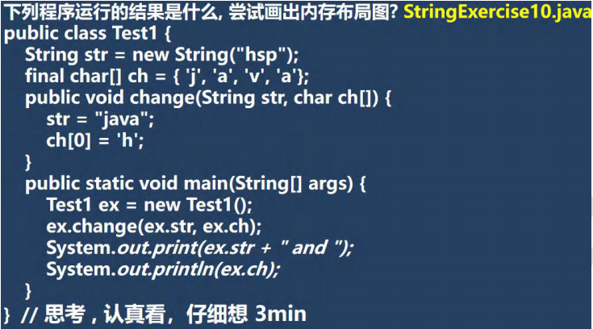 

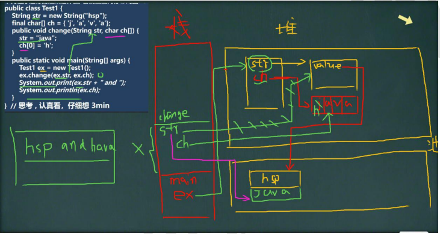 


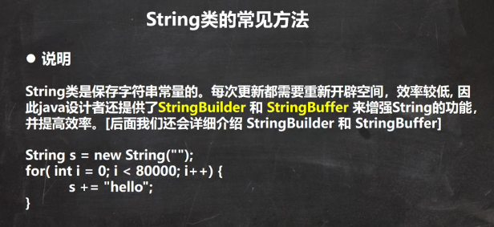 

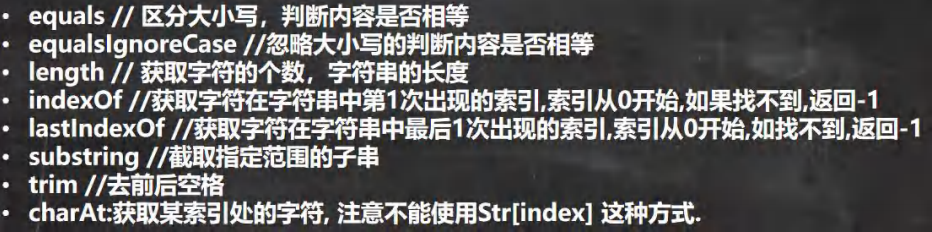 

```java
package com.czl.string_;

public class StringMethod01 {
    public static void main(String[] args) {
        //1. equals 前面已经讲过了. 比较内容是否相同，区分大小写
        String str1 = "hello";
        String str2 = "Hello";
        System.out.println(str1.equals(str2));//F

        // 2.equalsIgnoreCase 忽略大小写的判断内容是否相等
        String username = "johN";
        if ("john".equalsIgnoreCase(username)) {
            System.out.println("Success!");
        } else {
            System.out.println("Failure!");
        }

        // 3.length 获取字符的个数，字符串的长度
        System.out.println("czl".length());

        // 4.indexOf 获取字符在字符串对象中第一次出现的索引，索引从0开始，如果找不到，返回-1
        String s1 = "wer@terwe@g";
        int index = s1.indexOf('@');
        System.out.println(index);// 3
        System.out.println("weIndex=" + s1.indexOf("we"));//0

        // 5.lastIndexOf 获取字符在字符串中最后一次出现的索引，索引从0开始，如果找不到，返回-1
        s1 = "wer@terwe@g@";
        index = s1.lastIndexOf('@');
        System.out.println(index);//11
        System.out.println("ter的位置=" + s1.lastIndexOf("ter"));//4

        // 6.substring 截取指定范围的子串
        String name = "hello,张三";
        //下面name.substring(6) 从索引6开始截取后面所有的内容
        System.out.println(name.substring(6));//截取后面的字符
        //name.substring(0,5)表示从索引0开始截取，截取到索引 5-1=4位置
        System.out.println(name.substring(0,5));//hello
    }
}
```

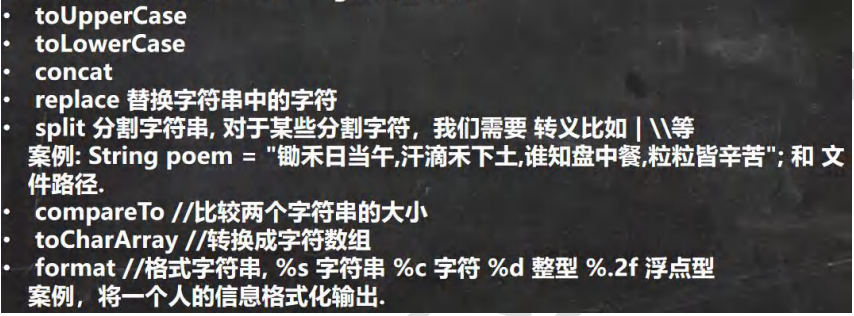 

```java
package com.czl.string_;

public class StringMethod02 {
    public static void main(String[] args) {
        // 1.toUpperCase转换成大写
        String s = "heLLo";
        System.out.println(s.toUpperCase());//HELLO

        // 2.toLowerCase
        System.out.println(s.toLowerCase());//hello

        // 3.concat拼接字符串
        String s1 = "宝玉";
        s1 = s1.concat("林黛玉").concat("薛宝钗").concat("together");
        System.out.println(s1);//宝玉林黛玉薛宝钗together

        // 4.replace 替换字符串中的字符
        s1 = "宝玉 and 林黛玉 林黛玉 林黛玉";
        //在s1中，将 所有的 林黛玉 替换成薛宝钗
        //s1.replace() 方法执行后，返回的结果才是替换过的.
        // 注意对 s1没有任何影响
        String s11 = s1.replace("宝玉", "jack");
        System.out.println(s1);//宝玉 and 林黛玉 林黛玉 林黛玉
        System.out.println(s11);//jack and 林黛玉 林黛玉 林黛玉

        // 5.split 分割字符串, 对于某些分割字符，我们需要 转义比如 \ \\等
        String poem = "锄禾日当午,汗滴禾下土,谁知盘中餐,粒粒皆辛苦";
        // 1. 以 , 为标准对 poem 进行分割 , 返回一个数组
        // 2. 在对字符串进行分割时，如果有特殊字符，需要加入 转义符 \
        String[] split = poem.split(",");
        poem = "E:\\aaa\\bbb";
        split = poem.split("\\\\");
        System.out.println("==分割后内容===");
        for (int i = 0; i < split.length; i++) {
            System.out.println(split[i]);
        }

        // 6.toCharArray 转换成字符数组
        s = "happy";
        char[] chs = s.toCharArray();
        for (int i = 0; i < chs.length; i++) {
            System.out.println(chs[i]);
        }

        // 7.compareTo 比较两个字符串的大小，如果前者大，
        // 则返回正数，后者大，则返回负数，如果相等，返回0
        // (1) 如果长度相同，并且每个字符也相同，就返回 0
        // (2) 如果长度相同或者不相同，但是在进行比较时，可以区分大小
        //     就返回 if (c1 != c2) {
        //                return c1 - c2;
        //            }
        // (3) 如果前面的部分都相同，就返回 str1.len - str2.len
        String a = "jcak";// len = 4
        String b = "jack";// len = 4
        System.out.println(a.compareTo(b)); // 返回值是 'c' - 'a' = 2的值

        // 8.format 格式字符串
        /* 占位符有:
         * %s 字符串 %c 字符 %d 整型 %.2f 浮点型
         *
         */
        String name = "john";
        int age = 10;
        double score = 56.857;
        char gender = '男';
        //将所有的信息都拼接在一个字符串.
        String info =
                "我的姓名是" + name + "年龄是" + age + ",成绩是" + score +
                        "性别是" + gender + "。希望大家喜欢我！";
        System.out.println(info);

        //1. %s , %d , %.2f %c 称为占位符
        //2. 这些占位符由后面变量来替换
        //3. %s 表示后面由 字符串来替换
        //4. %d 是整数来替换
        //5. %.2f 表示使用小数来替换，替换后，只会保留小数点两位, 并且进行四舍五入的处理
        //6. %c 使用char 类型来替换
        String formatStr = "我的姓名是%s 年龄是%d 成绩是%.2f 性别是%c 希望大家喜欢我！";

        String info2 = String.format(formatStr, name, age, score, gender);

        System.out.println("info2=" + info2);
    }
}
```

