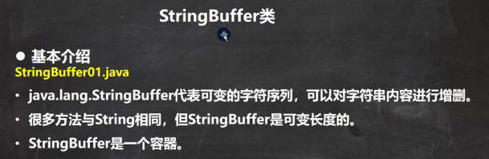
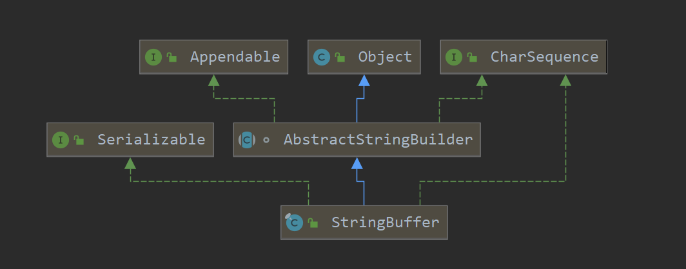
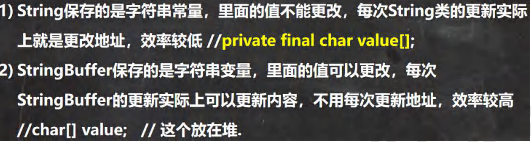
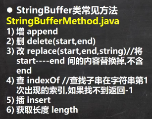
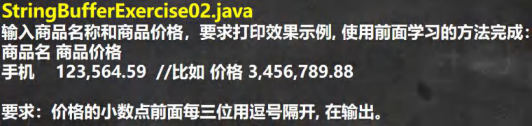

 

 

 

```java
package com.czl.stringbuffer;

public class StringBuffer01 {
    public static void main(String[] args) {
        //1. StringBuffer 的直接父类 是 AbstractStringBuilder
        //2. StringBuffer 实现了 Serializable, 即StringBuffer的对象可以串行化
        //3. 在父类中  AbstractStringBuilder 有属性 char[] value,不是final
        //   该 value 数组存放 字符串内容，因此存放在堆中的
        //4. StringBuffer 是一个 final类，不能被继承
        //5. 因为StringBuffer 字符内容是存在 char[] value, 所有在变化(增加/删除)
        //   不用每次都更换地址(即不是每次创建新对象)， 所以效率高于 String
        StringBuffer stringBuffer = new StringBuffer("hello");
    }
}


// 构造器：
package com.czl.stringbuffer;

public class StringBuffer02 {
    public static void main(String[] args) {

        //构造器的使用
        //1. 创建一个 大小为 16的 char[] ,用于存放字符内容
        StringBuffer stringBuffer = new StringBuffer();

        //2 通过构造器指定 char[] 大小
        StringBuffer stringBuffer1 = new StringBuffer(100);

        //3. 通过 给一个String 创建 StringBuffer, char[] 大小就是 str.length() + 16
        StringBuffer hello = new StringBuffer("hello");

    }
}
```


 

```java
package com.czl.stringbuffer;

public class StringAndStringBuffer {
    public static void main(String[] args) {

        //看 String——>StringBuffer
        String str = "hello tom";
        //方式1 使用构造器
        //注意： 返回的才是StringBuffer对象，对str 本身没有影响
        StringBuffer stringBuffer = new StringBuffer(str);
        //方式2 使用的是append方法
        StringBuffer stringBuffer1 = new StringBuffer();
        stringBuffer1 = stringBuffer1.append(str);

        //看看 StringBuffer ->String
        StringBuffer stringBuffer3 = new StringBuffer("czl");
        //方式1 使用StringBuffer提供的 toString方法
        String s = stringBuffer3.toString();
        //方式2: 使用构造器来
        String s1 = new String(stringBuffer3);
    }
}
```


 

```java
package com.czl.stringbuffer;

public class StringBufferMethod {
    public static void main(String[] args) {

        StringBuffer s = new StringBuffer("hello");
        //增
        s.append(',');// "hello,"
        s.append("张三丰");//"hello,张三丰"
        s.append("赵敏").append(100).append(true).append(10.5);//"hello,张三丰赵敏100true10.5"
        System.out.println(s);//"hello,张三丰赵敏100true10.5"  本质是调用StringBuffer重写的toString方法


        //删
        /*
         * 删除索引为>=start && <end 处的字符
         * 删除 11~14的字符 [11, 14)
         */
        s.delete(11, 14);
        System.out.println(s);//"hello,张三丰赵敏true10.5"

        //改
        //使用 周芷若 替换 索引9-11的字符 [9,11)
        s.replace(9, 11, "周芷若");
        System.out.println(s);//"hello,张三丰周芷若true10.5"

        //查找指定的子串在字符串第一次出现的索引，如果找不到返回-1
        int indexOf = s.indexOf("张三丰");
        System.out.println(indexOf);//6

        //插
        //在索引为9的位置插入 "赵敏",原来索引为9的内容自动后移
        s.insert(9, "赵敏");
        System.out.println(s);//"hello,张三丰赵敏周芷若true10.5"
        //长度
        System.out.println(s.length());//22
        System.out.println(s);

    }
}
```


```java
练习1：
package com.czl.stringbuffer;

public class StringBufferExercise01 {
    public static void main(String[] args) {
        String str = null;// ok
        StringBuffer sb = new StringBuffer(); //ok
        sb.append(str);//需要看源码 , 底层调用的是 AbstractStringBuilder 的 appendNull方法，返回字符串null
        System.out.println(sb.length());//4

        System.out.println(sb);//null
        //下面的构造器，会抛出NullPointerException
        StringBuffer sb1 = new StringBuffer(str);//看底层源码 super(str.length() + 16);
        System.out.println(sb1);

    }
}
```


 

```java
package com.czl.stringbuffer;

public class StringBufferExercise02 {
    public static void main(String[] args) {

        /*
        思路分析
        1. 定义一个Scanner 对象，接收用户输入的 价格(String)
        2. 希望使用到 StringBuffer的 insert ，需要将 String 转成 StringBuffer
        3. 然后使用相关方法进行字符串的处理
        代码实现
         */
        String price = "8123564.59";
        StringBuffer sb = new StringBuffer(price);
        //先完成一个最简单的实现123,564.59
        //找到小数点的索引，然后在该位置的前3位，插入,即可
//        int i = sb.lastIndexOf(".");
//        sb = sb.insert(i - 3, ",");

        //上面的两步需要做一个循环处理,才是正确的
        for (int i = sb.lastIndexOf(".") - 3; i > 0; i -= 3) {
            sb = sb.insert(i, ",");
        }
        System.out.println(sb);//8,123,564.59
    }
}
```

