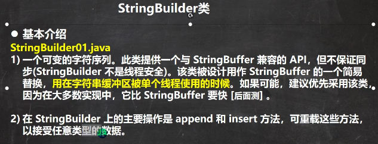
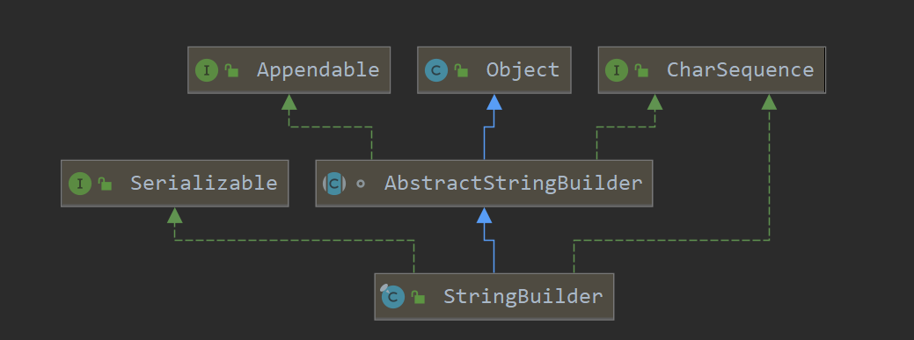
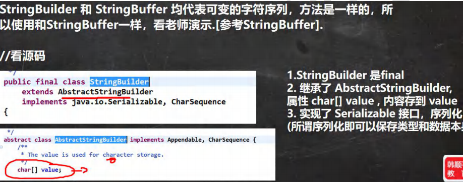
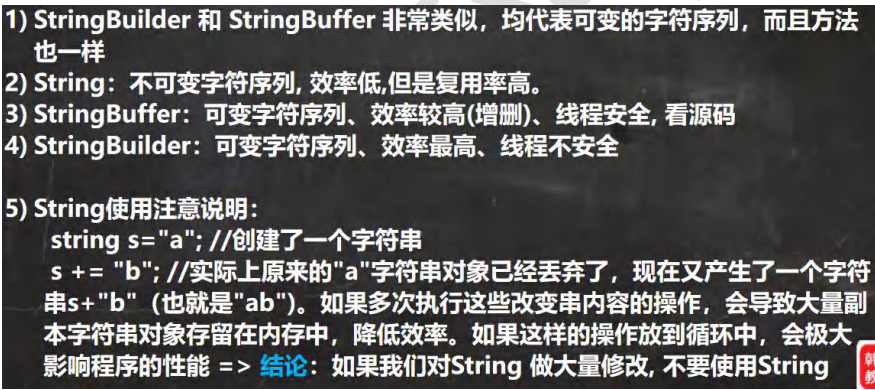

 

 

 

```java
package com.czl.stringbuilder;

public class StringBuilder01 {
    public static void main(String[] args) {
        //1. StringBuilder 继承 AbstractStringBuilder 类
        //2. 实现了 Serializable ,说明StringBuilder对象是可以串行化(对象可以网络传输,可以保存到文件)
        //3. StringBuilder 是final类, 不能被继承
        //4. StringBuilder 对象字符序列仍然是存放在其父类 AbstractStringBuilder的 char[] value;
        //   因此，字符序列是堆中
        //5. StringBuilder 的方法，没有做互斥的处理,即没有synchronized 关键字,因此在单线程的情况下使用
        //   StringBuilder
        StringBuilder stringBuilder = new StringBuilder();
    }
}
```


 

 

```java
package com.czl.stringbuilder;

public class StringVsStringBufferVsStringBuilder {
    public static void main(String[] args) {

        long startTime = 0L;
        long endTime = 0L;

        StringBuffer buffer = new StringBuffer("");
        startTime = System.currentTimeMillis();
        for (int i = 0; i < 80000; i++) {//StringBuffer 拼接 80000次
            buffer.append(String.valueOf(i));
        }
        endTime = System.currentTimeMillis();
        System.out.println("StringBuffer的执行时间：" + (endTime - startTime));

        StringBuilder builder = new StringBuilder("");
        startTime = System.currentTimeMillis();
        for (int i = 0; i < 80000; i++) {//StringBuilder 拼接 80000次
            builder.append(String.valueOf(i));
        }
        endTime = System.currentTimeMillis();
        System.out.println("StringBuilder的执行时间：" + (endTime - startTime));

        String text = "";
        startTime = System.currentTimeMillis();
        for (int i = 0; i < 80000; i++) {//String 拼接 80000
            text = text + i;
        }
        endTime = System.currentTimeMillis();
        System.out.println("String的执行时间：" + (endTime - startTime));
    }
}
```


 