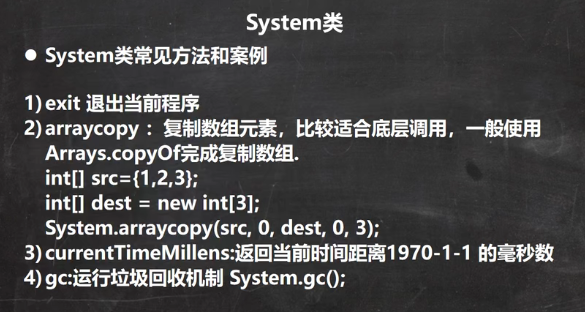

 

```java
package com.czl.stringbuilder;

import java.util.Arrays;

public class System_ {
    public static void main(String[] args) {

        //exit 退出当前程序
//        System.out.println("ok1");
//        //1. exit(0) 表示程序退出
//        //2. 0 表示一个状态 , 正常的状态
//        System.exit(0);//
//        System.out.println("ok2");

        //arraycopy ：复制数组元素，比较适合底层调用，
        // 一般使用Arrays.copyOf完成复制数组
        int[] src={1,2,3};
        int[] dest = new int[3];// dest 当前是 {0,0,0}
        //1. 主要是搞清楚这五个参数的含义
        //2.
        //     源数组
        //     * @param      src      the source array.

        //     srcPos： 从源数组的哪个索引位置开始拷贝
        //     * @param      srcPos   starting position in the source array.

        //     dest : 目标数组，即把源数组的数据拷贝到哪个数组
        //     * @param      dest     the destination array.

        //     destPos: 把源数组的数据拷贝到 目标数组的哪个索引
        //     * @param      destPos  starting position in the destination data.

        //     length: 从源数组拷贝多少个数据到目标数组
        //     * @param      length   the number of array elements to be copied.
        System.arraycopy(src, 0, dest, 0, src.length);
        System.out.println("dest=" + Arrays.toString(dest));//[1, 2, 3]

        //currentTimeMillis:返回当前时间距离1970-1-1 的毫秒数
        System.out.println(System.currentTimeMillis());
    }
}
```

