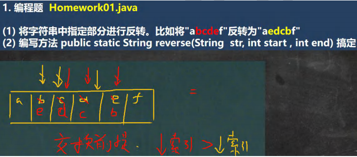
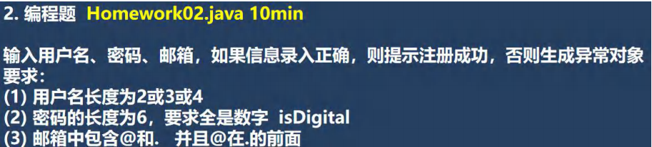
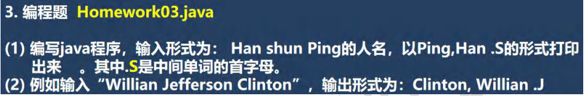
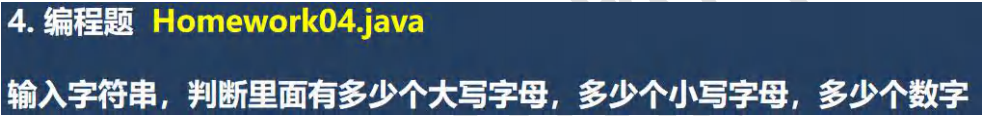
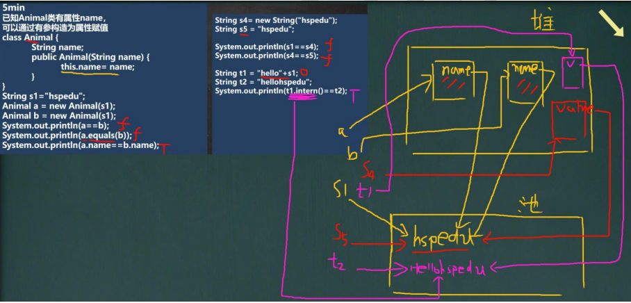

 

```java
public class Homework01 {
    public static void main(String[] args) {
        //测试
        String str = "abcdef";
        System.out.println("===交换前===");
        System.out.println(str);
        try {
            str = reverse(str, 1, 4);
        } catch (Exception e) {
            System.out.println(e.getMessage());
            return;
        }
        System.out.println("===交换后===");
        System.out.println(str);
    }

    /**
     * 思路分析
     * (1) 先把方法定义确定
     * (2) 把 String 转成 char[] ，因为char[] 的元素是可以交换的
     * (3) 画出分析示意图
     * (4) 代码实现
     */
    public static String reverse(String str, int start, int end) {
        //对输入的参数做一个验证
        //(1) 写出正确的情况
        //(2) 然后取反即可
        //(3) 这样写，你的思路就不乱
        if(!(str != null && start >= 0 && end > start && end < str.length())) {
            throw new RuntimeException("参数不正确");
        }
        char[] chars = str.toCharArray();
        char temp = ' '; //交换辅助变量
        for (int i = start, j = end; i < j; i++, j--) {
            temp = chars[i];
            chars[i] = chars[j];
            chars[j] = temp;
        }
        //使用chars 重新构建一个String 返回即可
        return new String(chars);
    }
}
```


 

```java
public class Homework02 {
    public static void main(String[] args) {

        String name = "abc";
        String pwd = "123456";
        String email = "ti@i@sohu.com";

        try {
            userRegister(name,pwd,email);
            System.out.println("恭喜你，注册成功~");
        } catch (Exception e) {
            System.out.println(e.getMessage());
        }

    }

    /**
     * 思路分析
     * (1) 先编写方法 userRegister(String name, String pwd, String email) {}
     * (2) 针对 输入的内容进行校核，如果发现有问题，就抛出异常，给出提示
     * (3) 单独的写一个方法，判断 密码是否全部是数字字符 boolean
     */
    public static void userRegister(String name, String pwd, String email) {
        //再加入一些校验
        if(!(name != null && pwd != null && email != null)) {
            throw  new RuntimeException("参数不能为null");
        }

        int userLength = name.length();
        if (!(userLength >= 2 && userLength <= 4)) {
            throw new RuntimeException("用户名长度为2或3或4");
        }

        if (!(pwd.length() == 6 && isDigital(pwd))) {
            throw new RuntimeException("密码的长度为6，要求全是数字");
        }

        int i = email.indexOf('@');
        int j = email.indexOf('.');
        if (!(i > 0 && j > i)) {
            throw new RuntimeException("邮箱中包含@和.   并且@在.的前面");
        }
    }

    //单独的写一个方法，判断 密码是否全部是数字字符 boolean
    public static boolean isDigital(String str) {
        char[] chars = str.toCharArray();
        for (int i = 0; i < chars.length; i++) {
            if (chars[i] < '0' || chars[i] > '9') {
                return false;
            }
        }
        return true;
    }
}
```


 

```java
public class Homework03 {
    public static void main(String[] args) {
        String name = "Willian Jefferson Clinton";
        printName(name);
    }

    /**
     * 思路分析
     * (1) 对输入的字符串进行 分割split(" ")
     * (2) 对得到的String[] 进行格式化String.format（）
     * (3) 对输入的字符串进行校验即可
     */
    public static void printName(String str) {
        
        if(str == null) {
            System.out.println("str 不能为空");
            return;
        }

        String[] names = str.split(" ");
        if(names.length != 3) {
            System.out.println("输入的字符串格式不对");
            return;
        }

        String format = String.format("%s,%s .%c", names[2], names[0], names[1].toUpperCase().charAt(0));
        System.out.println(format);
    }
}
```


 

```java
public class Homework04 {
    public static void main(String[] args) {
            String str = "abcHsp U 1234";
            countStr(str);
    }

    /**
     * 思路分析
     * (1) 遍历字符串，如果 char 在 '0'~'9' 就是一个数字
     * (2) 如果 char 在 'a'~'z' 就是一个小写字母
     * (3) 如果 char 在 'A'~'Z' 就是一个大写字母
     * (4) 使用三个变量来记录 统计结果
     */
    public static void countStr(String str) {
        if (str == null) {
            System.out.println("输入不能为 null");
            return;
        }
        int strLen = str.length();
        int numCount = 0;
        int lowerCount = 0;
        int upperCount = 0;
        int otherCount = 0;
        for (int i = 0; i < strLen; i++) {
            if(str.charAt(i) >= '0' && str.charAt(i) <= '9') {
                numCount++;
            } else if(str.charAt(i) >= 'a' && str.charAt(i) <= 'z') {
                lowerCount++;
            } else if(str.charAt(i) >= 'A' && str.charAt(i) <= 'Z') {
                upperCount++;
            } else {
                otherCount++;
            }
        }

        System.out.println("数字有 " + numCount);
        System.out.println("小写字母有 " + lowerCount);
        System.out.println("大写字母有 " + upperCount);
        System.out.println("其他字符有 " + otherCount);
    }
}
```


 

Animal类没有重写equals方法，判断的依旧是否是同一个对象