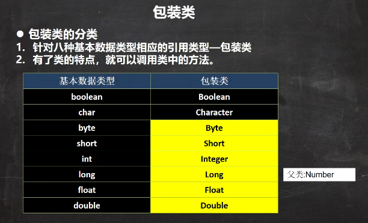
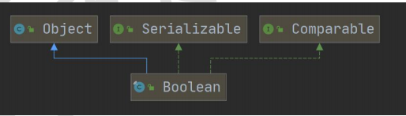
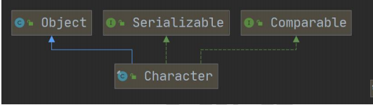
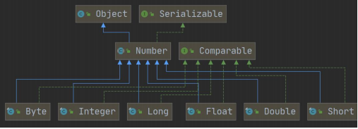
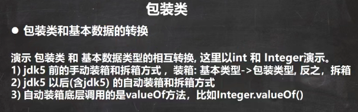
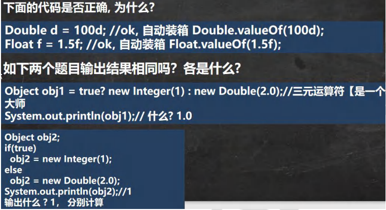
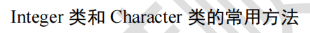
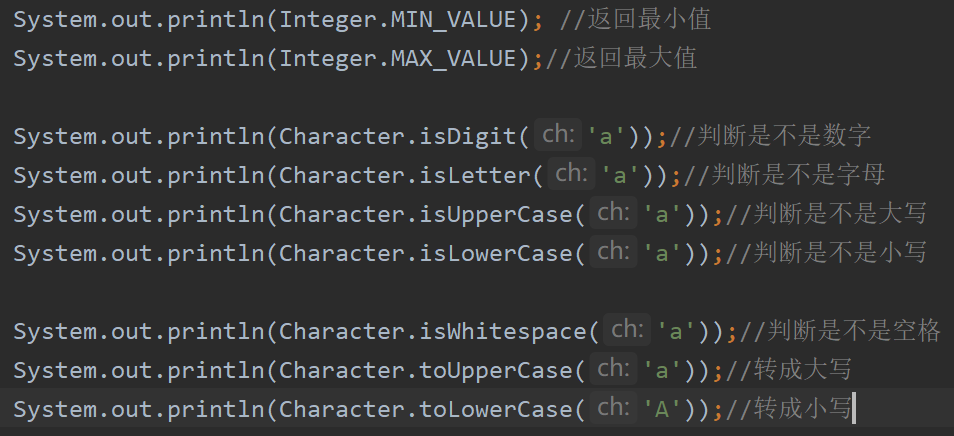
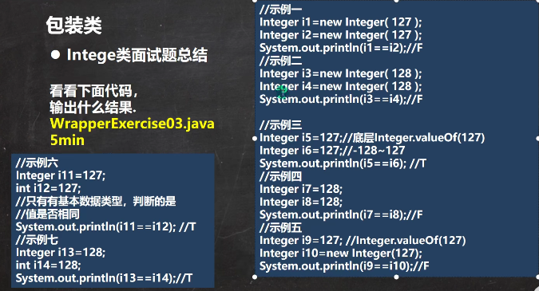

 

 

 

 

 

```java
package com.czl.wrapper;

public class Integer01 {
    public static void main(String[] args) {
        //演示int <--> Integer 的装箱和拆箱
        //jdk5前是手动装箱和拆箱
        //手动装箱 int->Integer
        int n1 = 100;
        Integer integer = new Integer(n1);
        Integer integer1 = Integer.valueOf(n1);

        //手动拆箱
        //Integer -> int
        int i = integer.intValue();

        //jdk5后，就可以自动装箱和自动拆箱
        int n2 = 200;
        //自动装箱 int->Integer
        Integer integer2 = n2; //底层使用的是 Integer.valueOf(n2)
        //自动拆箱 Integer->int
        int n3 = integer2; //底层仍然使用的是 intValue()方法
    }
}
```

 

三元运算符，是一个整体，精度最高是double，会提升优先级

 

```java
package com.czl.wrapper;

public class WrapperVSString {
    public static void main(String[] args) {
        //包装类(Integer)->String
        Integer i = 100;//自动装箱
        //方式1
        String str1 = i + "";
        //方式2
        String str2 = i.toString();
        //方式3
        String str3 = String.valueOf(i);

        //String -> 包装类(Integer)
        String str4 = "12345";
        Integer i2 = Integer.parseInt(str4);//使用到自动装箱
        Integer i3 = new Integer(str4);//构造器
    }
}
```


 

 


Integer创建机制：

```java
Integer创建机制：
package com.czl.wrapper;

public class WrapperExercise02 {
    public static void main(String[] args) {
        Integer i = new Integer(1);
        Integer j = new Integer(1);
        /*
        public Integer(int value) {
        this.value = value;
        }
         */
        System.out.println(i == j);  //False

        //所以，这里主要是看范围 -128 ~ 127 就是直接返回
        /*
        //1. 如果i 在 IntegerCache.low(-128)~IntegerCache.high(127),就直接从数组返回
        //2. 如果不在 -128~127,就直接 new Integer(i)
         public static Integer valueOf(int i) {
            if (i >= IntegerCache.low && i <= IntegerCache.high)
                return IntegerCache.cache[i + (-IntegerCache.low)];
            return new Integer(i);
        }
         */
        Integer m = 1; //底层 Integer.valueOf(1);
        Integer n = 1;//底层 Integer.valueOf(1);
        System.out.println(m == n); //T
        //所以，这里主要是看范围 -128 ~ 127 就是直接返回
        //，否则，就new Integer(xx);
        Integer x = 128;//底层Integer.valueOf(1);
        Integer y = 128;//底层Integer.valueOf(1);
        System.out.println(x == y);//False
    }
}
```

 