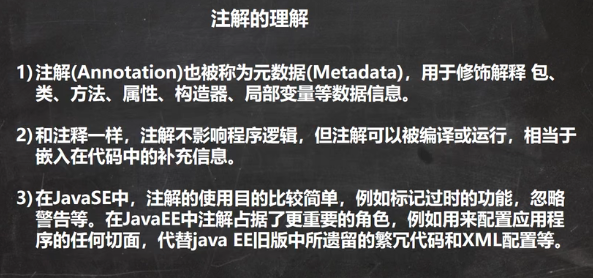
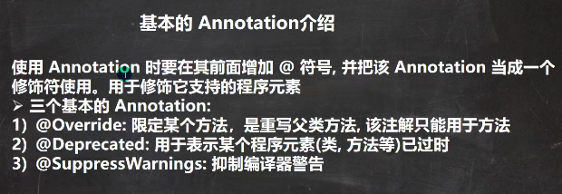
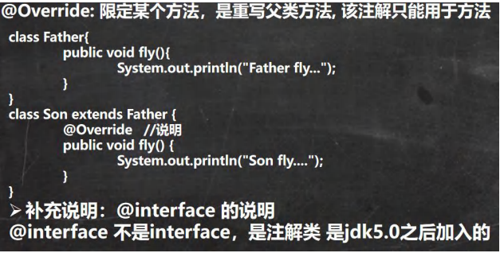
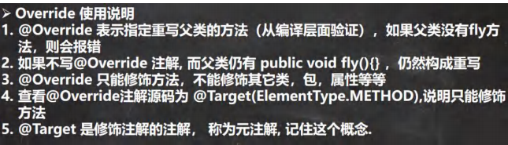
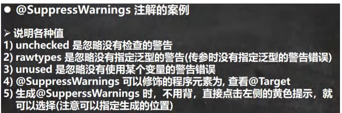

 

 


 

```java
class Father{//父类
    public void fly(){
        int i = 0;
        System.out.println("Father fly...");
    }
}
class Son extends Father {//子类
    //1. @Override 注解放在fly方法上，表示子类的fly方法时重写了父类的fly
    //2. 这里如果没有写 @Override 还是重写了父类fly
    //3. 如果你写了@Override注解，编译器就会去检查该方法是否真的重写了父类的
    //   方法，如果的确重写了，则编译通过，如果没有构成重写，则编译错误
    //4. 看看 @Override的定义
    //   @interface 表示一个 注解类
    /*
        @Target(ElementType.METHOD)
        @Retention(RetentionPolicy.SOURCE)
        public @interface Override {
        }
     */
    @Override   //说明
    public void fly() {
        System.out.println("Son fly....");
    }
}
```

 


```java
public class Deprecated_ {
    public static void main(String[] args) {
        A a = new A();
        a.n1;
        System.out.println(a.n1);
    }
}

//1. @Deprecated 修饰某个元素, 表示该元素已经过时
//2. 即不推荐使用，但是仍然可以使用
//3. 查看 @Deprecated 注解类的源码
//4. 可以修饰方法，类，字段, 包, 参数等等
//5. @Deprecated 可以做版本升级过渡使用
/*
@Documented
@Retention(RetentionPolicy.RUNTIME)
@Target(value={CONSTRUCTOR, FIELD, LOCAL_VARIABLE, METHOD, PACKAGE, PARAMETER, TYPE})
public @interface Deprecated {
}
 */
@Deprecated
class A {
    @Deprecated
    public int n1 = 10;
    @Deprecated
    public void hi(){
    }
}
```


 

```java
package com.hspedu.annotation_;

import java.util.ArrayList;
import java.util.List;

/**
 * @author 韩顺平
 * @version 1.0
 */
@SuppressWarnings({"rawtypes", "unchecked", "unused"})
public class SuppressWarnings_ {

    //老韩解读
    //1. 当我们不希望看到这些警告的时候，可以使用 SuppressWarnings注解来抑制警告信息
    //2. 在{""} 中，可以写入你希望抑制(不显示)警告信息
    //3. 可以指定的警告类型有
    //          all，抑制所有警告
    //          boxing，抑制与封装/拆装作业相关的警告
    //        //cast，抑制与强制转型作业相关的警告
    //        //dep-ann，抑制与淘汰注释相关的警告
    //        //deprecation，抑制与淘汰的相关警告
    //        //fallthrough，抑制与switch陈述式中遗漏break相关的警告
    //        //finally，抑制与未传回finally区块相关的警告
    //        //hiding，抑制与隐藏变数的区域变数相关的警告
    //        //incomplete-switch，抑制与switch陈述式(enum case)中遗漏项目相关的警告
    //        //javadoc，抑制与javadoc相关的警告
    //        //nls，抑制与非nls字串文字相关的警告
    //        //null，抑制与空值分析相关的警告
    //        //rawtypes，抑制与使用raw类型相关的警告
    //        //resource，抑制与使用Closeable类型的资源相关的警告
    //        //restriction，抑制与使用不建议或禁止参照相关的警告
    //        //serial，抑制与可序列化的类别遗漏serialVersionUID栏位相关的警告
    //        //static-access，抑制与静态存取不正确相关的警告
    //        //static-method，抑制与可能宣告为static的方法相关的警告
    //        //super，抑制与置换方法相关但不含super呼叫的警告
    //        //synthetic-access，抑制与内部类别的存取未最佳化相关的警告
    //        //sync-override，抑制因为置换同步方法而遗漏同步化的警告
    //        //unchecked，抑制与未检查的作业相关的警告
    //        //unqualified-field-access，抑制与栏位存取不合格相关的警告
    //        //unused，抑制与未用的程式码及停用的程式码相关的警告
    //4. 关于SuppressWarnings 作用范围是和你放置的位置相关
    //   比如 @SuppressWarnings放置在 main方法，那么抑制警告的范围就是 main
    //   通常我们可以放置具体的语句, 方法, 类.
    //5.  看看 @SuppressWarnings 源码
    //(1) 放置的位置就是 TYPE, FIELD, METHOD, PARAMETER, CONSTRUCTOR, LOCAL_VARIABLE
    //(2) 该注解类有数组 String[] values() 设置一个数组比如 {"rawtypes", "unchecked", "unused"}
    /*
        @Target({TYPE, FIELD, METHOD, PARAMETER, CONSTRUCTOR, LOCAL_VARIABLE})
            @Retention(RetentionPolicy.SOURCE)
            public @interface SuppressWarnings {
                String[] value();
        }
     */
    public static void main(String[] args) {
        List list = new ArrayList();
        list.add("jack");
        list.add("tom");
        list.add("mary");
        int i;
        System.out.println(list.get(1));

    }

    public void f1() {
//        @SuppressWarnings({"rawtypes"})
        List list = new ArrayList();


        list.add("jack");
        list.add("tom");
        list.add("mary");
//        @SuppressWarnings({"unused"})
        int i;
        System.out.println(list.get(1));
    }
}
```

