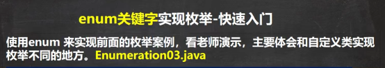 

```java
package com.czl.enum_;

public class Enumeration03 {
    public static void main(String[] args) {
        System.out.println(Season2.AUTUMN);
        System.out.println(Season2.SPRING);
    }
}

//演示使用enum关键字来实现枚举类
enum Season2 {//类
    //如果使用了enum 来实现枚举类
    //1. 使用关键字 enum 替代 class
    //2. public static final Season SPRING = new Season("春天", "温暖") 直接使用
    //   SPRING("春天", "温暖") 即常量名(实参列表)
    //3. 如果有多个常量(对象)， 使用 ,号间隔即可
    //4. 如果使用enum 来实现枚举，要求将定义常量对象，写在前面
    SPRING("春天", "温暖"), WINTER("冬天", "寒冷"),
    AUTUMN("秋天", "凉爽"), SUMMER("夏天", "炎热");

    private String name;
    private String desc;//描述

    private Season2(String name, String desc) {
        this.name = name;
        this.desc = desc;
    }

    public String getName() {
        return name;
    }

    public String getDesc() {
        return desc;
    }

    @Override
    public String toString() {
        return "Season{" +
                "name='" + name + '\'' +
                ", desc='" + desc + '\'' +
                '}';
    }
}
```


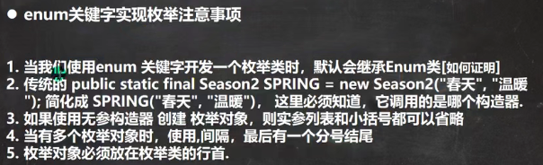 

（1）而且是一个final类

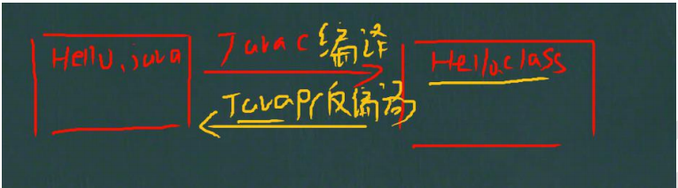 

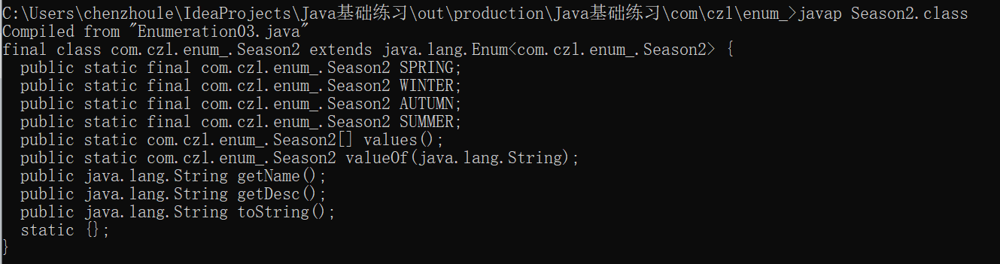 

（3）

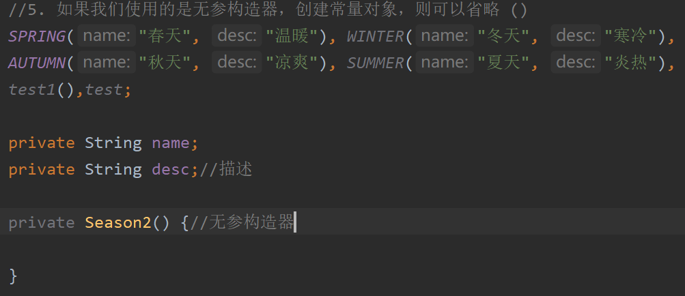 


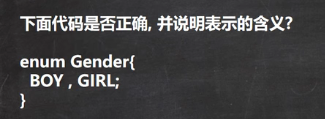 

正确

有一个枚举类Gender，没有属性

有两个枚举对象 BOY,GIRL，调用Gender的无参构造器创建

改成：

enum Gender{

BOY,GIRL;

private Gender(String name){}

private Gender(){}

}//默认的无参构造器被覆盖，要再次的显示声明，不然BOY,GIRL;无法使用。


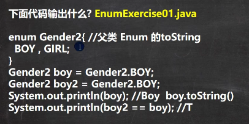 

```java
package com.czl.enum_;

public class EnumExercise01 {
    public static void main(String[] args) {
        Gender2 boy = Gender2.BOY;//OK
        Gender2 boy2 = Gender2.BOY;//OK
        System.out.println(boy);//输出BOY 
        //本质就是调用 Gender2 的父类Enum的 toString()
        System.out.println(boy2 == boy);//true Gender2.BOY是静态的对象
//        public String toString() {
//            return name;//返回枚举常量的名称
//        }
    }
}
enum Gender2{ //父类 Enum 的toString
    BOY,GIRL;
}
```


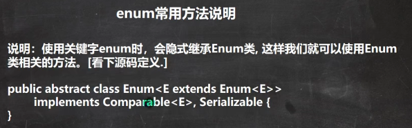 

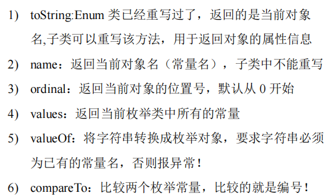 

```java
package com.czl.enum_;

//Enum类的各种方法的使用
public class EnumMethod {
    public static void main(String[] args) {
        //使用Season2 枚举类，来演示各种方法
        Season2 autumn = Season2.AUTUMN;

        //输出枚举对象的名字
        System.out.println(autumn.name());//输出 AUTUMN

        //ordinal() 输出的是该枚举对象的次序/编号，从0开始编号
        //AUTUMN 枚举对象是第三个
        System.out.println(autumn.ordinal());//输出 2

        //从反编译可以看出 values方法，返回 Season2[]
        //包含定义的所有枚举对象
        Season2[] values = Season2.values();
        System.out.println("===遍历取出枚举对象(增强for)====");
        for (Season2 season: values) {//增强for循环
            System.out.println(season);
        }
        //输出：
        //Season{name='春天', desc='温暖'}
        //Season{name='冬天', desc='寒冷'}
        //Season{name='秋天', desc='凉爽'}
        //Season{name='夏天', desc='炎热'}
//       //增强for
//        int[] nums = {1, 2, 9};
//        //普通的for循环
//        System.out.println("=====普通的for=====");
//        for (int i = 0; i < nums.length; i++) {
//            System.out.println(nums[i]);
//        }
//        System.out.println("=====增强的for=====");
//        //执行流程是 依次从nums数组中取出数据，赋给i, 如果取出完毕，则退出for
//        for(int i : nums) {
//            System.out.println("i=" + i);
//        }

        //valueOf：将字符串转换成枚举对象，要求字符串必须为已有的常量名，否则报异常
        //执行流程
        //1. 根据你输入的 "AUTUMN" 到 Season2的枚举对象去查找
        //2. 如果找到了，就返回，如果没有找到，就报错
        Season2 autumn1 = Season2.valueOf("AUTUMN");
        System.out.println("autumn1=" + autumn1);//autumn1=Season{name='秋天', desc='凉爽'}
        System.out.println(autumn == autumn1);//true

        //compareTo：比较两个枚举常量，比较的就是编号
        //1. 就是把 Season2.AUTUMN 枚举对象的编号 和 Season2.SUMMER枚举对象的编号比较
        //2. 看看结果
        /*
        public final int compareTo(E o) {
            return self.ordinal - other.ordinal;
        }
        Season2.AUTUMN的编号[2] - Season2.SUMMER的编号[3]
         */
        System.out.println(Season2.AUTUMN.compareTo(Season2.SUMMER));// -1
    }
}
```


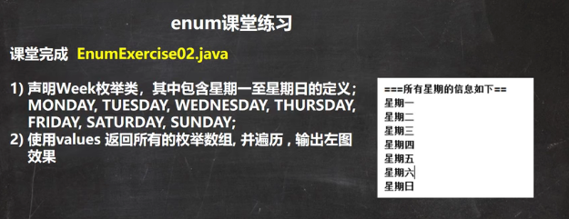 

```java
package com.czl.enum_;

public class EnumExercise02 {
    public static void main(String[] args) {
        Week[] values = Week.values();
        for (Week week : values) {
            System.out.println(week);
        }
    }
}

enum Week {
    MONDAY("星期一"), TUESDAY("星期二"), WEDNESDAY("星期三"), THURSDAY("星期四"),
    FRIDAY("星期五"), SATURDAY("星期六"), SUNDAY("星期日");
    private String name;

    Week(String name) {
        this.name = name;
    }

    @Override
    public String toString() {
        return name;
    }
}
```


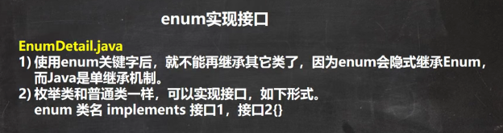 

```java
package com.czl.enum_;

public class EnumDetail {
    public static void main(String[] args) {
            Music.CLASSICMUSIC.playing();
    }
}
interface IPlaying {
    public void playing();
}
enum Music implements IPlaying {
    CLASSICMUSIC;
    @Override
    public void playing() {
        System.out.println("播放好听的音乐...");
    }
}
```


