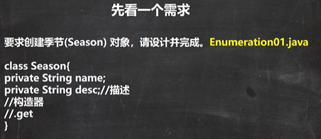
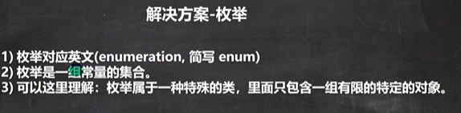
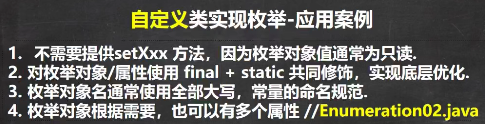
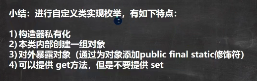

 

```java
package com.czl.enum_;

public class Enumeration01 {
    public static void main(String[] args) {
        //使用
        Season spring = new Season("春天", "温暖");
        Season winter = new Season("冬天", "寒冷");
        Season summer = new Season("夏天", "炎热");
        Season autumn = new Season("秋天", "凉爽");
        //因为对于季节而言，他的对象(具体值)，是固定的四个，不会有更多
        //按这个设计类的思路，不能体现季节是固定的四个对象
        //因此，这样的设计不好===> 枚举类[枚: 一个一个 举： 例举 , 即把具体的对象一个一个例举出来的类
        // 就称为枚举类]
        Season other = new Season("红天", "~~~");
    }
}

class Season{//类
    private String name;
    private String desc;//描述

    public Season(String name, String desc) {
        this.name = name;
        this.desc = desc;
    }

    public String getName() {
        return name;
    }

    public void setName(String name) {
        this.name = name;
    }

    public String getDesc() {
        return desc;
    }

    public void setDesc(String desc) {
        this.desc = desc;
    }
}
```

 

 

 

 

```java
package com.czl.enum_;

public class Enumeration01 {
    public static void main(String[] args) {
        System.out.println(Season.AUTUMN);
        System.out.println(Season.SPRING);
    }
}

//自定义枚举实现
//1. 将构造器私有化,目的防止 直接 new
//2. 去掉setXxx方法, 防止属性被修改
//3. 在Season 内部，直接创建固定的对象
//4. 优化，可以加入 final 修饰符，
// 使用静态属性 Season.SPRING 时 Season类不会加载
class Season{//类
    private String name;
    private String desc;//描述

    //定义了四个对象，固定
    public static final Season SPRING = new Season("春天", "温暖");
    public static final Season WINTER = new Season("冬天", "寒冷");
    public static final Season AUTUMN = new Season("秋天", "凉爽");
    public static final Season SUMMER = new Season("夏天", "炎热");

    private Season(String name, String desc) {
        this.name = name;
        this.desc = desc;
    }

    public String getName() {
        return name;
    }

    public String getDesc() {
        return desc;
    }

    @Override
    public String toString() {
        return "Season{" +
                "name='" + name + '\'' +
                ", desc='" + desc + '\'' +
                '}';
    }
}
```

 