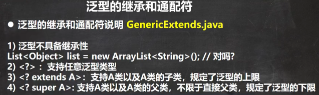
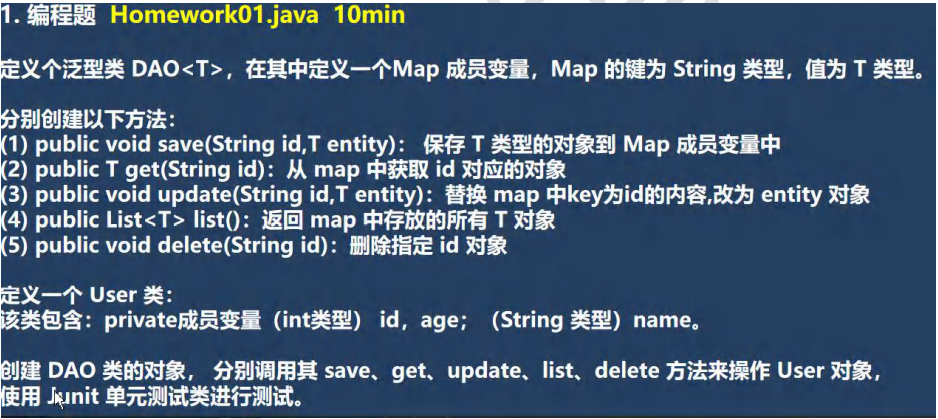
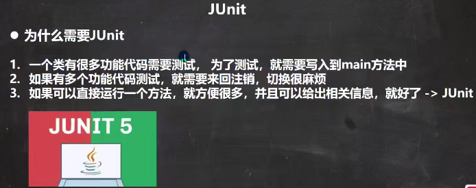
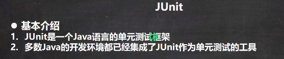

 

```java
public class GenericExtends {
    public static void main(String[] args) {

        Object o = new String("xx");//父类引用指向子类对象

        //泛型没有继承性
        //List<Object> list = new ArrayList<String>();

        //举例说明下面三个方法的使用
        List<Object> list1 = new ArrayList<>();
        List<String> list2 = new ArrayList<>();
        List<AA> list3 = new ArrayList<>();
        List<BB> list4 = new ArrayList<>();
        List<CC> list5 = new ArrayList<>();

        //如果是 List<?> c ，可以接受任意的泛型类型
        printCollection1(list1);
        printCollection1(list2);
        printCollection1(list3);
        printCollection1(list4);
        printCollection1(list5);

        //List<? extends AA> c： 表示 上限，可以接受 AA或者AA子类
//        printCollection2(list1);//×
//        printCollection2(list2);//×
        printCollection2(list3);//√
        printCollection2(list4);//√
        printCollection2(list5);//√

        //List<? super AA> c: 支持AA类以及AA类的父类，不限于直接父类
        printCollection3(list1);//√
        //printCollection3(list2);//×
        printCollection3(list3);//√
        //printCollection3(list4);//×
        //printCollection3(list5);//×
    }
    
    // ? extends AA 表示 上限，可以接受 AA或者AA子类
    public static void printCollection2(List<? extends AA> c) {
        for (Object object : c) {
            System.out.println(object);
        }
    }

    //说明: List<?> 表示 任意的泛型类型都可以接受
    public static void printCollection1(List<?> c) {
        for (Object object : c) { // 通配符，取出时，就是Object
            System.out.println(object);
        }
    }

    // ? super 子类类名AA:支持AA类以及AA类的父类，不限于直接父类，
    //规定了泛型的下限
    public static void printCollection3(List<? super AA> c) {
        for (Object object : c) {
            System.out.println(object);
        }
    }

}

class AA {
}

class BB extends AA {
}

class CC extends BB {
}
```


 

```java

public class User {
    private int id;
    private int age;
    private String name;

    public User(int id, int age, String name) {
        this.id = id;
        this.age = age;
        this.name = name;
    }

    public int getId() {
        return id;
    }

    public void setId(int id) {
        this.id = id;
    }

    public int getAge() {
        return age;
    }

    public void setAge(int age) {
        this.age = age;
    }

    public String getName() {
        return name;
    }

    public void setName(String name) {
        this.name = name;
    }

    @Override
    public String toString() {
        return "User{" +
                "id=" + id +
                ", age=" + age +
                ", name='" + name + '\'' +
                '}';
    }
}


public class DAO<T> {//泛型类
    private Map<String, T> map = new HashMap<>();

    public T get(String id) {
        return map.get(id);
    }
    public void update(String id,T entity) {
        map.put(id, entity);
    }
    //返回 map 中存放的所有 T 对象
    //遍历map [k-v],将map的 所有value(T entity),封装到ArrayList返回即可
    public List<T> list() {
        //创建 ArrayList
        List<T> list = new ArrayList<>();

        //遍历map
        Set<String> keySet = map.keySet();
        for (String key : keySet) {
            //map.get(key) 返回就是 User对象->ArrayList
            list.add(map.get(key));//也可以直接使用本类的 get(String id)
        }
        return list;
    }
    public void delete(String id) {
        map.remove(id);
    }
    public void save(String id,T entity) {//把entity保存到map
        map.put(id, entity);
    }
}


public class Homework01 {
    public static void main(String[] args) {

    }

    @Test
    public void testList() {
        //说明
        //这里我们给T 指定类型是User
        DAO<User> dao = new DAO<>();
        dao.save("001", new User(1,10,"jack"));
        dao.save("002", new User(2,18,"king"));
        dao.save("003", new User(3,38,"smith"));

        List<User> list = dao.list();

        System.out.println("list=" + list);

        dao.update("003", new User(3, 58, "milan"));
        dao.delete("001");//删除
        System.out.println("===修改后====");
        list = dao.list();
        System.out.println("list=" + list);

        System.out.println("id=003 " + dao.get("003"));//milan
    }
}
```


 

 

```java
package com.czl.generic;

import org.junit.jupiter.api.Test;

public class JUnit_ {
    public static void main(String[] args) {
        //传统方式
        //new JUnit_().m1();
        //new JUnit_().m2();
    }

    //alt+enter添加
    @Test
    public void m1() {
        System.out.println("m1方法被调用");
    }

    @Test
    public void m2() {
        System.out.println("m2方法被调用");
    }

    @Test
    public void m3() {
        System.out.println("m3方法被调用");
    }
}

```

