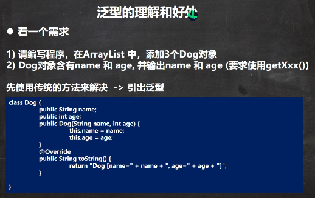
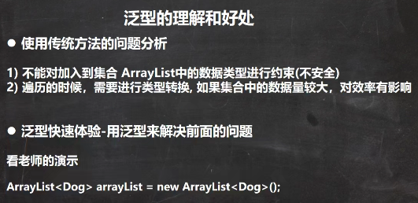
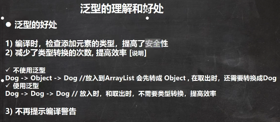
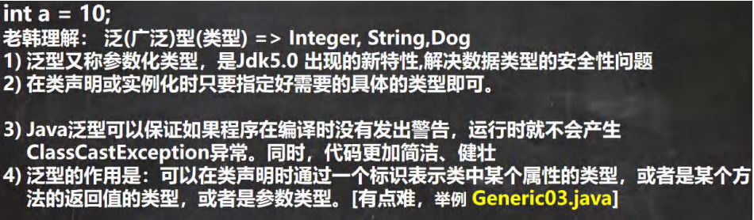
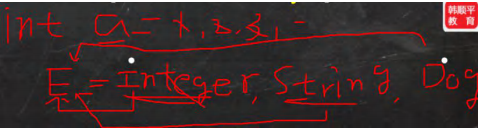
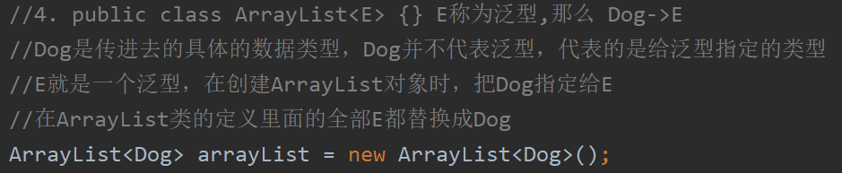
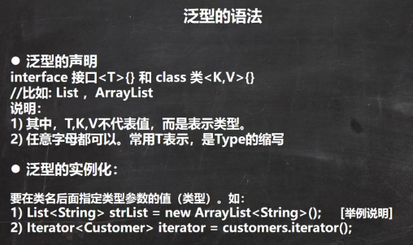
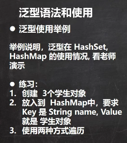
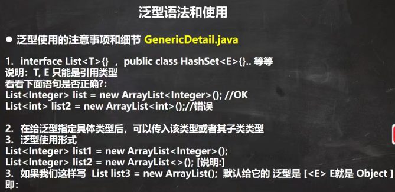
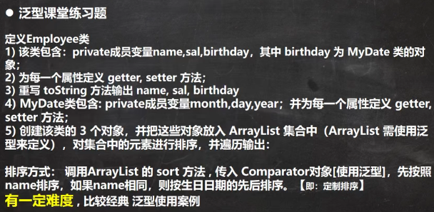

 

```java
package com.czl.generic;

import java.util.ArrayList;

@SuppressWarnings({"all"})
public class Generic01 {
    public static void main(String[] args) {

        //使用传统的方法来解决
        ArrayList arrayList = new ArrayList();
        arrayList.add(new Dog("旺财", 10));
        arrayList.add(new Dog("发财", 1));
        arrayList.add(new Dog("小黄", 5));

        //假如我们的程序员，不小心，添加了一只猫
        //arrayList.add(Object e);
        //这个对象能放进去，但下面遍历会出现异常 ClassCastException
        arrayList.add(new Cat("招财猫",8));

        //遍历
        for (Object o : arrayList) {
            //向下转型，Object转成Dog
            Dog dog = (Dog) o;
            System.out.println(dog.getName() + "-" + dog.getAge());
        }
    }
}

class Dog {
    private String name;
    private int age;

    public Dog(String name, int age) {
        this.name = name;
        this.age = age;
    }

    public String getName() {
        return name;
    }

    public void setName(String name) {
        this.name = name;
    }

    public int getAge() {
        return age;
    }

    public void setAge(int age) {
        this.age = age;
    }
}

class Cat { //Cat类
    private String name;
    private int age;
    public Cat(String name, int age) {
        this.name = name;
        this.age = age;
    }

    public String getName() {
        return name;
    }

    public void setName(String name) {
        this.name = name;
    }

    public int getAge() {
        return age;
    }

    public void setAge(int age) {
        this.age = age;
    }
}
```


 

```java
package com.czl.generic;

import java.util.ArrayList;

@SuppressWarnings({"all"})
public class Generic02 {
    public static void main(String[] args) {
        //1. ArrayList<Dog> 表示存放到 ArrayList 集合中的元素是Dog类型
        //2. 如果编译器发现添加的类型，不满足要求，就会报错
        //3. 在遍历的时候，可以直接取出 Dog 类型而不是 Object
        //4. public class ArrayList<E> {} E称为泛型,那么 Dog->E
        ArrayList<Dog> arrayList = new ArrayList<Dog>();
        arrayList.add(new Dog("旺财", 10));
        arrayList.add(new Dog("发财", 1));
        arrayList.add(new Dog("小黄", 5));

        //arrayList.add(new Cat("招财猫",8));
        for (Dog dog : arrayList) {
            System.out.println(dog.getName() + "-" + dog.getAge());
        }
    }
}

class Dog {
    private String name;
    private int age;

    public Dog(String name, int age) {
        this.name = name;
        this.age = age;
    }

    public String getName() {
        return name;
    }

    public void setName(String name) {
        this.name = name;
    }

    public int getAge() {
        return age;
    }

    public void setAge(int age) {
        this.age = age;
    }
}

class Cat { //Cat类
    private String name;
    private int age;
    public Cat(String name, int age) {
        this.name = name;
        this.age = age;
    }

    public String getName() {
        return name;
    }

    public void setName(String name) {
        this.name = name;
    }

    public int getAge() {
        return age;
    }

    public void setAge(int age) {
        this.age = age;
    }
}
```

 


 

 

E代表泛型，E代表的数据类型可以是Integer/String/Dog，泛型是可以表示数据类型的数据类型。

 

```java
package com.czl.generic;

public class Generic03 {
    public static void main(String[] args) {

        //注意，特别强调： E具体的数据类型在定义Person对象的时候指定,即在编译期间，就确定E是什么类型
        Person<String> person = new Person<String>("czl");
        person.show(); //class java.lang.String
        /*
            定义Person对象，把String赋给E之后，下面的所有E都用String替换
            class Person {
                String s ;

                public Person(String s) {//E也可以是参数类型
                    this.s = s;
                }

                public String f() {//返回类型使用E
                    return s;
                }
            }
         */

        Person<Integer> person2 = new Person<Integer>(100);
        person2.show();//class java.lang.Integer

        /*
            class Person {
                Integer s ;

                public Person(Integer s) {
                    this.s = s;
                }

                public Integer f() {
                    return s;
                }
            }
         */
    }
}

//泛型的作用是：可以在类声明时通过一个标识表示类中某个属性的类型，
// 或者是某个方法的返回值的类型，或者是参数类型

class Person<E> {
    E s ;//E表示 s的数据类型, 该数据类型在定义Person对象的时候指定,即在编译期间，就确定E是什么类型
    //属性s的数据类型是在创建/定义Person对象的时候指定的

    public Person(E s) {//E也可以是参数类型
        this.s = s;
    }

    public E f() {//返回类型使用E
        return s;
    }

    public void show() {
        System.out.println(s.getClass());//显示s的运行类型
    }
}
```


 

 

```java
package com.czl.generic;

import java.util.*;

@SuppressWarnings({"all"})
public class GenericExercise {
    public static void main(String[] args) {
        //使用泛型方式给HashSet 放入3个学生对象
        HashSet<Student> students = new HashSet<Student>();
        //students.add(Student e);不再是students.add(Object e);
        students.add(new Student("jack", 18));
        students.add(new Student("tom", 28));
        students.add(new Student("mary", 19));

        //遍历
        for (Student student : students) {
            System.out.println(student);
        }

        //使用泛型方式给HashMap 放入3个学生对象
        //K -> String V->Student
        HashMap<String, Student> hm = new HashMap<String, Student>();
        //构造器，K和V会被相应替换
        /*
            public class HashMap<K,V>  {}//构造器，K和V会被相应替换
         */
        hm.put("milan", new Student("milan", 38));
        hm.put("smith", new Student("smith", 48));
        hm.put("hsp", new Student("hsp", 28));

        //迭代器 EntrySet
        /*
        public Set<Map.Entry<K,V>> entrySet() {
            Set<Map.Entry<K,V>> es;
            return (es = entrySet) == null ? (entrySet = new EntrySet()) : es;
        }
         */
        Set<Map.Entry<String, Student>> entries = hm.entrySet();
        /*
            public final Iterator<Map.Entry<K,V>> iterator() {
                return new EntryIterator();
            }
         */
        Iterator<Map.Entry<String, Student>> iterator = entries.iterator();
        System.out.println("==============================");
        while (iterator.hasNext()) {
            Map.Entry<String, Student> next =  iterator.next();
            System.out.println(next.getKey() + "-" + next.getValue());
        }
    }
}

class Student {
    private String name;
    private int age;

    public Student(String name, int age) {
        this.name = name;
        this.age = age;
    }

    public String getName() {
        return name;
    }

    public void setName(String name) {
        this.name = name;
    }

    public int getAge() {
        return age;
    }

    public void setAge(int age) {
        this.age = age;
    }

    @Override
    public String toString() {
        return "Student{" +
                "name='" + name + '\'' +
                ", age=" + age +
                '}';
    }
}
```


 

```java
package com.czl.generic;

import java.util.ArrayList;
import java.util.List;

public class GenericDetail {
    public static void main(String[] args) {

        //1.给泛型指向数据类型是，要求是引用类型，不能是基本数据类型
        List<Integer> list = new ArrayList<Integer>(); //OK
        //List<int> list2 = new ArrayList<int>();//错误

        //2. 说明
        //因为 E 指定了 A 类型, 构造器传入了 new A() 实例对象
        //在给泛型指定具体类型后，可以传入该类型或者其子类类型
        Pig<A> aPig = new Pig<A>(new A());
        aPig.f();
        Pig<A> aPig2 = new Pig<A>(new B());
        aPig2.f();

        //3. 泛型的使用形式
        ArrayList<Integer> list1 = new ArrayList<Integer>();
        List<Integer> list2 = new ArrayList<Integer>();
        //在实际开发中，我们往往简写
        //编译器会进行类型推断, 推荐使用下面写法
        ArrayList<Integer> list3 = new ArrayList<>();
        List<Integer> list4 = new ArrayList<>();
        ArrayList<Pig> pigs = new ArrayList<>();

        //4. 如果是这样写 泛型默认是 Object
        ArrayList arrayList = new ArrayList();
        //arrayList.add(Object e);
        //等价 ArrayList<Object> arrayList = new ArrayList<Object>();
        /*
            public boolean add(Object e) {
                ensureCapacityInternal(size + 1);  // Increments modCount!!
                elementData[size++] = e;
                return true;
            }
         */
        
        Tiger tiger = new Tiger();
        /*
            class Tiger {//类
                Object e;

                public Tiger() {}

                public Tiger(Object e) {
                    this.e = e;
                }
            }
         */

    }
}
class Tiger<E> {//类
    E e;

    public Tiger() {}

    public Tiger(E e) {
        this.e = e;
    }
}

class A {}
class B extends A {}

class Pig<E> {
    E e;
    public Pig(E e) {
        this.e = e;
    }

    public void f() {
        System.out.println(e.getClass()); //运行类型
    }
}
```


 

```java
package com.czl.generic;

public class MyDate implements Comparable<MyDate>{
    private int year;
    private int month;
    private int day;

    public MyDate(int year, int month, int day) {
        this.year = year;
        this.month = month;
        this.day = day;
    }

    public int getYear() {
        return year;
    }

    public void setYear(int year) {
        this.year = year;
    }

    public int getMonth() {
        return month;
    }

    public void setMonth(int month) {
        this.month = month;
    }

    public int getDay() {
        return day;
    }

    public void setDay(int day) {
        this.day = day;
    }

    @Override
    public String toString() {
        return "MyDate{" +
                "year=" + year +
                ", month=" + month +
                ", day=" + day +
                '}';
    }

    @Override
    public int compareTo(MyDate o) { //把对year-month-day比较放在这里

        int yearMinus = year - o.getYear();
        if(yearMinus != 0) {
            return  yearMinus;
        }
        //如果year相同，就比较month
        int monthMinus = month - o.getMonth();
        if(monthMinus != 0) {
            return monthMinus;
        }
        //如果year 和 month
        return day - o.getDay();
    }
}

package com.czl.generic;

public class Employee {
    private String name;
    private double sal;
    private MyDate birthday;

    public Employee(String name, double sal, MyDate birthday) {
        this.name = name;
        this.sal = sal;
        this.birthday = birthday;
    }

    public String getName() {
        return name;
    }

    public void setName(String name) {
        this.name = name;
    }

    public double getSal() {
        return sal;
    }

    public void setSal(double sal) {
        this.sal = sal;
    }

    public MyDate getBirthday() {
        return birthday;
    }

    public void setBirthday(MyDate birthday) {
        this.birthday = birthday;
    }

    @Override
    public String toString() {
        return "\nEmployee{" +
                "name='" + name + '\'' +
                ", sal=" + sal +
                ", birthday=" + birthday +
                '}';
    }
}

package com.czl.generic;

import java.util.ArrayList;
import java.util.Comparator;

public class GenericExercise02 {
    public static void main(String[] args) {

        ArrayList<Employee> employees = new ArrayList<>();
        employees.add(new Employee("tom", 20000, new MyDate(1980,12,11)));
        employees.add(new Employee("jack", 12000, new MyDate(2001,12,12)));
        employees.add(new Employee("tom", 50000, new MyDate(1980,12,10)));

        System.out.println("employees=" + employees);

        employees.sort(new Comparator<Employee>() {
            @Override
            public int compare(Employee emp1, Employee emp2) {
                //先按照name排序，如果name相同，则按生日日期的先后排序。【即：定制排序】
                //先对传入的参数进行验证
                if(!(emp1 instanceof  Employee && emp2 instanceof Employee)) {
                    System.out.println("类型不正确..");
                    return 0;
                }
                //比较name
                int i = emp1.getName().compareTo(emp2.getName());
                if(i != 0) {
                    return i;
                }
                //下面是对birthday的比较，因此，我们最好把这个比较，放在MyDate类完成
                //封装后，将来可维护性和复用性，就大大增强.
                return emp1.getBirthday().compareTo(emp2.getBirthday());
            }
        });
        System.out.println("==对雇员进行排序==");
        System.out.println(employees);
    }
}
```

