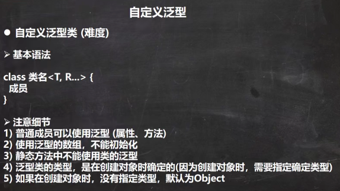
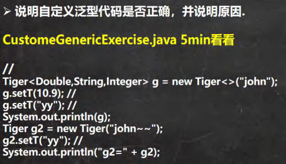
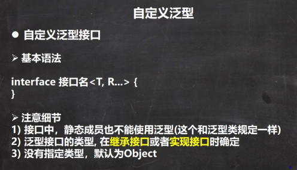
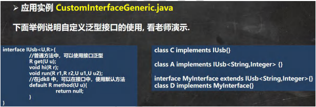
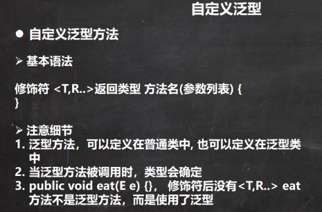
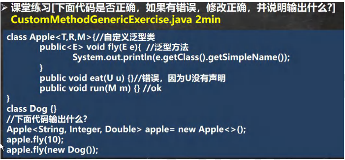

 

 

```java
package com.czl.generic;

import java.util.Arrays;

@SuppressWarnings({"all"})
public class CustomGeneric_ {
    public static void main(String[] args) {

        //T=Double, R=String, M=Integer
        Tiger<Double,String,Integer> g = new Tiger<>("john");
        g.setT(10.9); //OK
        //g.setT("yy"); //错误，类型不对
        System.out.println(g);
        Tiger g2 = new Tiger("john~~");//OK T默认为Object R=Object M=Object
        g2.setT("yy"); //OK ,因为 T=Object "yy"=String 是Object子类
        System.out.println("g2=" + g2);

    }
}

//1. Tiger 后面有泛型，所以我们把 Tiger 就称为自定义泛型类
//2, T, R, M 泛型的标识符, 一般是单个大写字母
//3. 泛型标识符可以有多个.
//4. 普通成员可以使用泛型 (属性、方法)
//5. 使用泛型的数组，不能初始化
//6. 静态方法中不能使用类的泛型
class Tiger<T, R, M> {
    String name;
    R r; //属性使用到泛型
    M m;
    T t;

    //因为数组在new的时候不能确定T的类型，就无法在内存开空间
    //T[] ts = new T[8];错误
    T[] ts;

    public Tiger(String name) {
        this.name = name;
    }

    public Tiger(R r, M m, T t) {//构造器使用泛型

        this.r = r;
        this.m = m;
        this.t = t;
    }

    public Tiger(String name, R r, M m, T t) {//构造器使用泛型
        this.name = name;
        this.r = r;
        this.m = m;
        this.t = t;
    }

    //因为静态是和类相关的，在类加载时，对象还没有创建
    //所以，如果静态方法和静态属性使用了泛型，JVM就无法完成初始化
//    static R r2;
//    public static void m1(M m) {
//
//    }

    //方法使用泛型
    public String getName() {
        return name;
    }

    public void setName(String name) {
        this.name = name;
    }

    public R getR() {
        return r;
    }

    public void setR(R r) {//方法使用到泛型
        this.r = r;
    }

    public M getM() {//返回类型可以使用泛型.
        return m;
    }

    public void setM(M m) {
        this.m = m;
    }

    public T getT() {
        return t;
    }

    public void setT(T t) {
        this.t = t;
    }

    @Override
    public String toString() {
        return "Tiger{" +
                "name='" + name + '\'' +
                ", r=" + r +
                ", m=" + m +
                ", t=" + t +
                ", ts=" + Arrays.toString(ts) +
                '}';
    }
}
```


 

 

```java
package com.czl.generic;

public class CustomInterfaceGeneric {
    public static void main(String[] args) {

    }
}

//在继承接口 指定泛型接口的类型
interface IA extends IUsb<String, Double> {

}
//当我们去实现IA接口时，因为IA在继承IUsu 接口时，指定了U 为String R为Double
//在实现IUsu接口的方法时，使用String替换U, 是Double替换R
class AA implements IA {

    @Override
    public Double get(String s) {
        return null;
    }
    @Override
    public void hi(Double aDouble) {

    }
    @Override
    public void run(Double r1, Double r2, String u1, String u2) {

    }
}

//实现接口时，直接指定泛型接口的类型
//给U 指定Integer 给 R 指定了 Float
//所以，当我们实现IUsb方法时，会使用Integer替换U, 使用Float替换R
class BB implements IUsb<Integer, Float> {

    @Override
    public Float get(Integer integer) {
        return null;
    }

    @Override
    public void hi(Float aFloat) {

    }

    @Override
    public void run(Float r1, Float r2, Integer u1, Integer u2) {

    }
}
//没有指定类型，默认为Object
//建议直接写成 IUsb<Object,Object>
class CC implements IUsb { //等价 class CC implements IUsb<Object,Object> {
    @Override
    public Object get(Object o) {
        return null;
    }
    @Override
    public void hi(Object o) {
    }
    @Override
    public void run(Object r1, Object r2, Object u1, Object u2) {

    }

}

interface IUsb<U, R> {

    int n = 10;
    //U name; 不能这样使用 接口中的属性，都是public final static的

    //普通方法中，可以使用接口泛型
    R get(U u);

    void hi(R r);

    void run(R r1, R r2, U u1, U u2);

    //在jdk8 中，可以在接口中，使用默认方法, 也是可以使用泛型
    default R method(U u) {
        return null;
    }
}
```


 

```java
package com.czl.generic;

import java.util.ArrayList;

public class CustomMethodGeneric {
    public static void main(String[] args) {
        Car car = new Car();
        car.fly("宝马", 100);//当调用方法时，传入参数，编译器，就会确定类型
        System.out.println("=======");
        car.fly(300, 100.1);//当调用方法时，传入参数，编译器，就会确定类型

        //测试
        //T->String, R-> ArrayList
        Fish<String, ArrayList> fish = new Fish<>();
        fish.hello(new ArrayList(), 11.3f);//new ArrayList(), 11.3f传进去的实参
    }
}

//泛型方法，可以定义在普通类中, 也可以定义在泛型类中
class Car {//普通类

    public void run() {//普通方法
    }
    //说明 泛型方法
    //1. <T,R> 就是泛型
    //2. 是提供给 fly使用的
    public <T, R> void fly(T t, R r) {//泛型方法
        System.out.println(t.getClass());//String
        System.out.println(r.getClass());//Integer
    }
}

class Fish<T, R> {//泛型类
    public void run() {//普通方法
    }
    public <U,M> void eat(U u, M m) {//泛型方法

    }
    //说明
    //1. 下面hi方法不是泛型方法，没有标识符
    //2. 是hi方法使用了类声明的 泛型
    public void hi(T t) {
    }
    //泛型方法，可以使用类声明的泛型，也可以使用自己声明泛型
    public<K> void hello(R r, K k) {
        System.out.println(r.getClass());//ArrayList
        System.out.println(k.getClass());//Float
    }
}
```


 

```java
package com.czl.generic;

public class CustomMethodGenericExercise {
    public static void main(String[] args) {
        //T->String, R->Integer, M->Double
        Apple<String, Integer, Double> apple = new Apple<>();
        apple.fly(10);//10 会被自动装箱 Integer10, 输出Integer
        apple.fly(new Dog());//Dog

    }
}

class Apple<T, R, M> {//自定义泛型类

    public <E> void fly(E e) {  //泛型方法
        System.out.println(e.getClass().getSimpleName());//只显示类名，不显示包名
    }

    //public void eat(U u) {}//错误，因为U没有声明
    public void run(M m) {
    } //ok
}

class Dog {
}
```

