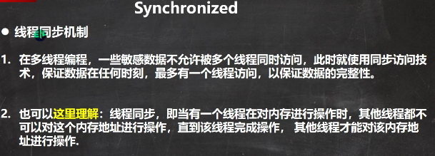
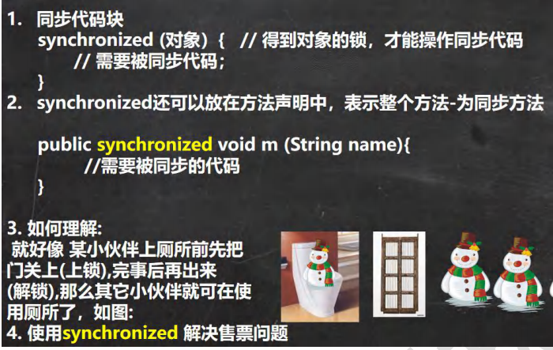

 

同步具体办法-Synchronized

线程在执行时，只有持有对象锁，才能进行下一步操作，操作完之后把锁放掉。

 

```java
package com.czl.thread;

public class SellTicket {
    public static void main(String[] args) {

        //测试
        SellTicket03 sellTicket03 = new SellTicket03();
        new Thread(sellTicket03).start();//第1个线程-窗口
        new Thread(sellTicket03).start();//第2个线程-窗口
        new Thread(sellTicket03).start();//第3个线程-窗口
    }
}

//实现接口方式, 使用synchronized实现线程同步
class SellTicket03 implements Runnable {
    private int ticketNum = 100;//让多个线程共享 ticketNum
    private boolean loop = true;//控制run方法变量

    public synchronized void sell() { //同步方法, 在同一时刻， 只能有一个线程来执行sell方法
            if (ticketNum <= 0) {
                System.out.println("售票结束...");
                loop = false;
                return;
            }
        //休眠50毫秒, 模拟
        try {
            Thread.sleep(50);
        } catch (InterruptedException e) {
            e.printStackTrace();
        }

        System.out.println("窗口 " + Thread.currentThread().getName() + " 售出一张票"
                + " 剩余票数=" + (--ticketNum));
    }

    @Override
    public void run() {
        while (loop) {
            sell();//sell方法是一共同步方法
        }
    }
}
```

