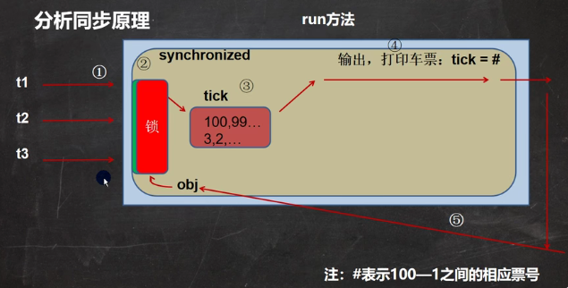
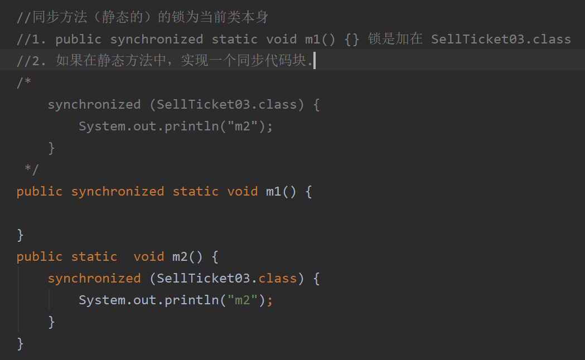

 


互斥锁基本介绍

 

```java
package com.czl.thread;

public class SellTicket {
    public static void main(String[] args) {

        //测试
        SellTicket03 sellTicket03 = new SellTicket03();
        new Thread(sellTicket03).start();//第1个线程-窗口
        new Thread(sellTicket03).start();//第2个线程-窗口
        new Thread(sellTicket03).start();//第3个线程-窗口
    }
}

//实现接口方式, 使用synchronized实现线程同步
class SellTicket03 implements Runnable {
    private int ticketNum = 100;//让多个线程共享 ticketNum
    private boolean loop = true;//控制run方法变量

    //1. public synchronized void sell() {} 就是一个同步方法
    //2. 这时锁在 this 对象
    //3. 也可以在代码块上写 synchronize ,同步代码块, 互斥锁还是在this对象
    public void sell() { //同步方法, 在同一时刻， 只能有一个线程来执行sell方法
        synchronized (this) {
            if (ticketNum <= 0) {
                System.out.println("售票结束...");
                loop = false;
                return;
            }
            //休眠50毫秒, 模拟
            try {
                Thread.sleep(50);
            } catch (InterruptedException e) {
                e.printStackTrace();
            }

            System.out.println("窗口 " + Thread.currentThread().getName() + " 售出一张票"
                    + " 剩余票数=" + (--ticketNum));
        }
    }

    @Override
    public void run() {
        while (loop) {
            sell();//sell方法是一共同步方法
        }
    }
}
```


```java
package com.czl.thread;

public class SellTicket {
    public static void main(String[] args) {

        //测试
        SellTicket03 sellTicket03 = new SellTicket03();
        new Thread(sellTicket03).start();//第1个线程-窗口
        new Thread(sellTicket03).start();//第2个线程-窗口
        new Thread(sellTicket03).start();//第3个线程-窗口
    }
}

//实现接口方式, 使用synchronized实现线程同步
class SellTicket03 implements Runnable {
    private int ticketNum = 100;//让多个线程共享 ticketNum
    private boolean loop = true;//控制run方法变量
    Object object = new Object();

    public void sell() { //同步方法, 在同一时刻， 只能有一个线程来执行sell方法
        synchronized (object) {
            if (ticketNum <= 0) {
                System.out.println("售票结束...");
                loop = false;
                return;
            }
            //休眠50毫秒, 模拟
            try {
                Thread.sleep(50);
            } catch (InterruptedException e) {
                e.printStackTrace();
            }

            System.out.println("窗口 " + Thread.currentThread().getName() + " 售出一张票"
                    + " 剩余票数=" + (--ticketNum));
        }
    }

    @Override
    public void run() {
        while (loop) {
            sell();//sell方法是一共同步方法
        }
    }
}
```


 


 