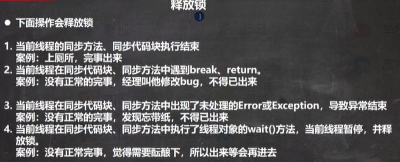
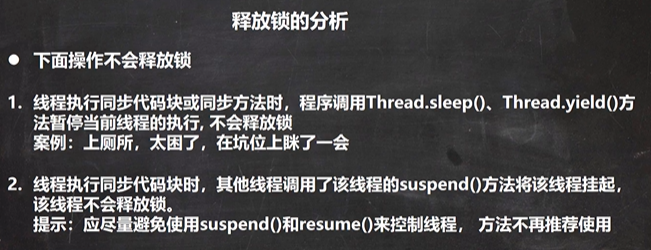

基本介绍：

 

```java
package com.czl.thread;

public class DeadLock_ {
    public static void main(String[] args) {
        //模拟死锁现象
        DeadLockDemo A = new DeadLockDemo(true);
        A.setName("A线程");
        DeadLockDemo B = new DeadLockDemo(false);
        B.setName("B线程");
        A.start();
        B.start();
    }
}

//线程
class DeadLockDemo extends Thread {
    static Object o1 = new Object();// 保证多线程，共享一个对象,这里使用static
    static Object o2 = new Object();
    boolean flag;

    public DeadLockDemo(boolean flag) {//构造器
        this.flag = flag;
    }

    @Override
    public void run() {

        //下面业务逻辑的分析
        //1. 如果flag 为 T, 线程A 就会先得到/持有 o1 对象锁, 然后尝试去获取 o2 对象锁
        //2. 如果线程A 得不到 o2 对象锁，就会Blocked
        //3. 如果flag 为 F, 线程B 就会先得到/持有 o2 对象锁, 然后尝试去获取 o1 对象锁
        //4. 如果线程B 得不到 o1 对象锁，就会Blocked
        if (flag) {
            synchronized (o1) {//对象互斥锁, 下面就是同步代码
                System.out.println(Thread.currentThread().getName() + " 进入1");
                synchronized (o2) { // 这里获得li对象的监视权
                    System.out.println(Thread.currentThread().getName() + " 进入2");
                }

            }
        } else {
            synchronized (o2) {
                System.out.println(Thread.currentThread().getName() + " 进入3");
                synchronized (o1) { // 这里获得li对象的监视权
                    System.out.println(Thread.currentThread().getName() + " 进入4");
                }
            }
        }
    }
}
```


 

 