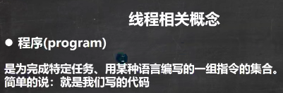
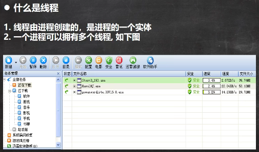
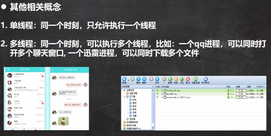
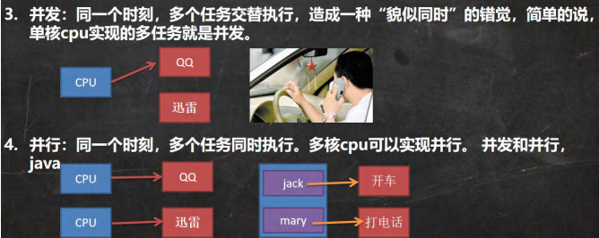

 

 

 

 

 

并发：一个CPU在同时执行多个任务

并行：多个CPU在执行不同的任务

并发和并行同时存在，多核CPU个数有限，如果任务过多，同一个CPU会并发执行任务

```java
package com.czl.thread;

public class CpuNum {
    public static void main(String[] args) {
        Runtime runtime = Runtime.getRuntime();//单例设计模式
        //获取当前电脑的cpu数量/核心数
        int cpuNums = runtime.availableProcessors();
        System.out.println("当前有cpu 个数=" + cpuNums);//8
    }
}
```

