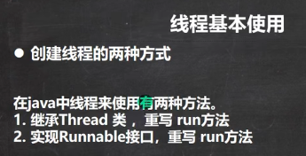
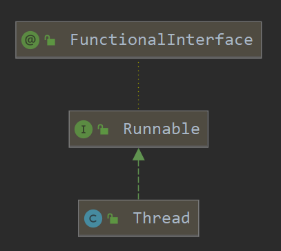
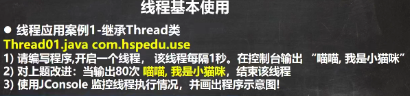
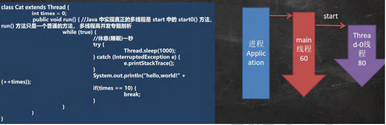
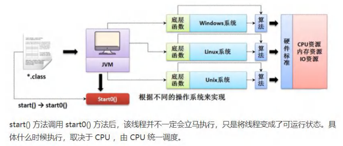
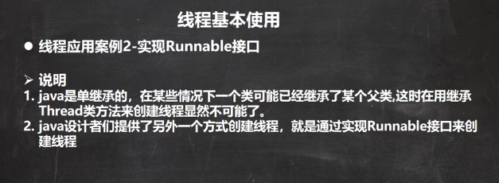
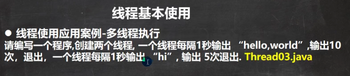
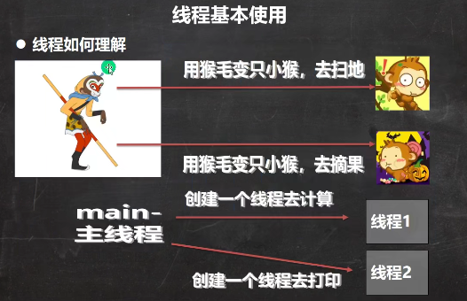
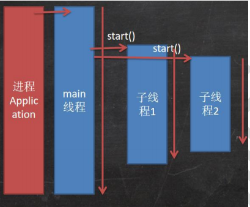
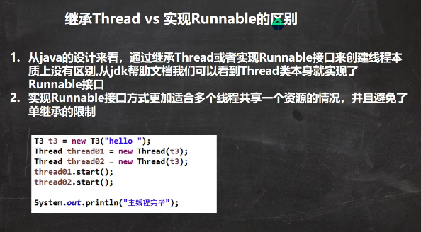

 

 


 

 

运行程序时，就启动了一个进程。

启动进程后，马上进入主方法。

进入主方法后，进程就开启了一个主线程。

主线程里面有Cat cat = new Cat();cat对象可以当成一个线程使用，因为继承了Thread。

cat.start();主线程又启动一个子线程。

主线程结束了，子线程还没结束，进程就还没结束。

全部线程都结束后，进程才能结束。

主线程可以开启多个子线程，子线程也可以再开启子线程。

```java
package com.czl.thread;

public class Thread01 {
    public static void main(String[] args) throws InterruptedException {

        //创建Cat对象，可以当做线程使用
        Cat cat = new Cat();

        /*
            (1)
            public synchronized void start() {
                start0();
            }
            (2)
            //start0() 是本地方法，是JVM调用, 底层是c/c++实现
            //真正实现多线程的效果， 是start0(), 而不是 run
            private native void start0();
         */

        cat.start();//启动线程-> 最终会执行cat的run方法

        //cat.run();//run方法就是一个普通的方法, 没有真正的启动一个线程，就会把run方法执行完毕，才向下执行
        //说明: 当main线程启动一个子线程 Thread-0, 主线程不会阻塞, 会继续执行
        //这时 主线程和子线程是交替执行..
        System.out.println("主线程继续执行" + Thread.currentThread().getName());//名字main
        for(int i = 0; i < 60; i++) {
            System.out.println("主线程 i=" + i);
            //让主线程休眠
            Thread.sleep(1000);
        }
    }
}

//1. 当一个类继承了 Thread 类， 该类就可以当做线程使用
//2. 我们会重写 run方法，写上自己的业务代码
//3. Thread 类 实现了 Runnable 接口的run方法
/*
    @Override
    public void run() {
        if (target != null) {
            target.run();
        }
    }
 */

class Cat extends Thread {

    int times = 0;
    @Override
    public void run() {//重写run方法，写上自己的业务逻辑
        while (true) {
            //该线程每隔1秒。在控制台输出 “喵喵, 我是小猫咪”
            System.out.println("喵喵, 我是小猫咪" + (++times) + " 线程名=" + Thread.currentThread().getName());
            //让该线程休眠1秒 ctrl+alt+t
            try {
                Thread.sleep(1000);
            } catch (InterruptedException e) {
                e.printStackTrace();
            }
            if(times == 80) {
                break;//当times 到80, 退出while, 这时线程也就退出..
            }
        }
    }
}
```

 


 

 

```java
package com.czl.thread;

public class Thread02 {
    public static void main(String[] args) {
//        Dog dog = new Dog();
//        //dog.start();//这里不能调用start，Runnable接口只有一个run方法
//        //创建了Thread对象，把 dog对象(实现了Runnable),放入Thread
//        Thread thread = new Thread(dog);
//        thread.start();

        Tiger tiger = new Tiger();//实现了 Runnable
        ThreadProxy threadProxy = new ThreadProxy(tiger);//tiger实现了Runnable接口，所以能传进去
        threadProxy.start();
    }
}

class Animal {
}

class Tiger extends Animal implements Runnable {

    @Override
    public void run() {
        System.out.println("老虎嗷嗷叫....");
    }
}

//线程代理类 , 模拟了一个极简的Thread类
class ThreadProxy implements Runnable {//可以把ThreadProxy类当做 Thread类

    private Runnable target = null;//属性，类型是 Runnable

    @Override
    public void run() {
        if (target != null) {
            target.run();//动态绑定（运行类型Tiger）
        }
    }

    public ThreadProxy(Runnable target) {
        this.target = target;//tiger传给了target
    }

    public void start() {
        start0();//这个方法是真正实现多线程方法
    }

    public void start0() {
        run();
        //会先调用本类ThreadProxy的run方法，
        // target.run();根据动态绑定机制，找到Tiger类的run方法
    }
}


class Dog implements Runnable { //通过实现Runnable接口，开发线程

    int count = 0;

    @Override
    public void run() { //普通方法
        while (true) {
            System.out.println("小狗汪汪叫..hi" + (++count) + Thread.currentThread().getName());

            //休眠1秒
            try {
                Thread.sleep(1000);
            } catch (InterruptedException e) {
                e.printStackTrace();
            }

            if (count == 10) {
                break;
            }
        }
    }
}
```


 

```java
package com.czl.thread;

public class Thread03 {
    public static void main(String[] args) {

        T1 t1 = new T1();
        T2 t2 = new T2();
        Thread thread1 = new Thread(t1);
        Thread thread2 = new Thread(t2);
        thread1.start();//启动第1个线程
        thread2.start();//启动第2个线程
    }
}

class T1 implements Runnable {

    int count = 0;

    @Override
    public void run() {
        while (true) {
            //每隔1秒输出 “hello,world”,输出10次
            System.out.println("hello,world " + (++count));
            try {
                Thread.sleep(1000);
            } catch (InterruptedException e) {
                e.printStackTrace();
            }
            if(count == 60) {
                break;
            }
        }
    }
}

class T2 implements Runnable {

    int count = 0;

    @Override
    public void run() {
        //每隔1秒输出 “hi”,输出5次
        while (true) {
            System.out.println("hi " + (++count));
            try {
                Thread.sleep(1000);
            } catch (InterruptedException e) {
                e.printStackTrace();
            }
            if(count == 50) {
                break;
            }
        }
    }
}
```


 

 


 

T3类实现了Runnable接口，t3对象可以放给两个线程Thread，即让两个线程来执行t3的run方法，两个线程共享同一个t3对象。


 

```java
package com.czl.thread;

public class SellTicket {
    public static void main(String[] args) {

//        //测试
//        SellTicket01 sellTicket01 = new SellTicket01();
//        SellTicket01 sellTicket02 = new SellTicket01();
//        SellTicket01 sellTicket03 = new SellTicket01();
//
//        //这里我们会出现超卖
//        //假如此时仅剩一张票，一个线程进来进行 if (ticketNum <= 0) 判断，不满足条件，执行下面代码
//        //但此时还没来得及执行--ticketNum，下一个线程进来进行 if (ticketNum <= 0) 判断，发现还不满足条件
//        //此时会执行两次 --ticketNum
//        //同一个时刻三个线程都执行到 if (ticketNum <= 0)，都执行到下一步
//        sellTicket01.start();//启动售票线程
//        sellTicket02.start();//启动售票线程
//        sellTicket03.start();//启动售票线程


        System.out.println("===使用实现接口方式来售票=====");
        SellTicket02 sellTicket02 = new SellTicket02();

        new Thread(sellTicket02).start();//第1个线程-窗口
        new Thread(sellTicket02).start();//第2个线程-窗口
        new Thread(sellTicket02).start();//第3个线程-窗口
    }
}

//使用Thread方式
class SellTicket01 extends Thread {

    private static int ticketNum = 100;//让多个线程共享 ticketNum

    @Override
    public void run() {
        while (true) {

            if (ticketNum <= 0) {
                System.out.println("售票结束...");
                break;
            }

            //休眠50毫秒, 模拟
            try {
                Thread.sleep(50);
            } catch (InterruptedException e) {
                e.printStackTrace();
            }

            System.out.println("窗口 " + Thread.currentThread().getName() + " 售出一张票"
                    + " 剩余票数=" + (--ticketNum));
        }
    }
}

//实现接口方式
class SellTicket02 implements Runnable {
    private int ticketNum = 100;//让多个线程共享 ticketNum

    @Override
    public void run() {
        while (true) {

            if (ticketNum <= 0) {
                System.out.println("售票结束...");
                break;
            }

            //休眠50毫秒, 模拟
            try {
                Thread.sleep(50);
            } catch (InterruptedException e) {
                e.printStackTrace();
            }

            System.out.println("窗口 " + Thread.currentThread().getName() + " 售出一张票"
                    + " 剩余票数=" + (--ticketNum));//1 - 0 - -1  - -2
        }
    }
}
```


 

```java
package com.czl.thread;

public class ThreadExit_ {
    public static void main(String[] args) throws InterruptedException {
        T t1 = new T();
        t1.start();

        //如果希望main线程去控制t1 线程的终止, 必须可以修改 loop
        //让t1 退出run方法，从而终止 t1线程 -> 通知方式

        //让主线程休眠 10 秒，再通知 t1线程退出
        System.out.println("main线程休眠10s...");
        Thread.sleep(10 * 1000);
        t1.setLoop(false);
    }
}

class T extends Thread {
    private int count = 0;
    //设置一个控制变量
    private boolean loop = true;
    @Override
    public void run() {
        while (loop) {
            try {
                Thread.sleep(50);// 让当前线程休眠50ms
            } catch (InterruptedException e) {
                e.printStackTrace();
            }
            System.out.println("T 运行中...." + (++count));
        }
    }
    public void setLoop(boolean loop) {
        this.loop = loop;
    }
}
```

