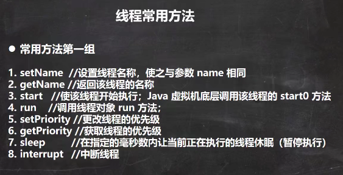
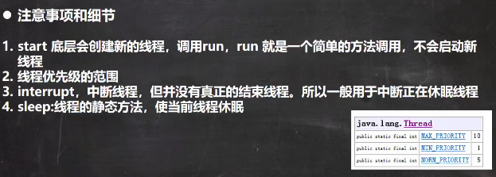
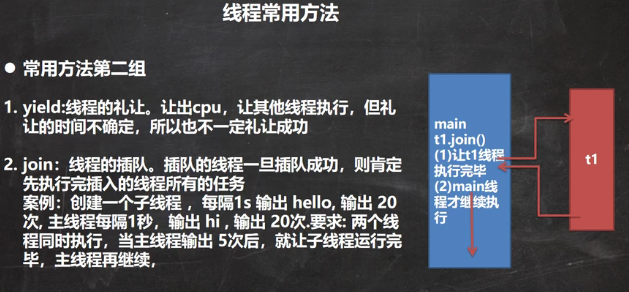
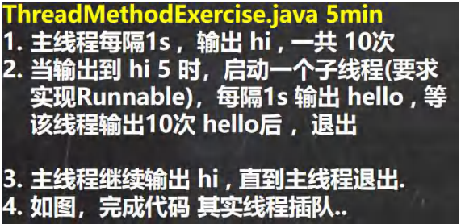
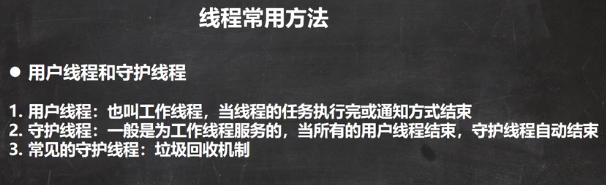

 

 

```java
package com.czl.thread;

public class ThreadMethod01 {
    public static void main(String[] args) throws InterruptedException {
        //测试相关的方法
        T t = new T();
        t.setName("czl");
        t.setPriority(Thread.MIN_PRIORITY);//1
        t.start();//启动子线程

        //主线程打印5 hi ,然后我就中断 子线程的休眠
        for(int i = 0; i < 5; i++) {
            Thread.sleep(1000);
            System.out.println("hi " + i);
        }

        System.out.println(t.getName() + " 线程的优先级 =" + t.getPriority());//1

        t.interrupt();//当执行到这里，就会中断 t线程的休眠.
    }
}

class T extends Thread { //自定义的线程类
    @Override
    public void run() {
        while (true) {
            for (int i = 0; i < 100; i++) {
                //Thread.currentThread().getName() 获取当前线程的名称
                System.out.println(Thread.currentThread().getName() + "  吃包子~~~~" + i);
            }
            try {
                System.out.println(Thread.currentThread().getName() + " 休眠中~~~");
                Thread.sleep(20000);//20秒
            } catch (InterruptedException e) {
                //当该线程执行到一个interrupt 方法时，就会catch 一个 异常, 可以加入自己的业务代码
                //InterruptedException 是捕获到一个中断异常.
                System.out.println(Thread.currentThread().getName() + "被 interrupt了");
            }
        }
    }
}
```


 

```java
package com.czl.thread;

public class ThreadMethod02 {
    public static void main(String[] args) throws InterruptedException {

        T2 t2 = new T2();
        t2.start();

        for(int i = 1; i <= 20; i++) {
            Thread.sleep(1000);
            System.out.println("主线程(小弟) 吃了 " + i  + " 包子");
            if(i == 5) {
                System.out.println("主线程(小弟) 让 子线程(老大) 先吃");
                //join, 线程插队
                t2.join();// 这里相当于让t2 线程先执行完毕
                //Thread.yield();//礼让，不一定成功..
                System.out.println("线程(老大) 吃完了 主线程(小弟) 接着吃..");
            }
        }
    }
}

class T2 extends Thread {
    @Override
    public void run() {
        for (int i = 1; i <= 20; i++) {
            try {
                Thread.sleep(1000);//休眠1秒
            } catch (InterruptedException e) {
                e.printStackTrace();
            }
            System.out.println("子线程(老大) 吃了 " + i +  " 包子");
        }
    }
}
```


 

```java
package com.czl.thread;

public class ThreadMethodExercise {
    public static void main(String[] args) throws InterruptedException {
        Thread t3 = new Thread(new T3());//创建子线程
        for (int i = 1; i <= 10; i++) {
            System.out.println("hi " + i);
            if(i == 5) {//说明主线程输出了5次 hi
                t3.start();//启动子线程 输出 hello...
                t3.join();//立即将t3子线程，插入到main线程，让t3先执行
            }
            Thread.sleep(1000);//输出一次 hi, 让main线程也休眠1s
        }
    }
}

class T3 implements Runnable {
    private int count = 0;

    @Override
    public void run() {
        while (true) {
            System.out.println("hello " + (++count));
            try {
                Thread.sleep(1000);
            } catch (InterruptedException e) {
                e.printStackTrace();
            }
            if (count == 10) {
                break;
            }
        }
    }
}
```


 

```java
package com.czl.thread;

public class ThreadMethod03 {
    public static void main(String[] args) throws InterruptedException {
        MyDaemonThread myDaemonThread = new MyDaemonThread();
        //如果我们希望当main线程结束后，子线程自动结束
        //,只需将子线程设为守护线程即可
        myDaemonThread.setDaemon(true);
        myDaemonThread.start();

        for( int i = 1; i <= 10; i++) {//main线程
            System.out.println("宝强在辛苦的工作...");
            Thread.sleep(1000);
        }
    }
}

class MyDaemonThread extends Thread {
    public void run() {
        for (; ; ) {//无限循环
            try {
                Thread.sleep(1000);//休眠1000毫秒
            } catch (InterruptedException e) {
                e.printStackTrace();
            }
            System.out.println("马蓉和宋喆快乐聊天，哈哈哈~~~");
        }
    }
}
```

