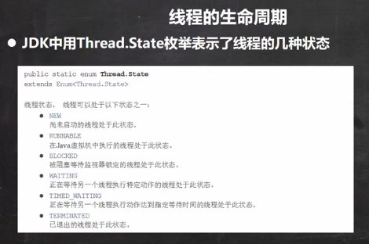
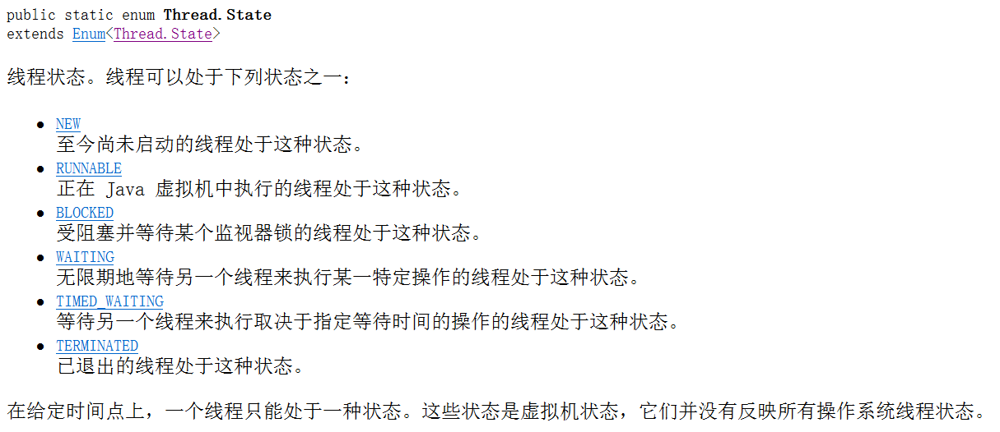
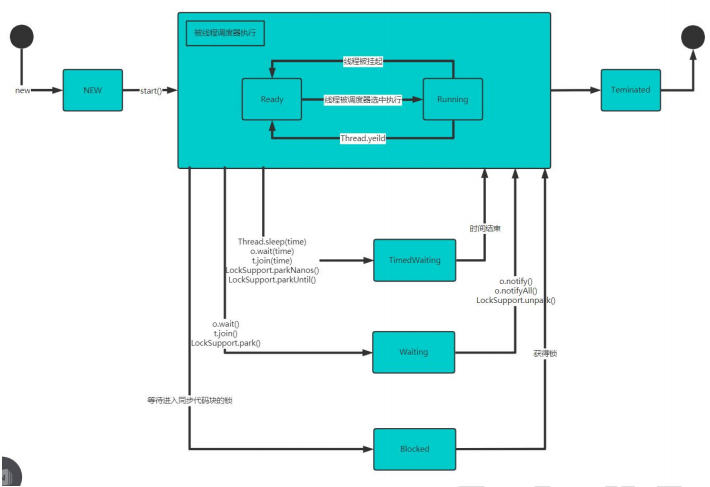

 

 


线程状态转换图

 

```java
package com.czl.thread;

public class ThreadState_ {
    public static void main(String[] args) throws InterruptedException {
        T t = new T();
        System.out.println(t.getName() + " 状态 " + t.getState());
        t.start();

        while (Thread.State.TERMINATED != t.getState()) {
            System.out.println(t.getName() + " 状态 " + t.getState());
            Thread.sleep(500);
        }

        System.out.println(t.getName() + " 状态 " + t.getState());

    }
}

class T extends Thread {
    @Override
    public void run() {
        while (true) {
            for (int i = 0; i < 10; i++) {
                System.out.println("hi " + i);
                try {
                    Thread.sleep(1000);
                } catch (InterruptedException e) {
                    e.printStackTrace();
                }
            }
            break;
        }
    }
}
```

