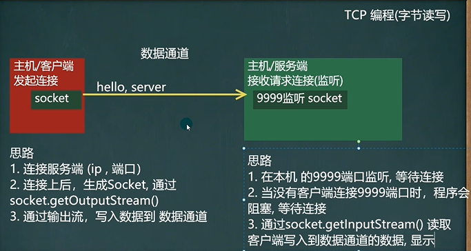

```java
public class SocketTCP01Server {
    public static void main(String[] args) throws IOException {
        //思路
        //1. 在本机 的9999端口监听, 等待连接
        //   细节: 要求在本机没有其它服务在监听9999
        //   细节：这个 ServerSocket 可以通过 accept() 返回多个Socket[多个客户端连接服务器的并发]
        ServerSocket serverSocket = new ServerSocket(9999);
        System.out.println("服务端，在9999端口监听，等待连接..");
        
        //2. 当没有客户端连接9999端口时，程序会 阻塞, 等待连接
        //   如果有客户端连接，则会返回Socket对象，程序继续
        Socket socket = serverSocket.accept();

        System.out.println("服务端 socket =" + socket.getClass());
        //
        //3. 通过socket.getInputStream() 读取客户端写入到数据通道的数据, 显示
        InputStream inputStream = socket.getInputStream();
        //4. IO读取
        byte[] buf = new byte[1024];
        int readLen = 0;
        while ((readLen = inputStream.read(buf)) != -1) {
            System.out.println(new String(buf, 0, readLen));//根据读取到的实际长度，显示内容.
        }
        //5.关闭流和socket
        inputStream.close();
        socket.close();
        serverSocket.close();//关闭

    }
}

public class SocketTCP01Client {
    public static void main(String[] args) throws IOException {
        //思路
        //1. 连接服务端 (ip , 端口）
        //解读: 连接本机的 9999端口, 如果连接成功，返回Socket对象
        Socket socket = new Socket(InetAddress.getLocalHost(), 9999);
        System.out.println("客户端 socket返回=" + socket.getClass());
        //2. 连接上后，生成Socket, 通过socket.getOutputStream()
        //   得到 和 socket对象关联的输出流对象
        OutputStream outputStream = socket.getOutputStream();
        //3. 通过输出流，写入数据到 数据通道
        outputStream.write("hello, server".getBytes());
        //4. 关闭流对象和socket, 必须关闭
        outputStream.close();
        socket.close();
        System.out.println("客户端退出.....");
    }
}
```


```java
public class SocketTCP02Server {
    public static void main(String[] args) throws IOException {
        //思路
        //1. 在本机 的9999端口监听, 等待连接
        //   细节: 要求在本机没有其它服务在监听9999
        //   细节：这个 ServerSocket 可以通过 accept() 返回多个Socket[多个客户端连接服务器的并发]
        ServerSocket serverSocket = new ServerSocket(9999);
        System.out.println("服务端，在9999端口监听，等待连接..");
        //2. 当没有客户端连接9999端口时，程序会 阻塞, 等待连接
        //   如果有客户端连接，则会返回Socket对象，程序继续

        Socket socket = serverSocket.accept();

        System.out.println("服务端 socket =" + socket.getClass());
        //
        //3. 通过socket.getInputStream() 读取客户端写入到数据通道的数据, 显示
        InputStream inputStream = socket.getInputStream();
        //4. IO读取
        byte[] buf = new byte[1024];
        int readLen = 0;
        while ((readLen = inputStream.read(buf)) != -1) {
            System.out.println(new String(buf, 0, readLen));//根据读取到的实际长度，显示内容.
        }
        //5. 获取socket相关联的输出流
        OutputStream outputStream = socket.getOutputStream();
        outputStream.write("hello, client".getBytes());
        //   设置结束标记
        socket.shutdownOutput();

        //6.关闭流和socket
        outputStream.close();
        inputStream.close();
        socket.close();
        serverSocket.close();//关闭

    }
}

public class SocketTCP02Client {
    public static void main(String[] args) throws IOException {
        //思路
        //1. 连接服务端 (ip , 端口）
        //解读: 连接本机的 9999端口, 如果连接成功，返回Socket对象
        Socket socket = new Socket(InetAddress.getLocalHost(), 9999);
        System.out.println("客户端 socket返回=" + socket.getClass());
        //2. 连接上后，生成Socket, 通过socket.getOutputStream()
        //   得到 和 socket对象关联的输出流对象
        OutputStream outputStream = socket.getOutputStream();
        //3. 通过输出流，写入数据到 数据通道
        outputStream.write("hello, server".getBytes());
        //   设置结束标记
        socket.shutdownOutput();

        //4. 获取和socket关联的输入流. 读取数据(字节)，并显示
        InputStream inputStream = socket.getInputStream();
        byte[] buf = new byte[1024];
        int readLen = 0;
        while ((readLen = inputStream.read(buf)) != -1) {
            System.out.println(new String(buf, 0, readLen));
        }

        //5. 关闭流对象和socket, 必须关闭
        inputStream.close();
        outputStream.close();
        socket.close();
        System.out.println("客户端退出.....");
    }
}
```


```java
public class SocketTCP03Server {
    public static void main(String[] args) throws IOException {
        //思路
        //1. 在本机 的9999端口监听, 等待连接
        //   细节: 要求在本机没有其它服务在监听9999
        //   细节：这个 ServerSocket 可以通过 accept() 返回多个Socket[多个客户端连接服务器的并发]
        ServerSocket serverSocket = new ServerSocket(9999);
        System.out.println("服务端，在9999端口监听，等待连接..");
        //2. 当没有客户端连接9999端口时，程序会 阻塞, 等待连接
        //   如果有客户端连接，则会返回Socket对象，程序继续

        Socket socket = serverSocket.accept();

        System.out.println("服务端 socket =" + socket.getClass());
        //
        //3. 通过socket.getInputStream() 读取客户端写入到数据通道的数据, 显示
        InputStream inputStream = socket.getInputStream();
        //4. IO读取, 使用字符流, 老师使用 InputStreamReader 将 inputStream 转成字符流
        BufferedReader bufferedReader = new BufferedReader(new InputStreamReader(inputStream));
        String s = bufferedReader.readLine();
        System.out.println(s);//输出

        //5. 获取socket相关联的输出流
        OutputStream outputStream = socket.getOutputStream();
       //    使用字符输出流的方式回复信息
        BufferedWriter bufferedWriter = new BufferedWriter(new OutputStreamWriter(outputStream));
        bufferedWriter.write("hello client 字符流");
        bufferedWriter.newLine();// 插入一个换行符，表示回复内容的结束
        bufferedWriter.flush();//注意需要手动的flush
        
        //6.关闭流和socket
        bufferedWriter.close();
        bufferedReader.close();
        socket.close();
        serverSocket.close();//关闭
    }
}

public class SocketTCP03Client {
    public static void main(String[] args) throws IOException {
        //思路
        //1. 连接服务端 (ip , 端口）
        //解读: 连接本机的 9999端口, 如果连接成功，返回Socket对象
        Socket socket = new Socket(InetAddress.getLocalHost(), 9999);
        System.out.println("客户端 socket返回=" + socket.getClass());
        //2. 连接上后，生成Socket, 通过socket.getOutputStream()
        //   得到 和 socket对象关联的输出流对象
        OutputStream outputStream = socket.getOutputStream();
        //3. 通过输出流，写入数据到 数据通道, 使用字符流
        BufferedWriter bufferedWriter = new BufferedWriter(new OutputStreamWriter(outputStream));
        bufferedWriter.write("hello, server 字符流");
        bufferedWriter.newLine();//插入一个换行符，表示写入的内容结束, 注意，要求对方使用readLine()!!!!
        bufferedWriter.flush();// 如果使用的字符流，需要手动刷新，否则数据不会写入数据通道

        //4. 获取和socket关联的输入流. 读取数据(字符)，并显示
        InputStream inputStream = socket.getInputStream();
        BufferedReader bufferedReader = new BufferedReader(new InputStreamReader(inputStream));
        String s = bufferedReader.readLine();
        System.out.println(s);

        //5. 关闭流对象和socket, 必须关闭
        bufferedReader.close();//关闭外层流
        bufferedWriter.close();
        socket.close();
        System.out.println("客户端退出.....");
    }
}
```


```java
public class TCPFileUploadServer {
    public static void main(String[] args) throws Exception {

        //1. 服务端在本机监听8888端口
        ServerSocket serverSocket = new ServerSocket(8888);
        System.out.println("服务端在8888端口监听....");
        //2. 等待连接
        Socket socket = serverSocket.accept();

        //3. 读取客户端发送的数据
        //   通过Socket得到输入流
        BufferedInputStream bis = new BufferedInputStream(socket.getInputStream());
        byte[] bytes = StreamUtils.streamToByteArray(bis);
        //4. 将得到 bytes 数组，写入到指定的路径，就得到一个文件了
        String destFilePath = "src\\abc.mp4";
        BufferedOutputStream bos = new BufferedOutputStream(new FileOutputStream(destFilePath));
        bos.write(bytes);
        bos.close();

        // 向客户端回复 "收到图片"
        // 通过socket 获取到输出流(字符)
        BufferedWriter writer = new BufferedWriter(new OutputStreamWriter(socket.getOutputStream()));
        writer.write("收到图片");
        writer.flush();//把内容刷新到数据通道
        socket.shutdownOutput();//设置写入结束标记

        //关闭其他资源
        writer.close();
        bis.close();
        socket.close();
        serverSocket.close();
    }
}

public class TCPFileUploadClient {
    public static void main(String[] args) throws Exception {

        //客户端连接服务端 8888，得到Socket对象
        Socket socket = new Socket(InetAddress.getLocalHost(), 8888);

        //创建读取磁盘文件的输入流
        //String filePath = "e:\\qie.png";
        String filePath = "e:\\abc.mp4";
        BufferedInputStream bis  = new BufferedInputStream(new FileInputStream(filePath));

        //bytes 就是filePath对应的字节数组
        byte[] bytes = StreamUtils.streamToByteArray(bis);

        //通过socket获取到输出流, 将bytes数据发送给服务端
        BufferedOutputStream bos = new BufferedOutputStream(socket.getOutputStream());
        bos.write(bytes);//将文件对应的字节数组的内容，写入到数据通道
        bis.close();
        socket.shutdownOutput();//设置写入数据的结束标记

        //=====接收从服务端回复的消息=====

        InputStream inputStream = socket.getInputStream();
        //使用StreamUtils 的方法，直接将 inputStream 读取到的内容 转成字符串
        String s = StreamUtils.streamToString(inputStream);
        System.out.println(s);

        //关闭相关的流
        inputStream.close();
        bos.close();
        socket.close();

    }
}

public class StreamUtils {

	//功能：将输入流转换成byte[]，既可以把文件的内容读入到byte[]
	public static byte[] streamToByteArray(InputStream is) throws Exception{
		ByteArrayOutputStream bos = new ByteArrayOutputStream();//创建输出流对象
		byte[] b = new byte[1024];
		int len;
		while((len=is.read(b))!=-1){
			bos.write(b, 0, len);	
		}
		byte[] array = bos.toByteArray();
		bos.close();
		return array;
	}
	//功能：将InputStream转换成String
	public static String streamToString(InputStream is) throws Exception{
		BufferedReader reader = new BufferedReader(new InputStreamReader(is));
		StringBuilder builder= new StringBuilder();
		String line;
		while((line=reader.readLine())!=null){ //当读取到 null时，就表示结束
			builder.append(line+"\r\n");
		}
		return builder.toString();
	}
}
```


